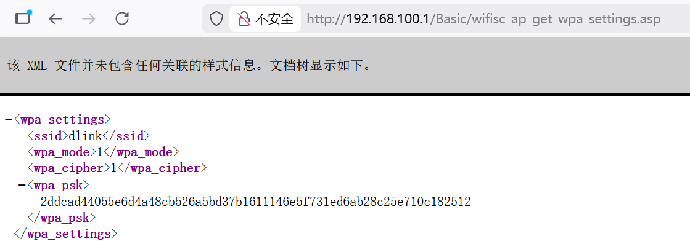
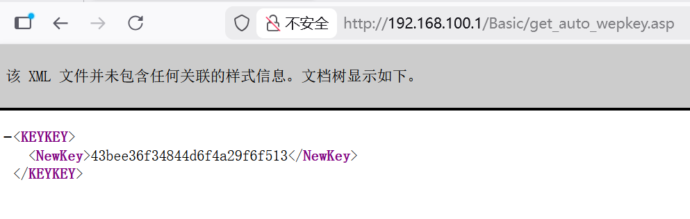

# D-Link Vulnerability

Vendor:D-Link

Product:DIR619L、DIR605L

Version:2.06B01、2.13B01

Type: Improper Access Control & Incorrect Privilege Assignment

Author:Jiaqian Peng

Mail:pengjiaqian@iie.ac.cn

Institution:Institute of Information Engineering,Chinese Academy of Sciences(IIE, CAS)

## Vulnerability description

We discovered that a recently released firmware of D-Link routers contains vulnerabilities related to improper access control and incorrect privilege assignment.

**Improper Access Control & Incorrect Privilege Assignment**

In `boa` binary:

An attacker can access the `wifisc_ap_get_wpa_settings.asp、get_auto_wepkey.asp` page **without any authentication**, resulting in the disclosure of critical configuration information, including WEP and WPA wireless keys.

The exposure of these wireless encryption keys allows an attacker to bypass wireless security protections, gain unauthorized access to the wireless network, and potentially compromise all devices connected to the network. This vulnerability may lead to complete loss of confidentiality and integrity of wireless communications.

## PoC & Result

