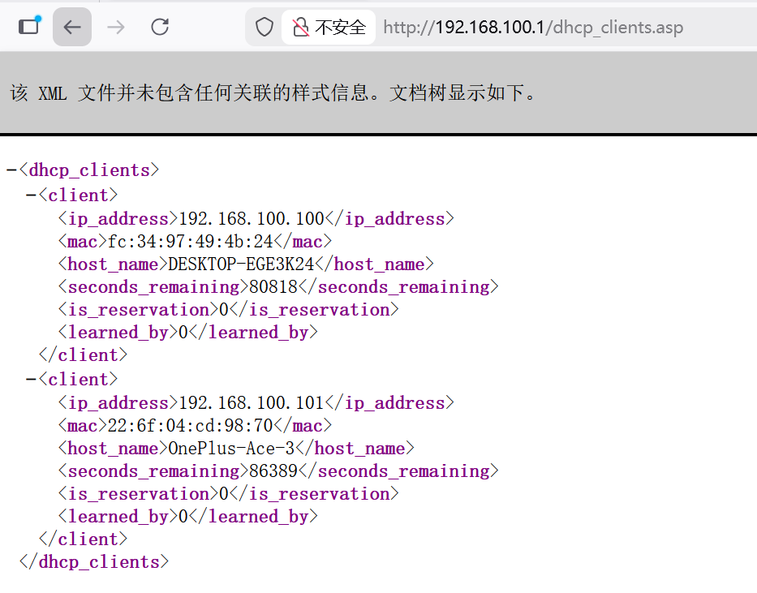
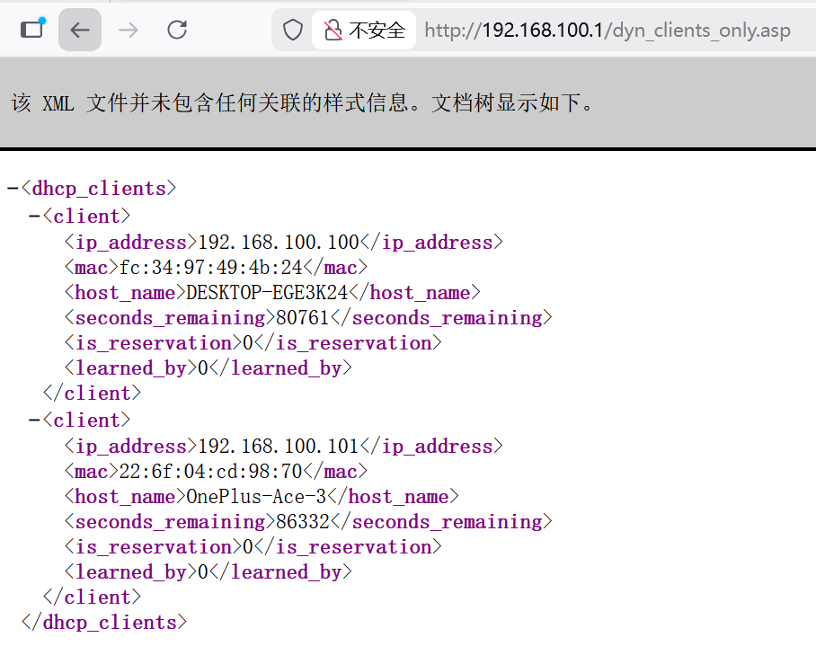
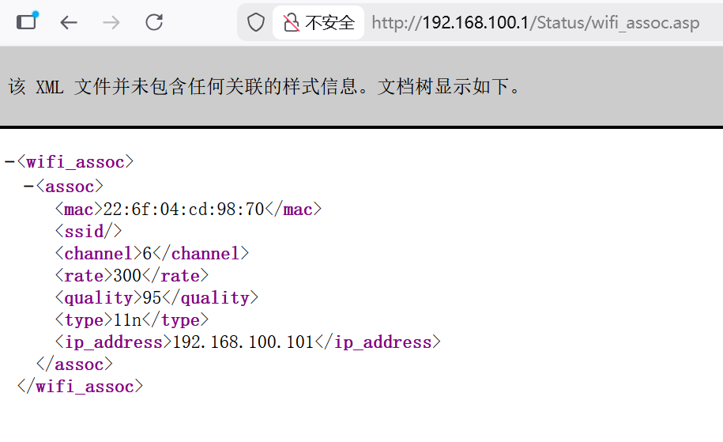

# D-Link Vulnerability

Vendor:D-Link

Product:DIR619L、DIR605L

Version:2.06B01、2.13B01

Type: Improper Access Control & Incorrect Privilege Assignment

Author:Jiaqian Peng

Mail:pengjiaqian@iie.ac.cn

Institution:Institute of Information Engineering,Chinese Academy of Sciences(IIE, CAS)

## Vulnerability description

We discovered that a recently released firmware of D-Link routers contains vulnerabilities related to improper access control and incorrect privilege assignment.

**Improper Access Control & Incorrect Privilege Assignment**

In `boa` binary:

An attacker can access the `dhcp_clients.asp、dyn_clients_only.asp、wifi_assoc.asp` pages **without any authentication**, resulting in the disclosure of sensitive network information.

These pages expose detailed information about active DHCP clients, including internal IP addresses, MAC addresses, hostnames, and lease status of devices connected to the network. The disclosure of this information allows an attacker to enumerate internal network assets, identify active devices, and infer the internal network topology.

## PoC & Result

