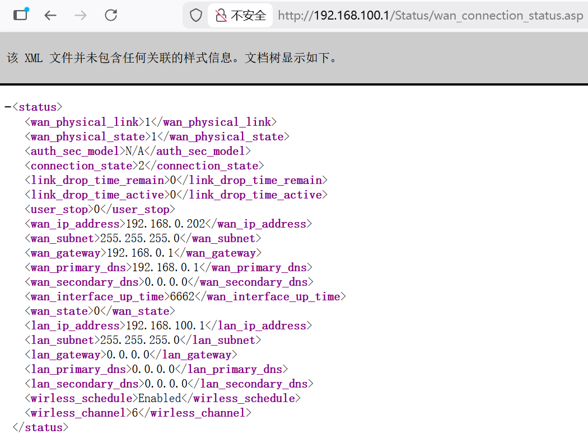

# D-Link Vulnerability

Vendor:D-Link

Product:DIR619L、DIR605L

Version:2.06B01、2.13B01

Type: Improper Access Control & Incorrect Privilege Assignment

Author:Jiaqian Peng

Mail:pengjiaqian@iie.ac.cn

Institution:Institute of Information Engineering,Chinese Academy of Sciences(IIE, CAS)

## Vulnerability description

We discovered that a recently released firmware of D-Link routers contains vulnerabilities related to improper access control and incorrect privilege assignment.

**Improper Access Control & Incorrect Privilege Assignment**

In `boa` binary:

An attacker can access the `wan_connection_status.asp` pages **without any authentication**, resulting in the disclosure of sensitive network information.

These pages expose detailed WAN and LAN status information of the device, including WAN IP address, subnet mask, default gateway, DNS configuration, interface uptime, LAN IP address, and wireless configuration status.

## PoC & Result

