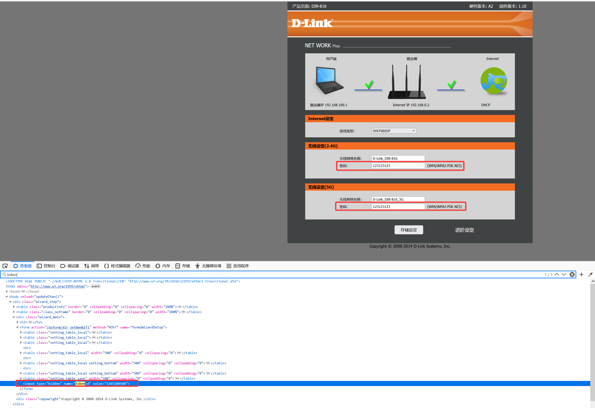
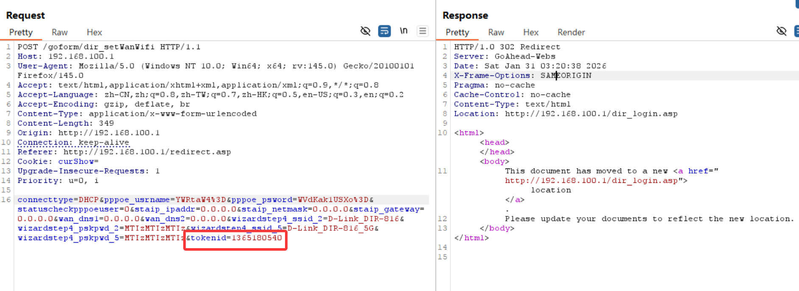

# D-Link Vulnerability

Vendor:D-Link

Product:DIR816

Version:1.10CNB05

Type:Improper Access Control & Incorrect Privilege Assignment

Author:Jiaqian Peng

Mail:pengjiaqian@iie.ac.cn

Institution:Institute of Information Engineering,Chinese Academy of Sciences(IIE, CAS)

## Vulnerability description

We discovered that a recently released firmware of D-Link routers contains vulnerabilities related to improper access control and incorrect privilege assignment.

**Improper Access Control & Incorrect Privilege Assignment**

In `goahead` binary:

An attacker can access the `redirect.asp` page **without any authentication**, which results in the disclosure of the `token_id` used by the router for authentication.

The router relies on `token_id` as a core authentication mechanism. By accessing this page, an attacker can obtain a valid `token_id`, thereby bypassing authentication controls.

Moreover, this page allows modification of critical configuration settings, including resetting the Wi-Fi password, leading to unauthorized configuration changes and full compromise of the device’s wireless security.

## PoC & Result

