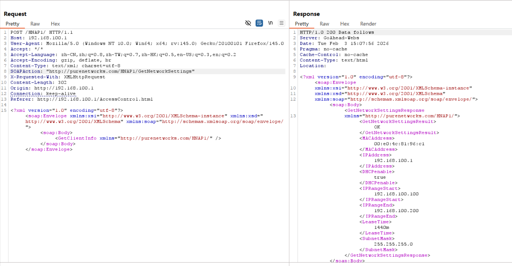
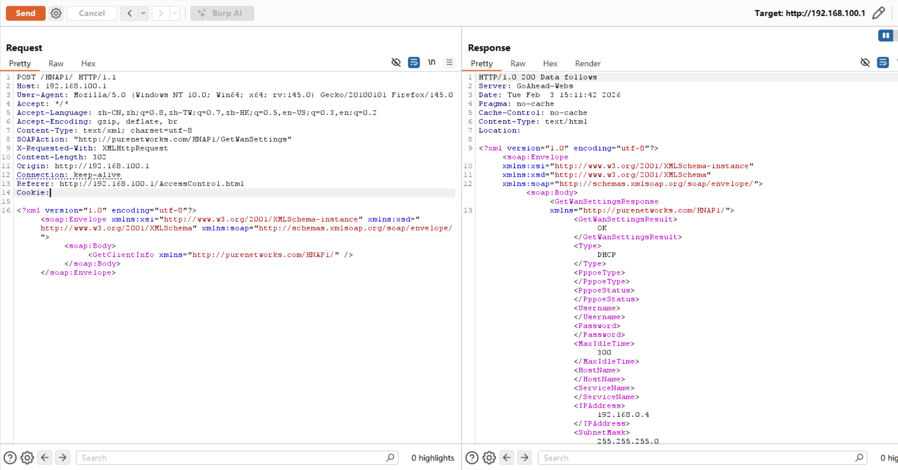
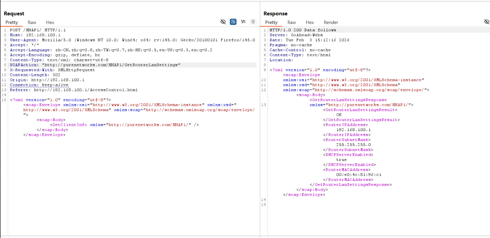
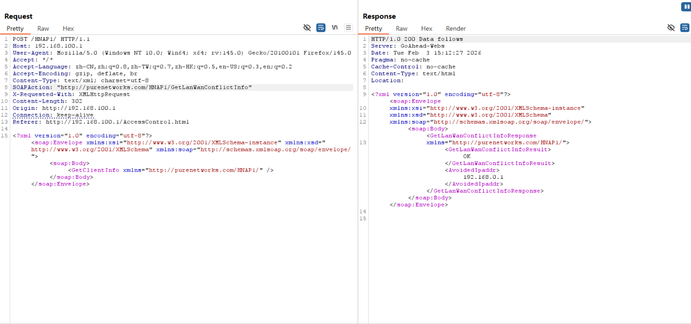
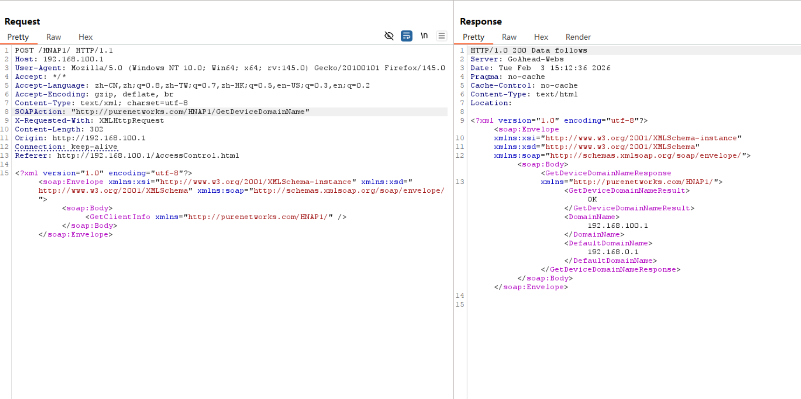
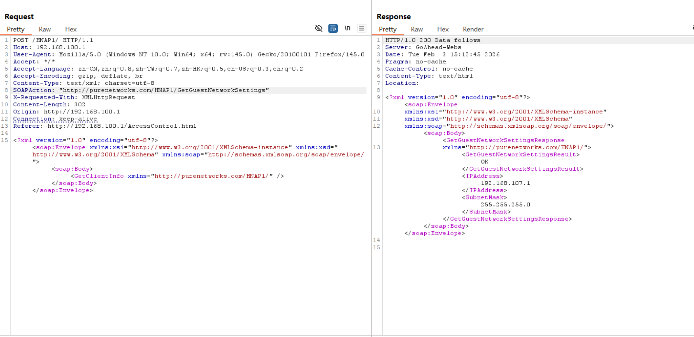
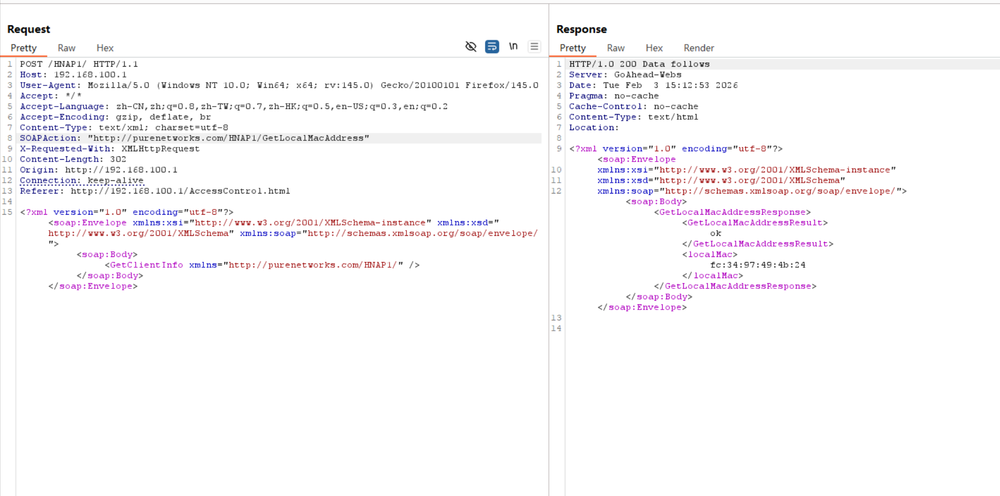
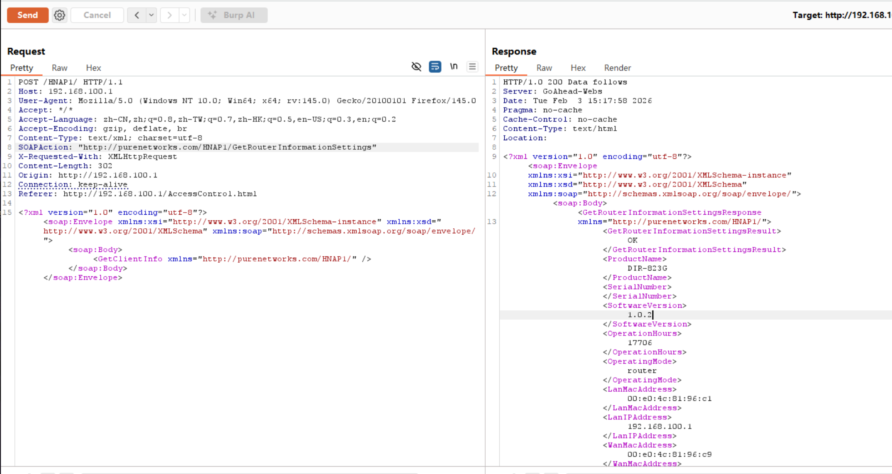

# D-Link Vulnerability

Vendor:D-Link

Product:DIR823G

Version:1.0.2B05

Type:Improper Access Control & Incorrect Privilege Assignment

Author:Jiaqian Peng

Mail:pengjiaqian@iie.ac.cn

Institution:Institute of Information Engineering,Chinese Academy of Sciences(IIE, CAS)

## Vulnerability description

We discovered that a recently released firmware of D-Link routers contains vulnerabilities related to improper access control and incorrect privilege assignment.

**Improper Access Control & Incorrect Privilege Assignment**

In `goahead` binary:

An attacker can access the `GetNetworkSettings、GetWanSettings、GetRouterLanSettings、GetLanWanConflictInfo、GetDeviceDomainName、GetGuestNetworkSettings、GetLocalMacAddress、GetRouterInformationSettings` interface **without any authentication**, resulting in the disclosure of sensitive network configuration and device information. 

The exposed information may include internal network topology, WAN and LAN configuration details, device identifiers, guest network settings, and wireless security parameters. Such information enables attackers to accurately fingerprint the device, infer network structure, and identify security boundaries, significantly facilitating subsequent attacks such as unauthorized wireless access, lateral movement within the local network, targeted exploitation of vulnerable services, and traffic interception.

## PoC & Result

