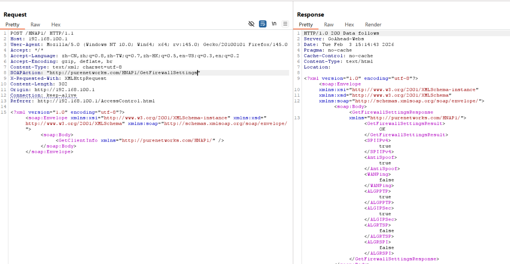
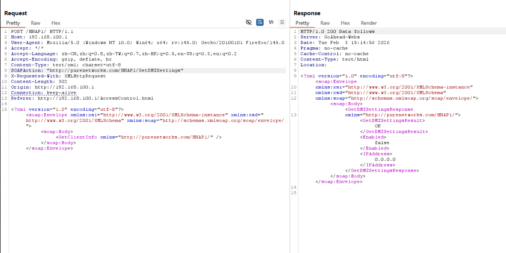
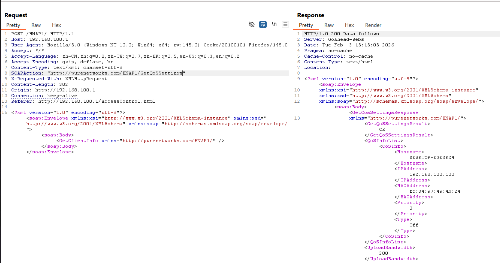
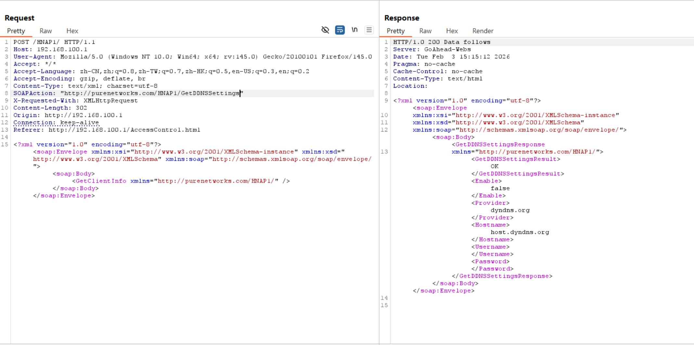

# D-Link Vulnerability

Vendor:D-Link

Product:DIR823G

Version:1.0.2B05

Type:Improper Access Control & Incorrect Privilege Assignment

Author:Jiaqian Peng

Mail:pengjiaqian@iie.ac.cn

Institution:Institute of Information Engineering,Chinese Academy of Sciences(IIE, CAS)

## Vulnerability description

We discovered that a recently released firmware of D-Link routers contains vulnerabilities related to improper access control and incorrect privilege assignment.

**Improper Access Control & Incorrect Privilege Assignment**

In `goahead` binary:

An attacker can access the `GetFirewallSettings、GetDMZSettings、GetQoSSettings、GetDDNSSettings` interface **without any authentication**, resulting in the disclosure of sensitive network configuration and security policy information. 

The exposed information may include dynamic DNS configuration, firewall and DMZ settings, QoS policies, and other related parameters. Such information enables attackers to accurately fingerprint the device, identify exposed services and security boundaries, and significantly facilitates subsequent attacks such as targeted exploitation of externally reachable services, unauthorized access to internal hosts, traffic interception, and lateral movement within the local network..

## PoC & Result

