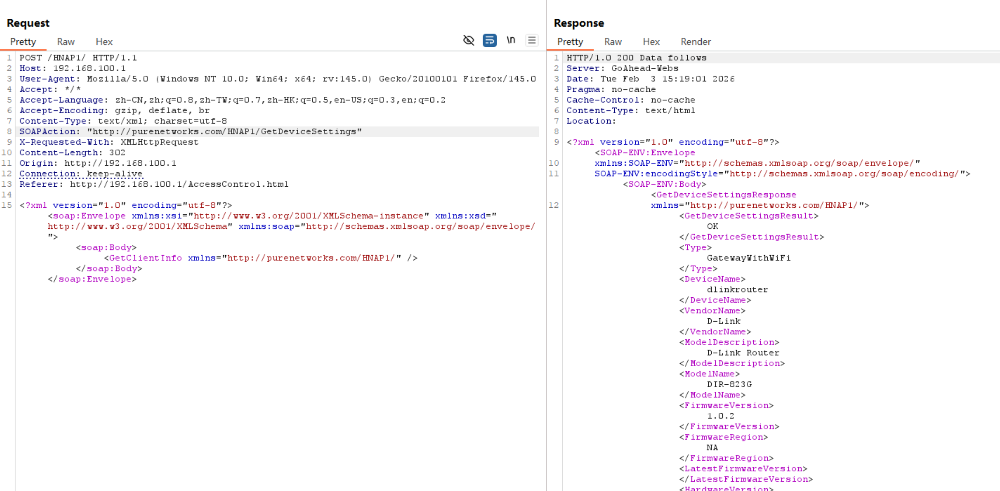
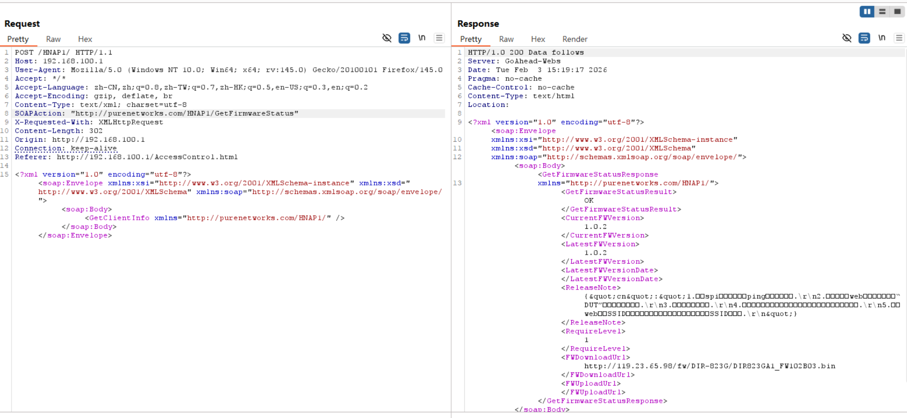

# D-Link Vulnerability

Vendor:D-Link

Product:DIR823G

Version:1.0.2B05

Type:Improper Access Control & Incorrect Privilege Assignment

Author:Jiaqian Peng

Mail:pengjiaqian@iie.ac.cn

Institution:Institute of Information Engineering,Chinese Academy of Sciences(IIE, CAS)

## Vulnerability description

We discovered that a recently released firmware of D-Link routers contains vulnerabilities related to improper access control and incorrect privilege assignment.

**Improper Access Control & Incorrect Privilege Assignment**

In `goahead` binary:

An attacker can access the `GetDeviceSettings、GetFirmwareStatus` interface **without any authentication**, resulting in the disclosure of sensitive device configuration and system status information. 

The exposed information may include device model details, firmware version, system status indicators, feature configuration summaries, and other identifying metadata. Such information allows attackers to accurately fingerprint the device, determine its software version and configuration state, and assess potential attack surfaces, thereby significantly facilitating targeted exploitation using known vulnerabilities, device-specific attack techniques, or tailored attack chains.

## PoC & Result

