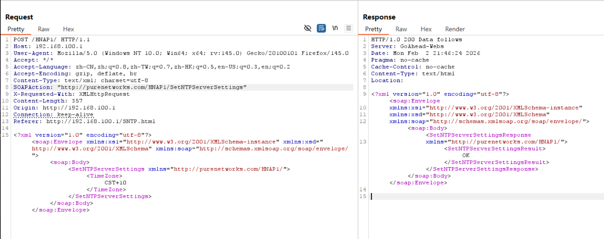

# D-Link Vulnerability

Vendor:D-Link

Product:DIR823G

Version:1.0.2B05

Type:Improper Access Control & Incorrect Privilege Assignment

Author:Jiaqian Peng

Mail:pengjiaqian@iie.ac.cn

Institution:Institute of Information Engineering,Chinese Academy of Sciences(IIE, CAS)

## Vulnerability description

We discovered that a recently released firmware of D-Link routers contains vulnerabilities related to improper access control and incorrect privilege assignment.

**Improper Access Control & Incorrect Privilege Assignment**

In `goahead` binary:

**An unauthenticated attacker** can access multiple configuration-modifying management interfaces, including `SetNTPServerSettings`, `UpdateClientInfo`, `SetWLanRadioSecurity`, `SetWPSSettings`, `SetGuestWLanSettings`, `SetNetworkTomographySettings、SetAccessCtlSwitch`, allowing unauthorized modification of critical device and wireless network configurations.

By exploiting these interfaces, an attacker can arbitrarily alter wireless security settings, enable or disable WPS, modify guest network configurations, manipulate client-related information, change access control enforcement, or tamper with system time sources. Such unauthorized configuration changes may weaken or bypass wireless security protections, disrupt normal network operation, enable unauthorized device access, interfere with security mechanisms relying on accurate system time, or cause persistent misconfiguration of the device.

## PoC & Result

