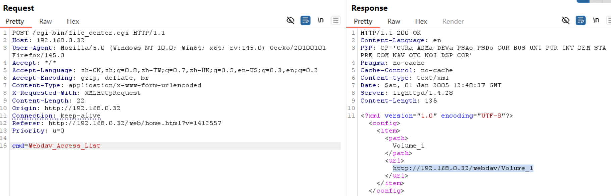

# D-Link Vulnerability

Vendor:D-Link

Product:DNS-120、DNR-202L、DNS-315L、DNS-320、DNS-320L、DNS-320LW、DNS-321、DNR-322L、DNS-323、DNS-325、DNS-326、DNS-327L、DNR-326、DNS-340L、DNS-343、DNS-345、DNS-726-4、DNS-1100-4、DNS-1200-05 、DNS-1550-04

Version:up to 20260205

Type:Improper Access Control & Incorrect Privilege Assignment

Author:Jiaqian Peng

Mail:pengjiaqian@iie.ac.cn

Institution:Institute of Information Engineering,Chinese Academy of Sciences(IIE, CAS)

> This vulnerability reporting environment is based on the latest version 2.06b01 of the DNS-320.

## Vulnerability description

We discovered that a recently released firmware of D-Link Technology NAS device  contains vulnerabilities related to improper access control and incorrect privilege assignment.

**Improper Access Control & Incorrect Privilege Assignment**

In `file_center.cgi` binary:

An attacker can access the `Webdav_Access_List` interface **without any authentication**, leading to the disclosure of WebDAV access information.

The interface returns structured configuration data containing shared directory names and their corresponding WebDAV access URLs, including the device’s internal IPv4 address. This allows an attacker to enumerate available shared resources and exposed WebDAV endpoints, facilitating further unauthorized access and follow-up attacks.

## PoC & Result

