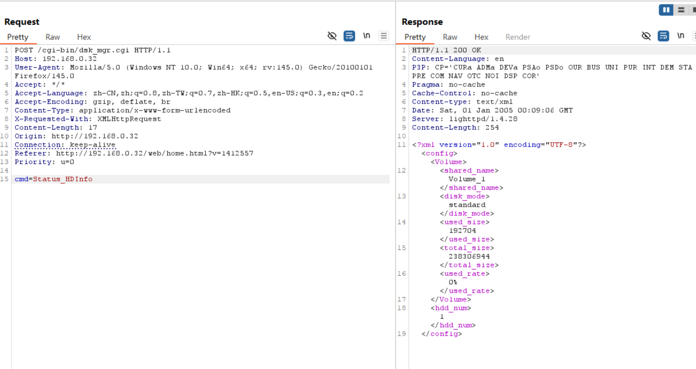

# D-Link Vulnerability

Vendor:D-Link

Product:DNS-120、DNR-202L、DNS-315L、DNS-320、DNS-320L、DNS-320LW、DNS-321、DNR-322L、DNS-323、DNS-325、DNS-326、DNS-327L、DNR-326、DNS-340L、DNS-343、DNS-345、DNS-726-4、DNS-1100-4、DNS-1200-05 、DNS-1550-04

Version:up to 20260205

Type:Improper Access Control & Incorrect Privilege Assignment

Author:Jiaqian Peng

Mail:pengjiaqian@iie.ac.cn

Institution:Institute of Information Engineering,Chinese Academy of Sciences(IIE, CAS)

> This vulnerability reporting environment is based on the latest version 2.06b01 of the DNS-320.

## Vulnerability description

We discovered that a recently released firmware of D-Link Technology NAS device  contains vulnerabilities related to improper access control and incorrect privilege assignment.

**Improper Access Control & Incorrect Privilege Assignment**

In `dsk_mgr.cgi` binary:

An attacker can access the `Status_HDInfo、SMART_List、ScanDisk_info、ScanDisk、volume_status、Get_Volume_Mapping、FMT_check_disk_remount_state、FMT_rebuildinfo、FMT_result_list、FMT_result_list_phy、FMT_get_dminfo、FMT_manually_rebuild_info、Get_current_raidtype` interface **without any authentication**, leading to the disclosure of device and disk status information.

The interface returns structured system and storage status data, including physical disk presence and attributes, SMART status, volume and RAID configuration, disk scanning and rebuild states, and volume-to-disk mappings. This information allows an attacker to infer the device’s storage layout, operational state, and RAID configuration, which can be leveraged for reconnaissance and to facilitate further attacks.

## PoC & Result

