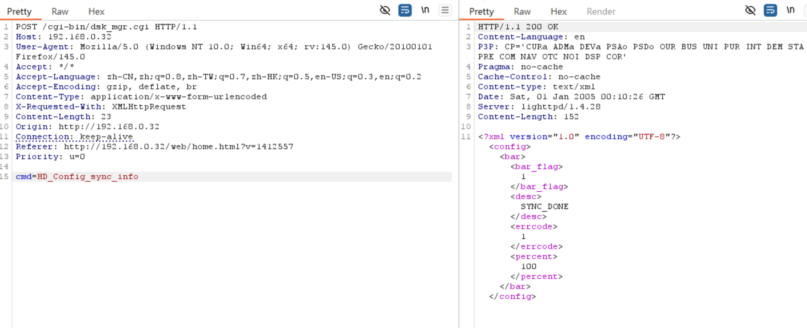

# D-Link Vulnerability

Vendor:D-Link

Product:DNS-120、DNR-202L、DNS-315L、DNS-320、DNS-320L、DNS-320LW、DNS-321、DNR-322L、DNS-323、DNS-325、DNS-326、DNS-327L、DNR-326、DNS-340L、DNS-343、DNS-345、DNS-726-4、DNS-1100-4、DNS-1200-05 、DNS-1550-04

Version:up to 20260205

Type:Improper Access Control & Incorrect Privilege Assignment

Author:Jiaqian Peng

Mail:pengjiaqian@iie.ac.cn

Institution:Institute of Information Engineering,Chinese Academy of Sciences(IIE, CAS)

> This vulnerability reporting environment is based on the latest version 2.06b01 of the DNS-320.

## Vulnerability description

We discovered that a recently released firmware of D-Link Technology NAS device  contains vulnerabilities related to improper access control and incorrect privilege assignment.

**Improper Access Control & Incorrect Privilege Assignment**

In `dsk_mgr.cgi、apkg_mgr.cgi` binary:

An attacker can access the `HD_Config_sync_info、HD_Config_button_info、HD_Status、HD_Exist、HD_Config、SMART_Schedule_List、SMART_XML_Create_Smart_Info、SMART_XML_Create_Device_List、SMART_Get_Test_Status、SMART_XML_Create_Test_List、ScanDisk_Finish、FMT_ajaxplorer_stop、FMT_create_type、FMT_disk_finish、FMT_disk_remount、FMT_remain_diskmgr、Module_Get_Info、module_list、module_show_install_status、module_Get_One_Info、Language_List、cgi_application_lst` interface **without any authentication**, leading to the disclosure of device operational status information.

The interface returns structured data describing the current operating state of the device, including disk availability and status, SMART monitoring and test status, ongoing or completed disk operations, configuration synchronization state, and related runtime indicators. This information allows an attacker to infer the device’s operational conditions and execution state, which can be leveraged for reconnaissance and to facilitate further attacks.

## PoC & Result

